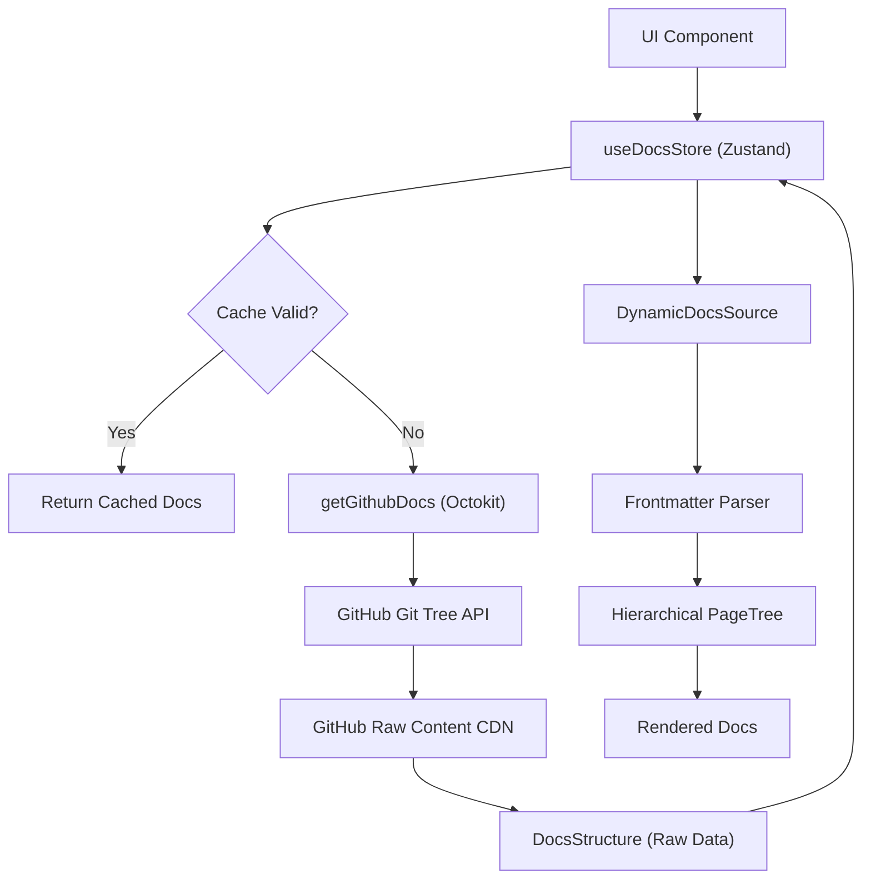

# Data Layer and Integration

The data layer of GitDex is designed to transform remote GitHub repository content into a structured, navigable documentation tree in real-time. This process involves a three-stage pipeline: fetching, caching, and transformation.

## Architecture Overview

The flow of data begins with a request for a specific owner/repo combination and ends with a hierarchical page tree compatible with the Fumadocs core.



## GitHub Integration

The integration is handled by `client/src/lib/github.ts`. To optimize performance and avoid GitHub API rate limits for large documentation sets, GitDex employs a hybrid fetching strategy:

1.  **Tree Discovery**: It uses the `@octokit/rest` library to perform a recursive fetch of the repository tree. This identifies all relevant blobs within the `docs/{owner}/{repo}` path.
2.  **Parallel Content Retrieval**: Instead of using the REST API for each file's content, GitDex fetches files directly from `raw.githubusercontent.com` using native `fetch` calls. This is faster and leverages GitHub's CDN.
3.  **Metadata Extraction**: The system looks for a `meta.json` file within the documentation directory to handle repository-specific configurations.

## Caching Strategy

To prevent redundant network requests and ensure a snappy user experience, GitDex implements a client-side cache using **Zustand** in `client/src/lib/docs-store.ts`.

### Cache Specifications
- **TTL (Time To Live)**: 10 minutes (`10 * 60 * 1000` ms).
- **Keying**: Data is keyed by the `${owner}/${repo}` string.
- **Invalidation**: The store provides `clearCache()` for global wipes and `clearCacheFor(owner, repo)` for targeted updates.

```typescript
// Simplified Cache Logic
if (cached && now - cached.timestamp < CACHE_TTL) {
  return cached.data;
}
```

## Dynamic Document Processing

The `DynamicDocsSource` class in `client/src/lib/dynamic-source.ts` acts as the transformation engine. It converts the raw `DocsStructure` into a format usable by the documentation UI.

### Frontmatter Parsing
Since the docs are fetched as raw strings, GitDex uses a custom regex-based parser to extract YAML-like frontmatter. It specifically looks for:
- `title`: The display name of the page.
- `description`: The SEO/summary text.
- `sidebar_position`: A numeric value used to override default alphabetical sorting.

### Hierarchical Tree Generation
The system converts a flat list of files into a nested folder structure using a naming convention logic:
1.  **Filtering**: Only `.mdx` files are processed.
2.  **Pattern Matching**: Files starting with a numeric prefix (e.g., `1.1.mdx`) are automatically grouped under a parent page (e.g., `1.mdx`).
3.  **Sorting**: Pages are sorted primarily by `sidebar_position` and secondarily by filename.
4.  **Tree Mapping**: The final output is a `PageTree.Root` object, allowing the UI to render nested sidebars and breadcrumbs.

### Title Formatting
If no title is provided in the frontmatter, the system automatically generates one by:
- Removing numeric prefixes.
- Splitting by underscores or hyphens.
- Capitalizing the first letter of each word.