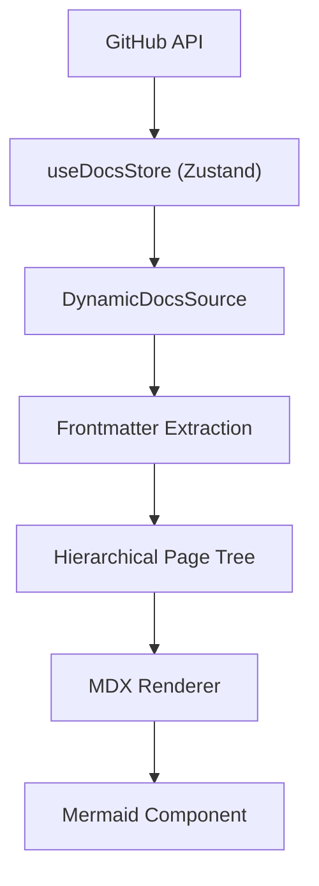

# Documentation Rendering

GitDex employs a dynamic rendering pipeline that transforms raw Markdown files from GitHub repositories into a structured, interactive documentation site. This process involves a three-stage pipeline: fetching, caching, and rendering.

## The Rendering Pipeline

The documentation flow is designed to minimize API latency while maintaining a flexible hierarchy.

## Dynamic Source Management

The `DynamicDocsSource` class acts as the orchestrator for converting flat GitHub file lists into a structured documentation tree compatible with `fumadocs-core`.

### Processing Logic
1.  **Filtering**: Only files ending in `.mdx` are processed, excluding metadata files like `meta.json`.
2.  **Frontmatter Extraction**: A custom regex-based parser extracts metadata from the top of the files, specifically looking for `title`, `description`, and `sidebar_position`.
3.  **Sorting**: Pages are sorted numerically based on the `sidebar_position` frontmatter key to ensure the intended reading order.
4.  **Tree Generation**: GitDex supports a hierarchical structure using a numbering convention (e.g., `1.0.mdx`, `1.1.mdx`). The source generator identifies these prefixes to nest sub-pages under a parent folder.

## Documentation Store and Caching

To optimize performance and avoid hitting GitHub API rate limits, GitDex utilizes a Zustand-based caching layer via `useDocsStore`.

-   **Cache Key**: Documentation is cached using the `owner/repo` string as the unique identifier.
-   **TTL (Time to Live)**: The store implements a **10-minute TTL**. If a request for the same repository is made within this window, the cached data is returned immediately.
-   **Cache Invalidation**: The store provides `clearCache` and `clearCacheFor` methods to force-refresh content when updates are pushed to the source repository.

## Advanced Diagram Rendering

GitDex provides a sophisticated `Mermaid` component that transforms Mermaid.js syntax into interactive SVGs.

### Syntax Resilience
Because MDX and GitHub content can sometimes introduce formatting artifacts, the component includes a `fixMermaidSyntax` utility. This utility:
-   **Wraps Labels**: Automatically inserts ` ` tags in long labels (max 20-25 characters) to prevent diagrams from becoming excessively wide.
-   **Normalizes Arrows**: Converts non-standard arrow syntax (e.g., `==>`, `-.->`) into valid Mermaid syntax.
-   **Sanitizes Input**: Removes conflicting quotes and cleans subgraph declarations.

### Interactive Features
The rendered diagrams are wrapped in a specialized container that provides:
-   **Pan & Zoom**: Integration with `panzoom` allows users to drag the diagram and zoom using `Ctrl + Scroll` or `Cmd + Scroll`.
-   **Theme Integration**: The component listens to `next-themes` to toggle between `dark` and `default` Mermaid themes seamlessly.
-   **Error Boundary**: If a diagram fails to render, GitDex catches the error and displays a styled alert containing the raw source code for debugging.

### Rendering Implementation
The component utilizes `use` and `cachePromise` to dynamically import the heavy `mermaid` library only when needed, ensuring the initial page load remains fast.