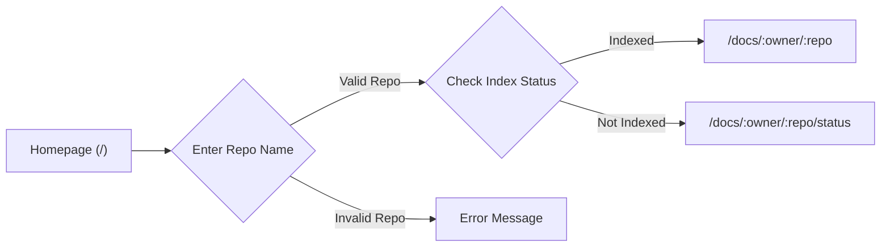
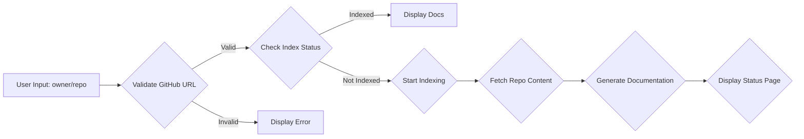

# Routing and Navigation

This document explains the routing structure of the GitDex application, outlining how different URLs are handled and mapped to specific components and functionalities. Understanding this structure is essential for contributing to the project or customizing its behavior.

The core routing logic is primarily handled by Next.js, utilizing its file-system routing capabilities. Key files involved are:

- `client/src/app/docs/[owner]/[repo]/[[...slug]]/page.tsx`: Handles the display of documentation pages for a given repository.
- `client/src/app/docs/[owner]/[repo]/layout.tsx`: Defines the layout for documentation pages within a specific repository.
- `client/src/app/page.tsx`: Implements the homepage with the search and repository selection functionalities.
- `client/middleware.ts`: Intercepts all requests to add a custom header containing the pathname.

## Middleware

The `middleware.ts` file plays a crucial role in intercepting incoming requests and modifying them before they reach the application's routes. Specifically, it adds the `x-pathname` header to each request, which can be useful for tracking the requested path within the application.

```typescript filename="client/middleware.ts"
import { NextResponse } from 'next/server';
import type { NextRequest } from 'next/server';

export function middleware(request: NextRequest) {
  const requestHeaders = new Headers(request.headers);
  requestHeaders.set('x-pathname', request.nextUrl.pathname);

  return NextResponse.next({
    request: {
      headers: requestHeaders,
    },
  });
}

export const config = {
  matcher: [
    '/((?!api|_next/static|_next/image|favicon.ico).*)',
  ],
};
```

[View on GitHub](https://github.com/shinymack/gitdex/blob/main/client/middleware.ts)

The `config.matcher` array defines the paths that the middleware should be applied to, in this case excluding API routes, static files, image optimization files, and the favicon.

## Dynamic Documentation Pages

The `client/src/app/docs/[owner]/[repo]/[[...slug]]/page.tsx` file is the heart of the documentation display logic. It uses Next.js's dynamic routes to handle documentation for any GitHub repository.

```typescript filename="client/src/app/docs/[owner]/[repo]/[[...slug]]/page.tsx"
import { DocsPage, DocsBody } from 'fumadocs-ui/page';
import { notFound, redirect } from 'next/navigation';
import { compiler } from '@/lib/mdx-compiler';
import { getMDXComponents } from '@/mdx-components';
import { DynamicDocsSource } from '@/lib/dynamic-source';
import { getTableOfContents } from 'fumadocs-core/content/toc';
import 'mermaid';

interface PageProps {
  params: Promise<{
    owner: string;
    repo: string;
    slug?: string[];
  }>;
}

export default async function Page({ params }: PageProps) {
  // Await the params before using their properties
  const { owner, repo, slug = [] } = await params;
  
  // If no slug is provided (visiting /docs/owner/repo), redirect to first page
  if (slug.length === 0) {
    const source = new DynamicDocsSource(owner, repo);
    await source.initialize();
    
    const firstPage = source.getFirstPage();
    
    if (firstPage) {
      redirect(`/docs/${owner}/${repo}${firstPage.url}`);
    } else {
      notFound();
    }
  }
  
  // Normal page rendering for specific slugs
  const source = new DynamicDocsSource(owner, repo);
  await source.initialize();
  
  const page = source.getPage(slug);
  
  if (!page) {
    notFound();
  }

  // Extract MDX content without frontmatter
  const mdxContent = page.content.replace(/^---\s*\n([\s\S]*?)\n---/, '').trim();
  
  // Generate table of contents from the MDX content
  const toc = getTableOfContents(mdxContent.replace(/^---\s*\n([\s\S]*?)\n---/, ''));

  // Compile MDX content
  const compiled = await compiler.compile({
    source: mdxContent.trim(),
  });
  
  const MdxContent = compiled.body;
  
  return (
    <DocsPage full={page.url === '/'}
    toc={toc}>
      <DocsBody>
        <MdxContent components={getMDXComponents({})} />
      </DocsBody>
    </DocsPage>
  );
}

export function generateStaticParams() {
  return [];
}
```

[View on GitHub](https://github.com/shinymack/gitdex/blob/main/client/src/app/docs/%5Bowner%5D/%5Brepo%5D/%5B%5B...slug%5D%5D/page.tsx)

The `[owner]` and `[repo]` segments capture the GitHub repository owner and name, while the `[[...slug]]` segment captures an optional array of path segments, enabling the display of nested documentation pages. If the `slug` is empty, it redirects to the first available page.

The component fetches the documentation content using `DynamicDocsSource`, extracts the MDX content, generates a table of contents, and compiles the MDX into React components using `compiler`.

```typescript filename="client/src/app/docs/[owner]/[repo]/[[...slug]]/page.tsx"
  const compiled = await compiler.compile({
    source: mdxContent.trim(),
  });
  
  const MdxContent = compiled.body;
```

This snippet showcases the MDX compilation process, converting the MDX source into executable React components.

## Layout

The `client/src/app/docs/[owner]/[repo]/layout.tsx` file provides the layout structure for the documentation pages, wrapping the content with a serif font.

```typescript filename="client/src/app/docs/[owner]/[repo]/layout.tsx"
import type { ReactNode } from 'react';

interface LayoutProps {
  children: ReactNode;
  params: Promise<{
    owner: string;
    repo: string;
  }>;
}

export default async function Layout({ children }: LayoutProps) {
  return <div className='font-serif'>
    {children};
    </div>
}
```

[View on GitHub](https://github.com/shinymack/gitdex/blob/main/client/src/app/docs/%5Bowner%5D/%5Brepo%5D/layout.tsx)

This ensures a consistent look and feel across all documentation pages within a repository.

## Homepage and Repository Selection

The `client/src/app/page.tsx` file renders the homepage, which features a search input for users to specify a GitHub repository. It includes live suggestions via calls to the `/api/search` endpoint.

```typescript filename="client/src/app/page.tsx"
'use client';

import { useState, useEffect, useCallback, useRef } from 'react';
import Link from 'next/link';
import { Button } from '@/src/components/ui/button';
import { Input } from '@/src/components/ui/input';
import { Card, CardContent, CardDescription, CardHeader, CardTitle } from '@/src/components/ui/card';
import { FloatingNav } from '@/src/components/navbar';
import { ClientOnly } from '@/src/components/ClientOnly';
import { ArrowRight, Zap, Code, Sparkles, Terminal, FileText, GitBranch, AlertCircle, Search } from 'lucide-react';
import { validateGitHubUrl } from '@/lib/validation';
import MemoizedFaultyTerminal from '@/src/components/bg';

interface RepoSuggestion {
  full_name: string;
  description: string;
  html_url: string;
}

export default function HomePage() {
  const [query, setQuery] = useState('');
  const [suggestions, setSuggestions] = useState<RepoSuggestion[]>([]);
  const [selectedRepo, setSelectedRepo] = useState<string>('');
  const [isLoading, setIsLoading] = useState(false);
  const [error, setError] = useState('');
  const [showSuggestions, setShowSuggestions] = useState(false);
  const [debounceTimer, setDebounceTimer] = useState<NodeJS.Timeout | null>(null);
  const containerRef = useRef<HTMLDivElement | null>(null);

  // Debounced GitHub search via server-side Octokit proxy
  const searchRepos = useCallback(async (q: string) => {
    // allow shorter queries so partial repo names return suggestions
    if (q.length < 1) {
      setSuggestions([]);
      return;
    }

    try {
      const res = await fetch(`/api/search?q=${encodeURIComponent(q)}`);
      if (!res.ok) throw new Error('Search failed');
      const data = await res.json();
      setSuggestions(data.items || []);
    } catch (err) {
      console.error('Search error:', err);
      setSuggestions([]);
    }
  }, []);

  useEffect(() => {
    if (debounceTimer) clearTimeout(debounceTimer);

    // faster response for autocomplete; reduce debounce slightly
    const timer = setTimeout(() => {
      searchRepos(query);
    }, 200);

    setDebounceTimer(timer);
    return () => clearTimeout(timer);
  }, [query, searchRepos]);

  const handleSelectRepo = (repo: RepoSuggestion) => {
    setQuery(repo.full_name);
    setSelectedRepo(repo.full_name);
    setShowSuggestions(false);
  };

  const handleSubmit = async () => {
    setError('');
    const input = selectedRepo || query;
    const fullUrl = input.includes('github.com') ? input : `https://github.com/${input}`;
    const validation = validateGitHubUrl(fullUrl);
    if (!validation.valid) {
      setError(validation.error || 'Invalid GitHub URL format');
      return;
    }

    setIsLoading(true);

    try {
      const urlParts = input.split('/');
      const owner = urlParts[urlParts.length - 2];
      const repo = urlParts[urlParts.length - 1].replace('.git', '');
      const res = await fetch(`/api/status?owner=${owner}&repo=${repo}`);
      const data = await res.json();

      if (data.indexed) {
        window.location.href = data.path;
      } else {
        window.location.href = `/docs/${owner}/${repo}/status`;
      }
    } catch (err) {
      setError(err instanceof Error ? err.message : 'Failed to check status');
    } finally {
      setIsLoading(false);
    }
  };

  const handleInputChange = (e: React.ChangeEvent<HTMLInputElement>) => {
    const val = e.target.value;
    setQuery(val);
    setSelectedRepo('');
    setError('');

    if (val.trim() === '') {
      setSuggestions([]);
      setShowSuggestions(false);
      return;
    }

    // only show suggestions when input has content
    setShowSuggestions(true);
  };

  useEffect(() => {
    function onDocClick(e: MouseEvent) {
      const target = e.target as Node | null;
      if (containerRef.current && !containerRef.current.contains(target)) {
        setShowSuggestions(false);
      }
    }

    document.addEventListener('click', onDocClick);
    return () => document.removeEventListener('click', onDocClick);
  }, []);

  return (
    <div className="min-h-screen relative overflow-hidden">
      <div className="font-serif">
        <FloatingNav />
      </div>

      {/* Background */}
      <div className="absolute inset-0 z-0">
        <ClientOnly>
          <MemoizedFaultyTerminal
            key="faulty-terminal-static"
            scale={1.7}
            gridMul={[2, 2]}
            digitSize={2.9}
            timeScale={1.2}
            pause={false}
            scanlineIntensity={1}
            glitchAmount={1}
            flickerAmount={0.5}
            noiseAmp={0.8}
            chromaticAberration={1}
            dither={0}
            curvature={0.2}
            tint="#4caf50"
            mouseReact={true}
            mouseStrength={1}
            pageLoadAnimation={true}
            brightness={0.4}
            className=""  // Add this
            style={{}}
          />
        </ClientOnly>
      </div>

      {/* Content */}
      <div className="relative z-10 min-h-screen flex flex-col">
        <main className="flex-1 flex items-center justify-center px-4 py-16">
          <div className="w-full max-w-4xl">
            {/* Hero Section */}
            <div className="text-center mb-12">
              <div className="inline-flex items-center gap-2 px-3 py-1 rounded-full bg-primary/10 border border-primary/20 text-primary text-sm font-medium mb-6">
                <Sparkles className="w-4 h-4" />
                <span>AI-Powered Documentation</span>
              </div>

              <h1 className="text-5xl font-headline md:text-6xl mb-6 bg-gradient-to-r from-foreground via-primary to-primary/70 bg-clip-text text-transparent">
                GitDex
              </h1>

              <p className="text-xl font-serif text-muted-foreground mb-8 max-w-2xl mx-auto">
                Transform any GitHub repository into beautiful, interactive documentation in seconds
              </p>

              {/* Autocomplete Input Section */}
              <div className="font-serif max-w-xl mx-auto mb-8 relative">
                <div className="flex gap-2 p-1 bg-background/50 backdrop-blur-sm rounded-lg border border-border/50">
                  <div className="relative flex-1">
                    <Search className="absolute left-3 top-1/2 transform -translate-y-1/2 text-muted-foreground w-4 h-4" />
                    <Input
                      placeholder="owner/repo"
                      value={query}
                      onChange={handleInputChange}
                      onFocus={() => query.length >= 2 && setShowSuggestions(true)}
                      className="pl-10 flex-1 bg-transparent border-none focus-visible:ring-0 focus-visible:ring-offset-0"
                      disabled={isLoading}
                    />
                  </div>
                  <Button
                    onClick={handleSubmit}
                    disabled={isLoading || !query.trim()}
                    className="bg-primary text-primary-foreground hover:bg-primary/90 gap-2"
                  >
                    {isLoading ? (
                      <>
                        <div className="w-4 h-4 animate-spin rounded-full border-2 border-current border-t-transparent"></div>
                        Checking...
                      </>
                    ) : (
                      <>
                        <Zap className="w-4 h-4" />
                        Go to Docs
                      </>
                    )}
                  </Button>
                </div>

                {/* Suggestions Dropdown */}
                {showSuggestions && suggestions.length > 0 && (
                  <div className="absolute z-10 w-full mt-1 bg-background border border-border/50 rounded-lg shadow-lg max-h-60 overflow-auto">
                    {suggestions.map((repo) => (
                      <button
                        key={repo.full_name}
                        onClick={() => handleSelectRepo(repo)}
                        className="w-full text-left px-4 py-3 hover:bg-accent/50 border-b border-border/50 last:border-b-0"
                      >
                        <div className="font-medium">{repo.full_name}</div>
                        <div className="text-sm text-muted-foreground truncate">{repo.description}</div>
                      </button>
                    ))}
                  </div>
                )}

                {error && (
                  <div className="flex items-center gap-2 mt-2 text-sm text-destructive bg-destructive/10 p-3 rounded-md">
                    <AlertCircle className="w-4 h-4" />
                    {error}
                  </div>
                )}

                <p className="text-sm text-muted-foreground mt-2">
                  Search for a GitHub repo (e.g., owner/repo) to view or generate docs
                </p>
              </div>
            </div>

            {/* Features Grid */}
            <div className="font-serif grid md:grid-cols-3 gap-6 mb-12">
              <Card className="bg-background/40 backdrop-blur-sm border-border/50 hover:bg-background/60 transition-all duration-300">
                <CardHeader className="pb-3">
                  <div className="w-10 h-10 rounded-lg bg-gradient-to-br from-blue-500 to-blue-600 flex items-center justify-center mb-3">
                    <Code className="w-5 h-5 text-white" />
                  </div>
                  <CardTitle className="text-lg">Smart Analysis</CardTitle>
                </CardHeader>
                <CardContent>
                  <CardDescription>
                    AI-powered code analysis that understands your project structure and generates comprehensive documentation
                  </CardDescription>
                </CardContent>
              </Card>

              <Card className="bg-background/40 backdrop-blur-sm border-border/50 hover:bg-background/60 transition-all duration-300">
                <CardHeader className="pb-3">
                  <div className="w-10 h-10 rounded-lg bg-gradient-to-br from-purple-500 to-purple-600 flex items-center justify-center mb-3">
                    <Terminal className="w-5 h-5 text-white" />
                  </div>
                  <CardTitle className="text-lg">Interactive Diagrams</CardTitle>
                </CardHeader>
                <CardContent>
                  <CardDescription>
                    Auto-generated Mermaid diagrams with pan and zoom functionality for visualizing your codebase architecture
                  </CardDescription>
                </CardContent>
              </Card>

              <Card className="bg-background/40 backdrop-blur-sm border-border/50 hover:bg-background/60 transition-all duration-300">
                <CardHeader className="pb-3">
                  <div className="w-10 h-10 rounded-lg bg-gradient-to-br from-green-500 to-green-600 flex items-center justify-center mb-3">
                    <GitBranch className="w-5 h-5 text-white" />
                  </div>
                  <CardTitle className="text-lg">Always Updated</CardTitle>
                </CardHeader>
                <CardContent>
                  <CardDescription>
                    Documentation stays in sync with your repository with automatic updates on every push
                  </CardDescription>
                </CardContent>
              </Card>
            </div>

            {/* CTA Section */}
            <div className="text-center">
              <p className="text-muted-foreground mb-4">See it in action</p>
              <Link href="/docs/shinymack/Chat-App-MERN">
                <Button variant="outline" className="bg-background/40 backdrop-blur-sm border-border/50 hover:bg-background/60 gap-2 group">
                  <FileText className="w-4 h-4" />
                  View Example Documentation
                  <ArrowRight className="w-4 h-4 group-hover:translate-x-1 transition-transform" />
                </Button>
              </Link>
            </div>
          </div>
        </main>

        {/* Footer */}
        <footer className="py-6 text-center text-sm text-muted-foreground">
          <p>Built with Next.js, Fumadocs, and a sprinkle of AI magic</p>
        </footer>
      </div>
    </div>
  );
}
```

[View on GitHub](https://github.com/shinymack/gitdex/blob/main/client/src/app/page.tsx)

The `handleSubmit` function constructs the URL based on the user's input and redirects them to either the documentation page if the repository is already indexed, or a status page if indexing is required.

```typescript filename="client/src/app/page.tsx"
  const handleSubmit = async () => {
    setError('');
    const input = selectedRepo || query;
    const fullUrl = input.includes('github.com') ? input : `https://github.com/${input}`;
    const validation = validateGitHubUrl(fullUrl);
    if (!validation.valid) {
      setError(validation.error || 'Invalid GitHub URL format');
      return;
    }

    setIsLoading(true);

    try {
      const urlParts = input.split('/');
      const owner = urlParts[urlParts.length - 2];
      const repo = urlParts[urlParts.length - 1].replace('.git', '');
      const res = await fetch(`/api/status?owner=${owner}&repo=${repo}`);
      const data = await res.json();

      if (data.indexed) {
        window.location.href = data.path;
      } else {
        window.location.href = `/docs/${owner}/${repo}/status`;
      }
    } catch (err) {
      setError(err instanceof Error ? err.message : 'Failed to check status');
    } finally {
      setIsLoading(false);
    }
  };
```

Here's a Mermaid diagram illustrating the navigation flow:





## Key Integration Points

The routing system is tightly integrated with the following aspects of the application:

- **Dynamic Content Loading:** The `DynamicDocsSource` class fetches documentation content dynamically from the specified GitHub repository.
- **MDX Compilation:** The `@/lib/mdx-compiler` module compiles MDX files into React components, allowing for rich, interactive documentation.
- **Real-time Search Suggestions:** The `/api/search` endpoint provides real-time search suggestions as the user types, improving the user experience.

## Best Practices

- **Consistent URL Structure:** Adhere to the defined URL structure (`/docs/[owner]/[repo]/[[...slug]]`) for all documentation pages to ensure proper routing and navigation.
- **Error Handling:** Implement robust error handling to gracefully handle invalid repository names, missing documentation files, and other potential issues.
- **Performance Optimization:** Optimize the loading and compilation of MDX files to ensure fast page load times.

## Example Usage

To view the documentation for the `shinymack/gitdex` repository, you would navigate to `/docs/shinymack/gitdex`. To view a specific page within the documentation, such as `introduction.mdx`, you would navigate to `/docs/shinymack/gitdex/introduction`.

Here is a diagram representing the flow for generating documentation from a github repository





By understanding the routing and navigation structure of the GitDex application, developers can effectively extend and customize its functionality to meet their specific needs.
```