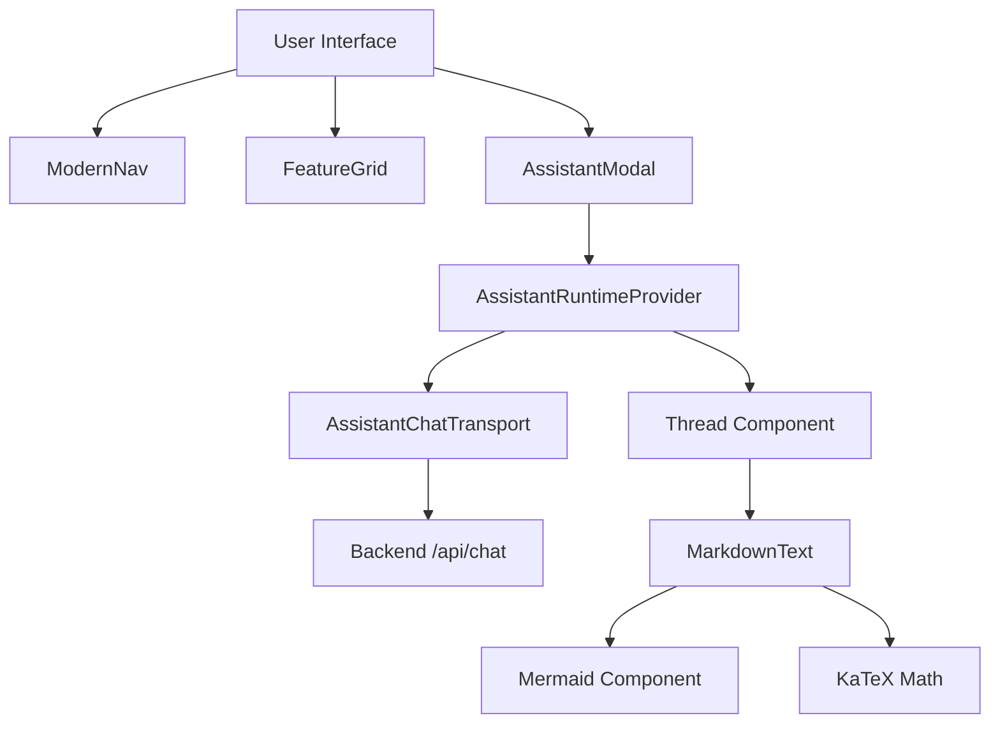

# UI Components & Assistant Interface

The GitDex frontend utilizes a modular component architecture built with React, Tailwind CSS, and specialized AI UI libraries. The interface is designed to provide a seamless transition between high-level repository exploration and deep-dive AI interactions.

## Global Navigation & Layout

The `ModernNav` component serves as the primary navigation hub, providing a consistent entry point across the application.

### ModernNav Component
The navigation bar is implemented as a fixed, backdrop-blurred element that adapts to various screen sizes.

**Key Features:**
- **Theme Integration:** Uses `next-themes` to toggle between light and dark modes via a `Sun`/`Moon` icon toggle.
- **Responsive Design:** Implements a mobile menu toggle (`Menu`/`X` icons) for smaller viewports.
- **Layout Stability:** Renders a skeleton state during the initial mount to prevent layout shift.

```tsx
// Simplified theme toggle logic in ModernNav.tsx
<Button
  variant="ghost"
  size="icon"
  onClick={() => setTheme(theme === 'dark' ? 'light' : 'dark')}
  className="w-8 h-8 rounded-full text-muted-foreground hover:text-foreground"
>
  {theme === 'dark' ? <Sun className="w-4 h-4 text-amber-500" /> : <Moon className="w-4 h-4 text-blue-600" /> }
</Button>
```

## Marketing & Feature Showcase

The `FeatureGrid` component implements a "Bento Box" style layout to visually demonstrate the core capabilities of GitDex.

### Featured Capabilities
The grid consists of four primary informational cards:

| Feature | Visual Representation | Description |
| :--- | :--- | :--- |
| **Smart AI Analysis** | Mocked terminal scanning codebase | AI-powered structure understanding and MDX generation. |
| **Architecture Flowcharts** | SVG Node Graph (Router $\rightarrow$ AuthCtx/Database) | Automatic mapping of structural relationships. |
| **Interactive Assistant** | Mocked Chat Interface | Contextual codebase querying without hallucination. |
| **On-Demand Updates** | Reindex Button with state pulse | Instant repository re-indexing and commit scanning. |

## AI Assistant Interface

The AI interface is a sophisticated integration of `@assistant-ui` and custom rendering logic to handle complex technical responses.

### Assistant Modal Architecture
The `AssistantModal` acts as the container for the AI interaction, managing the runtime environment and user interface state.

**Technical Specifications:**
- **Runtime Provider:** Wrapped in `AssistantRuntimeProvider` to manage chat state.
- **Transport Layer:** Uses `AssistantChatTransport` to communicate with the `/api/chat` endpoint.
- **Request Context:** Sends GitHub metadata via custom headers: `x-github-owner` and `x-github-repo`.
- **UX Features:** 
    - Desktop resizable sidebar (min 360px, max 50% screen width).
    - Mobile full-screen overlay with backdrop blur.
    - Thread reset functionality via `runtime.thread.reset()`.

### Markdown & Diagram Rendering
The `MarkdownText` component extends the standard markdown experience to support technical documentation needs.

- **Plugins:** Integrates `remark-gfm` (GitHub Flavored Markdown), `remark-math`, and `rehype-katex` for mathematical notation.
- **Custom Code Blocks:** Implements a `CodeHeader` providing the language identifier and a "Copy to Clipboard" utility.
- **Mermaid Integration:** Detects `mermaid` language blocks and redirects them to the `MermaidCodeBlock` component for visual diagram rendering.

## Component Relationships

The following diagram illustrates how the UI components interact and the flow of data from the user to the AI runtime.



## AI Interaction Sequence

The sequence below details the lifecycle of an AI request within the `AssistantModal`.

```mermaid
sequenceDiagram
    autonumber
    participant U as User
    participant AM as AssistantModal
    participant RT as AssistantRuntime
    participant TR as ChatTransport
    participant API as Backend API

    U->>AM: Input Query
    AM->>RT: Send Message
    RT->>TR: Process Transport
    TR->>API: POST /api/chat (Headers: owner, repo)
    API-->>TR: Stream Response
    TR-->>RT: Update State
    RT-->>AM: Trigger Re-render
    AM->>U: Render MarkdownText / Mermaid