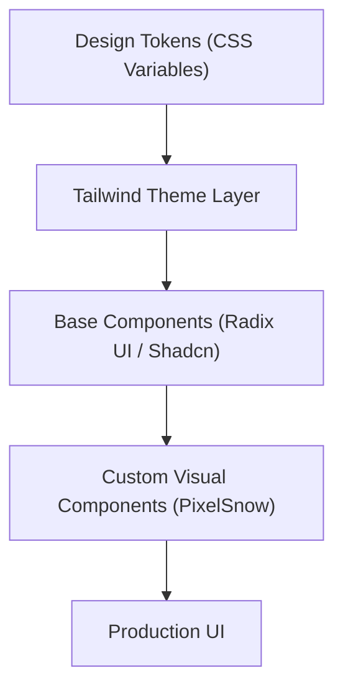

# UI Components & Design System

GitDex utilizes a nature-inspired design system built upon **Tailwind CSS**, **Shadcn UI**, and **Three.js**. The visual language emphasizes readability, accessibility, and a distinct "earthy" aesthetic, leveraging custom typography and a carefully curated color palette.

## Design Architecture

The system follows a layered approach to styling, ensuring that global tokens can be updated without modifying individual components.



## Design Tokens

Global styling is managed via CSS variables in `globals.css`, allowing for seamless switching between light and dark modes while maintaining consistent contrast ratios.

### Color Palette

The palette is centered around organic greens and warm neutrals to reduce eye strain.

| Token | Light Mode | Dark Mode | Usage |
| :--- | :--- | :--- | :--- |
| `--background` | `#f8f5f0` | `#1c2a1f` | Main page background |
| `--primary` | `#2e7d32` | `#4caf50` | Primary actions, branding |
| `--foreground` | `#3e2723` | `#f0ebe5` | Primary text |
| `--muted` | `#f0e9e0` | `#252f26` | De-emphasized backgrounds |
| `--accent` | `#c8e6c9` | `#388e3c` | Hover states, highlights |

### Typography

GitDex employs a sophisticated font stack to balance technical clarity with editorial elegance:
- **Sans-serif**: `MozillaHeadline` (Primary headings and UI)
- **Serif**: `MozillaText` (Long-form content)
- **Mono**: Standard monospace (Code blocks and technical data)

## UI Components

### Button Component

The `Button` component is a highly flexible, polymorphic element built using `class-variance-authority` (CVA) for type-safe variant management.

#### Available Variants

| Variant | Description |
| :--- | :--- |
| `default` | High-emphasis primary action. |
| `destructive` | Critical actions (e.g., delete). |
| `outline` | Low-emphasis secondary action. |
| `secondary` | Complementary actions. |
| `ghost` | Minimalist button for subtle interactions. |
| `link` | Styled as a hyperlink. |

#### Usage Example

```tsx
import { Button } from "@/components/ui/button";

export default function Example() {
  return (
    <div className="flex gap-2">
      <Button variant="default">Save Changes</Button>
      <Button variant="outline" size="sm">Cancel</Button>
      <Button variant="destructive">Delete Repo</Button>
    </div>
  );
}
```

## Custom Visuals: PixelSnow

`PixelSnow` is a high-performance decorative component that renders a GPU-accelerated snowfall effect using WebGL and custom GLSL shaders via **Three.js**.

### Technical Implementation

The component utilizes a single `PlaneGeometry` covering the viewport, with all visual logic handled in the **Fragment Shader**. This minimizes CPU overhead and ensures 60FPS performance.

#### Key Shader Features:
- **Coordinate Hashing**: Uses optimized unsigned integer multiplication for pseudo-random flake distribution.
- **Depth Fading**: Implements exponential decay (`exp2`) to simulate atmospheric depth.
- **Pixelation**: A custom `uPixelResolution` uniform allows for a retro, low-res aesthetic.

#### Component API

```tsx
<PixelSnow 
  variant="snowflake" // 'square' | 'round' | 'snowflake'
  color="#ffffff" 
  density={0.3} 
  speed={1.25} 
  pixelResolution={200} 
/>
```

## Utility Functions

### The `cn` Helper

To handle the merging of Tailwind classes without conflicts (especially when using conditional logic), GitDex uses a `cn` utility combining `clsx` and `tailwind-merge`.

```ts
import { twMerge } from 'tailwind-merge';

export function cn(...inputs: any[]) {
  return twMerge(inputs);
}
```

This ensures that if two conflicting classes are passed (e.g., `px-2` and `px-4`), the last one provided always takes precedence.