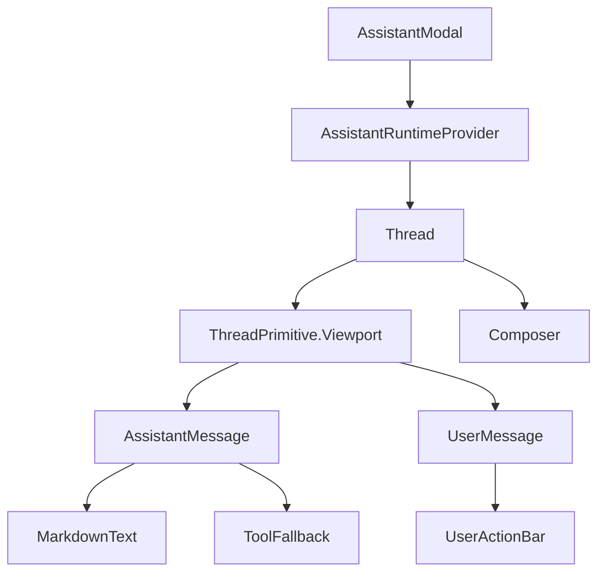
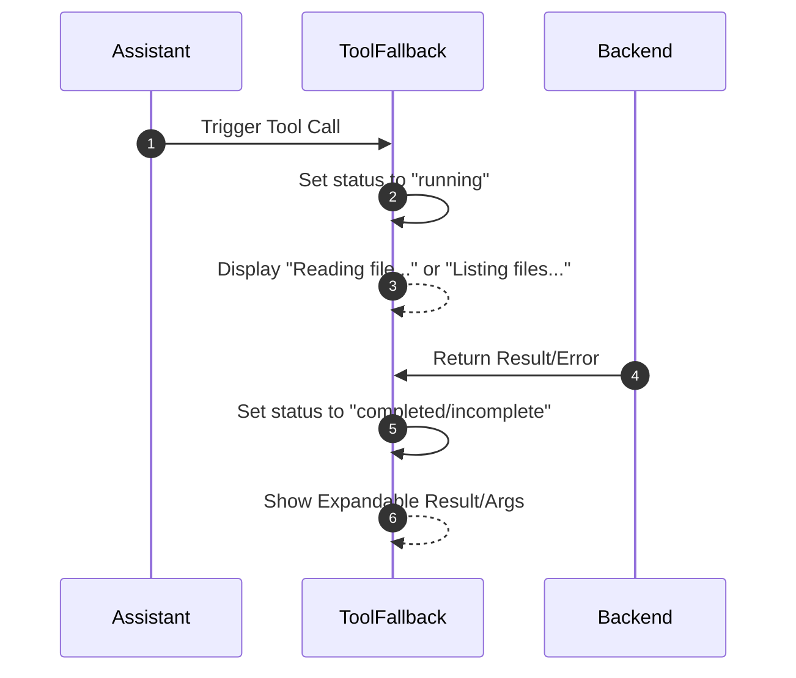

# AI Assistant Interface

The AI Assistant Interface provides a sophisticated, stateful chat experience integrated into the GitDex platform. It enables users to interact with the repository's AI index through a resizable sidebar, supporting complex markdown rendering, codebase-aware tool execution, and thread branching.

## Component Architecture

The interface is built using a provider-based pattern where the runtime state is decoupled from the visual components. The `AssistantModal` serves as the primary entry point and state orchestrator.

### Component Relationship Diagram

## Modal and Runtime Configuration

The `AssistantModal` manages the lifecycle of the chat session and its visual presentation.

### Transport and Connectivity
The interface utilizes `useChatRuntime` and `AssistantChatTransport` to communicate with the backend API [client/src/components/assistant-ui/assistant-modal.tsx:67-76](). 

| Configuration | Value/Source | Description |
| :--- | :--- | :--- |
| API Endpoint | `${apiBaseUrl}/api/chat` | The backend route handling chat completions [client/src/components/assistant-ui/assistant-modal.tsx:69]() |
| Header: Owner | `x-github-owner` | Passes the repository owner to the server [client/src/components/assistant-ui/assistant-modal.tsx:71]() |
| Header: Repo | `x-github-repo` | Passes the repository name to the server [client/src/components/assistant-ui/assistant-modal.tsx:72]() |

### User Interface Features
- **Responsive Design**: The modal adapts to mobile screens by becoming full-screen and implementing a backdrop blur [client/src/components/assistant-ui/assistant-modal.tsx:25-41]().
- **Dynamic Resizing**: On desktop, users can drag the left edge of the panel to adjust the width, constrained between 360px and 50% of the window width [client/src/components/assistant-ui/assistant-modal.tsx:44-65]().
- **Session Management**: A reset trigger is provided in the header to clear the current chat history via `runtime.thread.reset()` [client/src/components/assistant-ui/assistant-modal.tsx:116-122]().

## Thread Management

The `Thread` component orchestrates the message history and user input flow [client/src/components/assistant-ui/thread.tsx:17-23]().

### Message Flow and Constraints
To ensure performance and API stability, the interface implements specific usage limits:

- **Message Limit**: A maximum of 10 user messages are allowed per thread. Once reached, the composer is replaced by a limit notification [client/src/components/assistant-ui/thread.tsx:96-108]().
- **Attachment Limit**: The system limits the total number of attachments across a thread to 5 [client/src/components/assistant-ui/thread.tsx:123-134]().

### Interactive Features
- **Thread Branching**: Through the `BranchPicker`, users can navigate between different response versions (branches) of the conversation [client/src/components/assistant-ui/thread.tsx:261-280]().
- **Suggested Prompts**: When a thread is empty, `ThreadWelcome` displays predefined prompts to guide users on capabilities like architecture overview and API route discovery [client/src/components/assistant-ui/thread.tsx:68-113]().

## Content Rendering

The `MarkdownText` component provides high-fidelity rendering of AI responses, extending standard markdown with technical documentation requirements [client/src/components/assistant-ui/markdown-text.tsx:18-26]().

### Rendering Pipeline
The component utilizes a combination of `remark` and `rehype` plugins to support advanced notation:

| Plugin | Purpose |
| :--- | :--- |
| `remark-gfm` | GitHub Flavored Markdown (Tables, Tasklists) [client/src/components/assistant-ui/markdown-text.tsx:20]() |
| `remark-math` | Mathematical notation support [client/src/components/assistant-ui/markdown-text.tsx:20]() |
| `rehype-katex` | High-quality LaTeX math rendering [client/src/components/assistant-ui/markdown-text.tsx:21]() |

### Specialized Code Blocks
The renderer intercepts specific code languages to provide enhanced visualizations:
- **Mermaid Diagrams**: When a code block is marked as `mermaid`, the `MermaidCodeBlock` component renders an interactive diagram instead of raw text [client/src/components/assistant-ui/markdown-text.tsx:77-98]().
- **Code Headers**: Standard code blocks include a custom header with the language label and a copy-to-clipboard button [client/src/components/assistant-ui/markdown-text.tsx:31-52]().

## Tool Integration and Fallbacks

Because the AI assistant uses tools to explore the codebase (e.g., `listFiles`, `readFile`), the `ToolFallback` component visualizes these background operations [client/src/components/assistant-ui/tool-fallback.tsx:12-15]().

### Tool State Visualization

### Fallback Component Logic
The `ToolFallback` component handles three primary states based on the tool execution status [client/src/components/assistant-ui/tool-fallback.tsx:20-30]():

1. **Running**: Displays a spinning loader and a descriptive label (e.g., "Reading file...") [client/src/components/assistant-ui/tool-fallback.tsx:46-48]().
2. **Cancelled**: Displays a strike-through title and the specific cancellation reason [client/src/components/assistant-ui/tool-fallback.tsx:49-51]().
3. **Completed**: Displays a success checkmark and provides an expandable section containing:
   - **Arguments**: The exact parameters passed to the tool [client/src/components/assistant-ui/tool-fallback.tsx:78-84]().
   - **Result**: The output returned by the tool, formatted as a string or prettified JSON [client/src/components/assistant-ui/tool-fallback.tsx:86-93]().