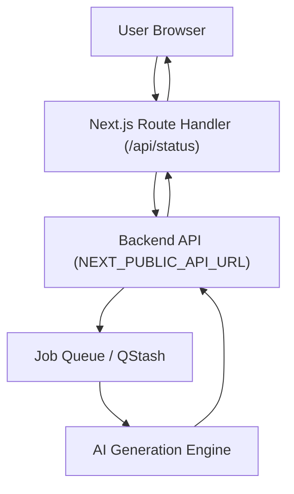

# API & Infrastructure

GitDex utilizes a decoupled architecture where a Next.js frontend serves as the orchestration layer between the end-user and a specialized backend AI engine. This section details the proxying mechanism, the asynchronous job monitoring system, and the routing infrastructure.

## Request Proxying

To maintain clean routing and provide the backend with necessary context regarding the requested resource, GitDex implements an edge-compatible proxy layer.

The `proxy.ts` middleware intercepts incoming requests and injects a custom `x-pathname` header. This allows the backend to identify the specific repository path being accessed without parsing the full URL string manually.

**Proxy Configuration:**
- **Excluded Paths:** `/api`, `/_next/static`, `/_next/image`, and `favicon.ico`.
- **Header Injection:** `x-pathname` is set to `request.nextUrl.pathname`.

## Status Monitoring & Indexing Flow

Generating documentation for a repository is a resource-intensive process handled asynchronously. GitDex uses a polling mechanism to provide real-time feedback to the user.

### Infrastructure Diagram



### The Job Lifecycle

When a user requests documentation for a repository, the system transitions through the following states:

| State | Description | UI Indicator |
| :--- | :--- | :--- |
| `loading` | Initial check of repository status. | Spinner / "Checking Status..." |
| `not-indexed` | No documentation exists for this repo. | "Start Indexing" Button |
| `queued` | Job is waiting for available worker capacity. | Hourglass / "Waiting in Queue" |
| `processing` | AI is actively generating documentation. | Progress Bar / Step-specific text |
| `failed` | An error occurred during the generation process. | Alert Icon / Error Message |

### Indexing Progress Steps

During the `processing` state, the backend reports a `currentStep` integer, which the frontend maps to the following progression:

1. **Step 0 (20%)**: Scanning repository files.
2. **Step 1 (40%)**: Planning documentation structure.
3. **Step 2 (75%)**: Writing documentation sections.
4. **Step 3 (90%)**: Uploading documentation.

## API Endpoints

The frontend interacts with the backend through a series of internal Next.js route handlers that act as a bridge.

### Get Repository Status
`GET /api/status?owner={owner}&repo={repo}`

Proxies the request to the backend to determine if the repository is indexed or if a job is currently active.

**Success Response:**
```json
{
  "indexed": boolean,
  "job": {
    "state": "queued" | "processing" | "completed" | "failed",
    "currentStep": number,
    "error": "string | null"
  }
}
```

### Trigger Indexing
`POST /api/index`

Initiates the AI documentation process for a specific repository.

**Request Body:**
```json
{
  "repoUrl": "https://github.com/{owner}/{repo}"
}
```

## Polling Strategy

To balance real-time updates with server load, the `StatusPage` implements an **Exponential Backoff Polling** strategy:
- **Initial Delay**: 2000ms.
- **Increment**: 1000ms per poll.
- **Maximum Cap**: 5000ms.
- **Reset**: The delay resets to 2000ms upon a manual "Try Again" trigger or a new indexing request.