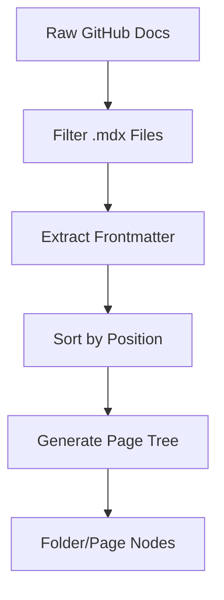

# Client-Side State & Data Fetching

GitDex employs a hybrid data fetching strategy that combines Next.js API routes as backend proxies with a client-side state management layer using Zustand. This architecture ensures that sensitive API keys (like GitHub tokens) remain server-side while providing a responsive, cached experience for the end user.

## State Management

The client manages the documentation state and caching through a centralized store implemented with Zustand. This prevents redundant network requests when users navigate between different pages of the same repository.

### Documentation Cache Store

The `useDocsStore` handles the retrieval and temporary storage of repository structures. It implements a Time-To-Live (TTL) mechanism to ensure data freshness.

**Key Store Properties:**
- **Cache TTL**: 10 minutes (`10 * 60 * 1000` ms).
- **Cache Key**: A string combining the owner and repository (`owner/repo`).

| Method | Description |
| :--- | :--- |
| `getDocs(owner, repo)` | Returns cached data if available and valid; otherwise, fetches fresh data via `getGithubDocs` and updates the cache. |
| `clearCache()` | Wipes all cached documentation. |
| `clearCacheFor(owner, repo)` | Removes the cache entry for a specific repository. |

```typescript
// Example of the cache structure in docs-store.ts
interface DocsCache {
  [key: string]: {
    data: DocsStructure;
    timestamp: number;
  };
}
```

## Dynamic Documentation Engine

The `DynamicDocsSource` class is responsible for transforming raw GitHub file data into a structured, navigable documentation tree compatible with the frontend.

### Processing Pipeline

The engine processes files through several stages to generate the final UI structure:

1.  **Filtering**: Only files ending in `.mdx` are processed; `meta.json` files are ignored.
2.  **Frontmatter Extraction**: A regex-based parser extracts metadata (title, description, sidebar position) from the top of MDX files.
3.  **Sorting**: Pages are sorted numerically based on the `sidebar_position` found in frontmatter (defaulting to `999`).
4.  **Hierarchy Generation**: The engine looks for filename prefixes (e.g., `1.1`) to group pages into folders.

### Data Structures

The primary unit of content is the `DocPage` object:

| Field | Type | Description |
| :--- | :--- | :--- |
| `url` | `string` | The relative path to the page. |
| `title` | `string` | Extracted from frontmatter or formatted from the filename. |
| `content` | `string` | The raw MDX content. |
| `sidebar_position` | `number` | Determines the order in the navigation tree. |
| `slugs` | `string[]` | An array of path segments for routing. |



## Backend API Communication

To maintain security and bypass CORS issues, the client communicates with the backend via Next.js API routes which act as proxies.

### Internal API Routes

| Endpoint | Method | Purpose | Logic |
| :--- | :--- | :--- | :--- |
| `/api/search` | `GET` | Repository Discovery | Uses `Octokit` to search GitHub. Applies a secondary client-side filter on `full_name`, `name`, and `description` for better partial matches. Returns up to 7 items. |
| `/api/status` | `GET` | Index Status | Proxies a request to the external backend (`NEXT_PUBLIC_API_URL`) to check if the specific `owner/repo` has been indexed. |

### Data Request Flow

The following sequence diagram illustrates the flow when the application requests documentation for a repository.

```mermaid
sequenceDiagram
    autonumber
    participant UI as "UI Component"
    participant Store as "useDocsStore"
    participant API as "GitHub API / Proxy"
    participant Engine as "DynamicDocsSource"

    UI ->> Store: getDocs(owner, repo)
    activate Store
    alt Cache Valid
        Store -->> UI: return cached data
    else Cache Miss/Expired
        Store ->> API: getGithubDocs(owner, repo)
        API -->> Store: return raw file data
        Store ->> Store: Update cache timestamp
        Store -->> UI: return data
    end
    deactivate Store
    UI ->> Engine: initialize()
    activate Engine
    Engine ->> Engine: Process Frontmatter & Hierarchy
    Engine -->> UI: return PageTree
    deactivate Engine