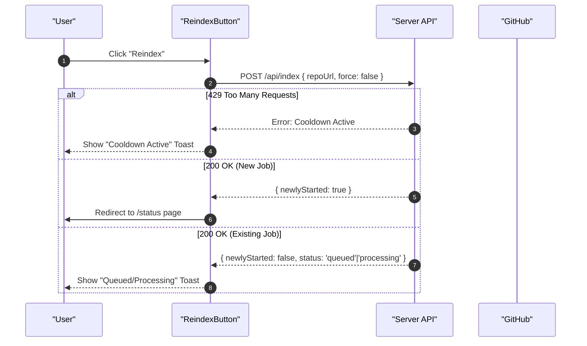

# Data Indexing & GitHub Integration

This module manages the retrieval of repository documentation from GitHub, the client-side caching layer to optimize performance, and the interface for triggering re-indexing jobs.

## GitHub Data Retrieval

The system does not fetch raw source code directly for the search index; instead, it retrieves processed documentation stored in a dedicated documentation repository.

### Fetching Logic
The retrieval process is handled by the `getGithubDocs` function, which targets a specific documentation repository (defaulting to `shinymacktest/gitdex-docs`) Sources: [client/src/lib/github.ts:16-19]().

The fetching workflow follows these steps:
1.  **Tree Discovery**: Uses the Octokit REST client to perform a recursive search of the `main` branch to find all files within the path `docs/${owner}/${repo}` Sources: [client/src/lib/github.ts:35-39]().
2.  **Blob Filtering**: Filters the tree results to include only items of type `blob` that match the repository path Sources: [client/src/lib/github.ts:41-43]().
3.  **Content Retrieval**: Fetches the raw text of each file via `raw.githubusercontent.com`. A timestamp query parameter (`?t=Date.now()`) is appended to bypass potential caching and ensure the latest version is retrieved Sources: [client/src/lib/github.ts:26-32]().
4.  **Metadata Parsing**: Specifically looks for a `meta.json` file within the retrieved files to populate the documentation metadata Sources: [client/src/lib/github.ts:51-55]().

### Data Structure
The retrieved data is normalized into a `DocsStructure` object:

| Field | Type | Description | Source |
| :--- | :--- | :--- | :--- |
| `index` | `string` | The index content for the repository. | [client/src/lib/github.ts:11]() |
| `meta` | `any` | Metadata parsed from `meta.json`. | [client/src/lib/github.ts:12]() |
| `files` | `DocFile[]` | Array of files containing `path` and `content`. | [client/src/lib/github.ts:13]() |

## Client-Side Caching Layer

To reduce API pressure and improve load times, GitDex implements a client-side cache using Zustand.

### Cache Mechanism
The `useDocsStore` manages a `DocsCache` where the key is the repository identifier (`owner/repo`) Sources: [client/src/lib/docs-store.ts:4-9]().

*   **TTL (Time To Live)**: The cache is configured with a TTL of 10 minutes (`10 * 60 * 1000` ms) Sources: [client/src/lib/docs-store.ts:15]().
*   **Retrieval Logic**: When `getDocs` is called, the store checks if a cached version exists and if the current time minus the cached timestamp is less than the TTL Sources: [client/src/lib/docs-store.ts:22-25]().
*   **Invalidation**: The store provides `clearCache()` and `clearCacheFor(owner, repo)` methods to manually purge cached data Sources: [client/src/lib/docs-store.ts:35-42]().

## Reindexing Workflow

Users can trigger a background re-indexing process via the `ReindexButton` component, which interacts with the backend API to update the documentation index.

### Interaction Flow
The reindexing process involves several states and API interactions:

### API Endpoints Used
The indexing interface relies on two primary endpoints:

| Endpoint | Method | Purpose | Source |
| :--- | :--- | :--- | :--- |
| `/api/index` | `POST` | Triggers the indexing pipeline for a specific `repoUrl`. | [client/src/components/ReindexButton.tsx:44-48]() |
| `/api/status` | `GET` | Fetches the `lastIndexed` timestamp and current job state (`queued`, `processing`). | [client/src/components/ReindexButton.tsx:31-33]() |

### Component State Management
The `ReindexButton` manages its internal state to provide visual feedback:
*   **Idle**: Default state.
*   **Loading**: Displayed as "Queuing..." with a `Loader2` spinner during the API call Sources: [client/src/components/ReindexButton.tsx:89-93]().
*   **Error**: Displayed with an `AlertCircle` icon if the request fails Sources: [client/src/components/ReindexButton.tsx:91]().
*   **Success**: Triggered when `newlyStarted` is true, leading to a status page redirection Sources: [client/src/components/ReindexButton.tsx:65-68]().