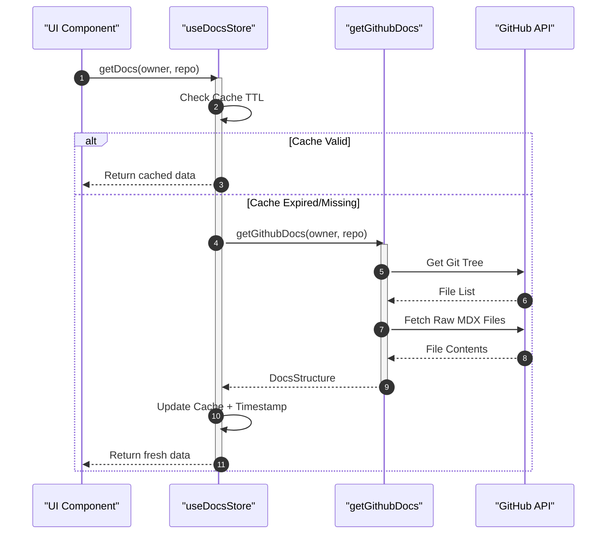
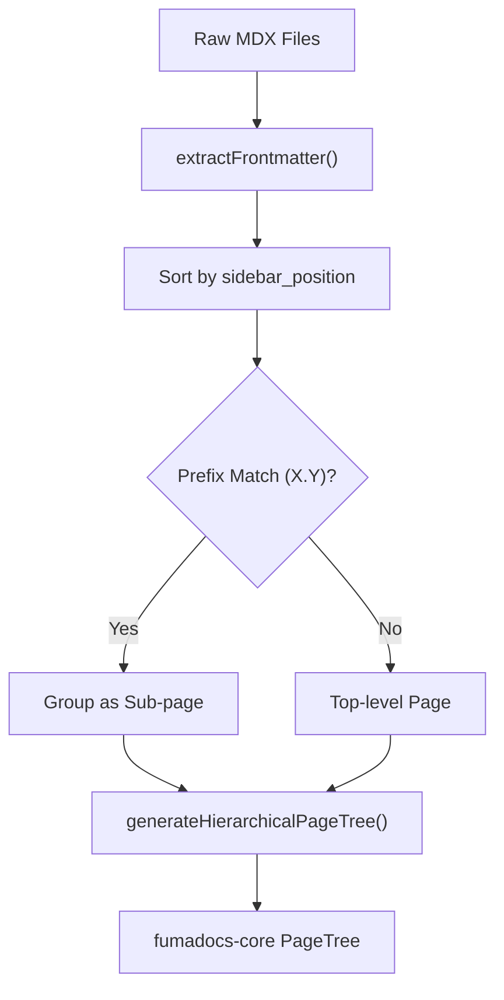

# GitHub Integration & Data Store

This module manages the lifecycle of documentation data within GitDex, from the initial retrieval of raw files from GitHub to the structured, cached representation used by the frontend UI. It ensures that documentation is fetched efficiently, cached to reduce API overhead, and transformed into a hierarchical tree for navigation.

## Data Acquisition Flow

The process of retrieving documentation follows a specific sequence to ensure that only relevant files for a specific owner and repository are loaded.

### GitHub Fetching Logic

The `getGithubDocs` function in `client/src/lib/github.ts` acts as the primary gateway to the external documentation repository. It uses a combination of the GitHub REST API (via Octokit) for directory traversal and direct raw content requests for file retrieval.

**Fetching Process:**
1. **Tree Retrieval:** Uses `octokit.rest.git.getTree` to recursively fetch the file structure of the `gitdex-docs` repository.
2. **Path Filtering:** Filters the tree to find blobs starting with the path `docs/${owner}/${repo}/`.
3. **Content Retrieval:** Iterates through the filtered files and fetches their raw text from `raw.githubusercontent.com`.
4. **Metadata Extraction:** Specifically identifies `meta.json` to extract repository-level configuration.

```typescript
// Example of the fetch mechanism used for individual files
const url = `https://raw.githubusercontent.com/${docsRepoOwner}/${docsRepo}/${branch}/${path}?t=${Date.now()}`;
const res = await fetch(url, {
    headers,
    cache: 'no-store'
});
```

## Client-Side Data Store

To prevent redundant network requests and improve performance, GitDex implements a client-side cache using a Zustand store.

### Cache Management

The `useDocsStore` in `client/src/lib/docs-store.ts` manages a `DocsCache` object where keys are formatted as `owner/repo`.

| Feature | Implementation | Detail |
| :--- | :--- | :--- |
| **State Tool** | Zustand | Used for global reactive state management. |
| **Cache TTL** | 10 Minutes | Defined by `CACHE_TTL = 10 * 60 * 1000`. |
| **Key Format** | `${owner}/${repo}` | Unique identifier for each repository's docs. |
| **Invalidation** | `clearCacheFor` | Allows targeted removal of a specific repo's cache. |

### Data Flow Diagram

The following sequence diagram illustrates the interaction between the UI, the state store, and the GitHub integration layer.



## Dynamic Documentation Source

Once raw data is fetched, the `DynamicDocsSource` class in `client/src/lib/dynamic-source.ts` transforms the flat file list into a structured documentation system.

### Document Processing Pipeline

The `initialize()` method processes the `DocsStructure` through the following pipeline:

1. **Filtering:** Retains only `.mdx` files and excludes `meta.json`.
2. **Frontmatter Extraction:** Parses the top of each file for YAML-style metadata.
3. **Property Mapping:** Assigns titles, descriptions, and `sidebar_position`.
4. **Sorting:** Orders pages based on the `sidebar_position` (defaulting to 999).
5. **Tree Generation:** Converts the sorted list into a hierarchical `PageTree`.

### Frontmatter Specification

GitDex parses the following keys from the MDX frontmatter:

| Key | Type | Description |
| :--- | :--- | :--- |
| `title` | `string` | The display name of the page. |
| `description` | `string` | Brief summary of the page content. |
| `sidebar_position` | `string` | Numerical order for sorting in the sidebar. |

### Hierarchical Page Tree Logic

The `generateHierarchicalPageTree` method creates a nested structure based on filename prefixes. If a filename follows the pattern `X.Y` (e.g., `1.1_introduction.mdx`), it is treated as a child of the top-level page `X` (e.g., `1_getting-started.mdx`).



### Page Retrieval

The `DynamicDocsSource` provides a method to retrieve specific pages using slugs:

```typescript
getPage(slugs: string[] = []): DocPage | null {
    const url = '/' + slugs.join('/');
    const page = this.pages.find(page => page.url === url);
    return page || null;
}