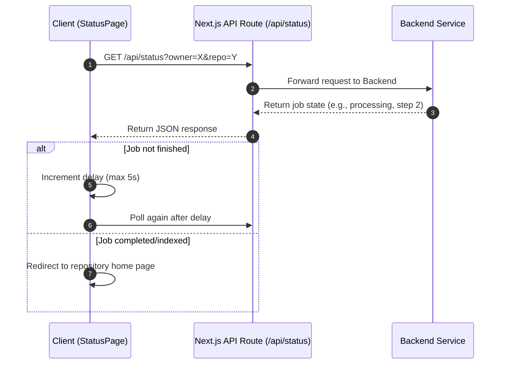
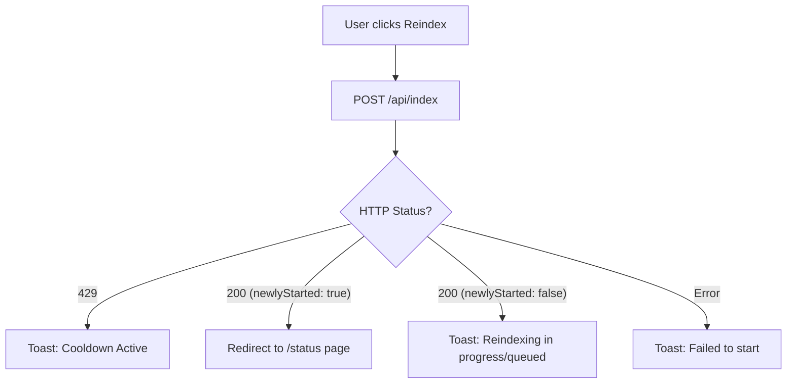

# Repository Indexing and Status

This section details the lifecycle of repository indexing within GitDex, the mechanism for polling the status of background jobs, and the triggers used to initiate or refresh the indexing process.

## Indexing Lifecycle

The indexing process is an asynchronous pipeline that transforms a GitHub repository into structured AI-powered documentation. The system tracks the progression of this pipeline through a set of defined states.

### Indexing States
The UI reflects the current state of the indexing job to provide real-time feedback to the user:

| State | Description | UI Representation |
| :--- | :--- | :--- |
| `loading` | Initial state while the client determines the repository's status. | "Checking Status..." |
| `not-indexed` | No documentation exists for the repository. | "Repository Status" with "Start Indexing" button. |
| `queued` | A job has been created but is waiting for available resources. | "Waiting in Queue" (Hourglass icon). |
| `processing` | The AI pipeline is actively analyzing and writing documentation. | "Indexing In Progress" (Spinning loader). |
| `failed` | An error occurred during the background process. | "Indexing Failed" with error details and retry option. |

### Processing Steps
When a job is in the `processing` state, it progresses through four distinct stages. These stages are mapped to a progress bar in the `StatusPage` component:

```typescript
const STEP_INFO: Record<number, { text: string; progress: number }> = {
  0: { text: 'Scanning repository files...', progress: 20 },
  1: { text: 'Planning documentation structure...', progress: 40 },
  2: { text: 'Writing documentation sections...', progress: 75 },
  3: { text: 'Uploading documentation...', progress: 90 },
};
```

## Status Polling Mechanism

Because indexing is a long-running background process (managed via QStash), the client implements a polling mechanism to synchronize the UI with the backend state.

### Polling Logic
The `StatusPage` utilizes a recursive polling strategy with a dynamic delay to balance responsiveness with server load.



**Key Implementation Details:**
- **Adaptive Delay:** The polling interval starts at 2,000ms and increases by 1,000ms per request, capping at 5,000ms.
- **Termination Conditions:** Polling stops if the backend reports `indexed: true`, if the job state is `failed`, or if the component unmounts.
- **API Proxy:** The client does not call the backend directly; it uses `client/src/app/api/status/route.ts` as a proxy to handle environment-specific API URLs.

## Re-indexing Trigger Mechanism

Users can trigger a fresh index of the repository using the `ReindexButton` component. This is particularly useful when the underlying source code has changed.

### Trigger Workflow
The re-indexing process follows a specific logic path to prevent redundant jobs and handle rate limits:



### Implementation Details

**Reindex Request Payload:**
The trigger sends a POST request with the following body:
```json
{
  "repoUrl": "https://github.com/{owner}/{repo}",
  "force": false
}
```

**Key Features of the Reindex Button:**
- **Last Indexed Timestamp:** The component fetches the `lastIndexed` value from the status API and displays it as a relative time (e.g., "2h ago").
- **State Management:** The button transitions through `idle` $\rightarrow$ `loading` $\rightarrow$ `success`/`error` to prevent multiple simultaneous clicks.
- **Intelligent Routing:** If a brand new job is successfully started (`newlyStarted: true`), the user is redirected to the `/status` page to track progress. If a job is already active, the user remains on the current page and receives a notification toast.

## API Interface Summary

The following endpoints are utilized for managing and monitoring the indexing lifecycle:

| Endpoint | Method | Purpose | Key Parameters |
| :--- | :--- | :--- | :--- |
| `/api/status` | `GET` | Checks if a repo is indexed and retrieves job state. | `owner`, `repo` |
| `/api/index` | `POST` | Initiates the indexing pipeline for a repository. | `repoUrl`, `force` |