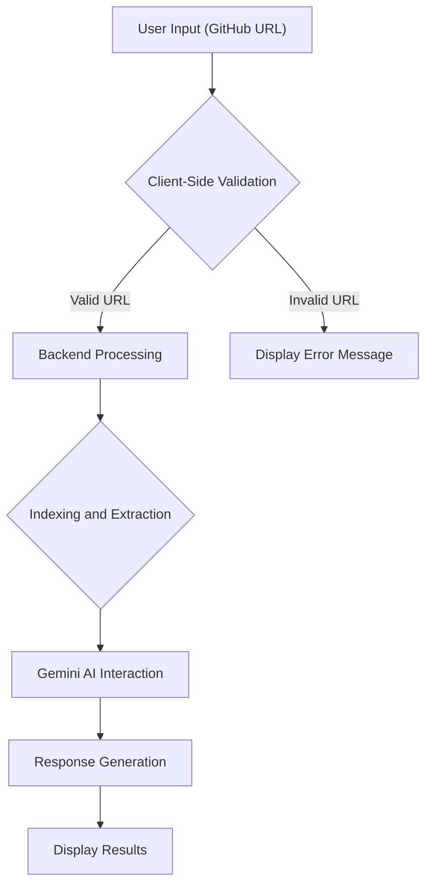

# Testing and Validation

This document details the testing methodologies and validation processes employed in the `shinymack/gitdex` project. Robust testing and validation are crucial for ensuring the reliability and correctness of the application, especially given its role in indexing and retrieving information from GitHub repositories and interacting with language models.

## Validation

### GitHub URL Validation

The client-side validation logic ensures that users provide valid GitHub URLs. This is implemented in `client/lib/validation.ts`.

```typescript filename="client/lib/validation.ts"
export function validateGitHubUrl(url: string): { valid: boolean; error?: string } {
  if (!url || url.trim() === '') {
    return { valid: false, error: "GitHub URL is required" };
  }

  const trimmedUrl = url.trim();
  
  // Check for GitHub URL format
  const githubRegex = /^https?:\/\/(?:www\.)?github\.com\/[a-zA-Z0-9_.-]+\/[a-zA-Z0-9_.-]+(?:\/)?$/;
  if (!githubRegex.test(trimmedUrl)) {
    return { 
      valid: false, 
      error: "Invalid GitHub URL format. Use https://github.com/owner/repo" 
    };
  }

  return { valid: true };
}
```

This function checks if the provided URL matches the expected GitHub URL format using a regular expression. If the URL is invalid, an error message is returned.

[View on GitHub](https://github.com/shinymack/gitdex/blob/main/client/lib/validation.ts)

### Extracting Owner and Repository

The `extractOwnerRepoFromUrl` function in `client/lib/validation.ts` extracts the owner and repository name from a given GitHub URL.

```typescript filename="client/lib/validation.ts"
export function extractOwnerRepoFromUrl(url: string): { valid: boolean; owner?: string; repo?: string; error?: string } {
  if (!url || url.trim() === '') {
    return { valid: false, error: "URL is required" };
  }

  const trimmedUrl = url.trim();
  
  // Handle GitHub URLs
  const githubRegex = /(?:https?:\/\/)?(?:www\.)?github\.com\/([a-zA-Z0-9_.-]+)\/([a-zA-Z0-9_.-]+)(?:\/)?/;
  const match = trimmedUrl.match(githubRegex);
  
  if (match) {
    return { 
      valid: true, 
      owner: match[1],
      repo: match[2].replace('.git', '')
    };
  }
  
  return { 
    valid: false, 
    error: "Invalid GitHub URL format. Use https://github.com/owner/repo" 
  };
}
```

This function uses a regular expression to capture the owner and repository name from the URL. This is crucial for backend operations that need to interact with the GitHub API.

[View on GitHub](https://github.com/shinymack/gitdex/blob/main/client/lib/validation.ts)

## Client-Side Testing

The `client/test.ts` file showcases basic tests for the dynamic source creation and relative link resolution functionalities.

```typescript filename="client/test.ts"
// test-dynamic-source.ts
import { createDynamicSource, extractHeadings, resolveRelativeLink } from './lib/dynamic-source';

async function test() {
  try {
    // Replace with a real indexed repo (e.g., from your backend run)
    const repo = 'Chat-App-MERN'; // Or whatever you indexed
    console.log(`\nTesting for repo: ${repo}\n`);

    const source = await createDynamicSource(repo);
    console.log('=== Page Tree (Sidebar Structure) ===');
    console.dir(source.pageTree, { depth: 3 }); // Logs hierarchical nodes

    console.log('\n=== Pages Map (All Files) ===');
    console.log(Object.keys(source.pagesMap)); // Logs slugs like ['_toc', '1_system-overview', '2.1_authentication...']

    console.log('\n=== Sample Page Data ===');
    const sample = source.pagesMap['1_system-overview']; // Adjust slug if needed
    if (sample) console.dir(sample, { depth: 1 });

    console.log('\n=== Sample Relative Link Resolution ===');
    // From slug ['2_backend-architecture-and-apis'], resolve './3.1_user-interface-components.mdx'
    const resolved = resolveRelativeLink(['2_backend-architecture-and-apis'], './3.1_user-interface-components.mdx', source.pagesMap);
    console.log('Resolved href:', resolved); // Should be '/3.1-user-interface-components' (wait, slugify? Wait, in resolve, I have it as is; adjust if titles have spaces)

    console.log('\n=== Sample Headings Extraction (from a content snippet) ===');
    // Mock content for test
    const mockContent = '# H1 Title\n## H2 Sub\n### H3 Deep\nText here';
    const headings = extractHeadings(mockContent);
    console.dir(headings, { depth: 1 });
  } catch (error) {
    console.error('Test failed:', error);
    // Common issues: 404 if repo/docs/{repo} not indexed yet, or invalid token
  }
}

test();
```

This test script simulates the creation of a dynamic source, extracts headings from mock content, and resolves relative links. It provides a basic sanity check for the client-side functionalities.

[View on GitHub](https://github.com/shinymack/gitdex/blob/main/client/test.ts)

### Heading Extraction

The heading extraction functionality is tested to ensure that headings are correctly parsed from markdown content.

```typescript filename="client/test.ts"
    console.log('\n=== Sample Headings Extraction (from a content snippet) ===');
    // Mock content for test
    const mockContent = '# H1 Title\n## H2 Sub\n### H3 Deep\nText here';
    const headings = extractHeadings(mockContent);
    console.dir(headings, { depth: 1 });
```

This ensures that the table of contents and other structural elements can be correctly generated from the indexed content.

### Relative Link Resolution

The relative link resolution is tested to ensure navigation between pages functions correctly.

```typescript filename="client/test.ts"
    console.log('\n=== Sample Relative Link Resolution ===');
    // From slug ['2_backend-architecture-and-apis'], resolve './3.1_user-interface-components.mdx'
    const resolved = resolveRelativeLink(['2_backend-architecture-and-apis'], './3.1_user-interface-components.mdx', source.pagesMap);
    console.log('Resolved href:', resolved); // Should be '/3.1-user-interface-components' (wait, slugify? Wait, in resolve, I have it as is; adjust if titles have spaces)
```

This helps maintain a seamless user experience when navigating the indexed documentation.

## Server-Side Testing

The `server/routes/testGemini.js` file demonstrates how to test the integration with the Gemini AI model.

```javascript filename="server/routes/testGemini.js"
import express from 'express';
import { GoogleGenAI } from '@google/genai';

const router = express.Router();

router.get('/', async (req, res) => {
    const GEMINI_API_KEY = process.env.GEMINI_API_KEY;

    const ai = new GoogleGenAI({ apiKey: GEMINI_API_KEY });

    
    const response = await ai.models.generateContent({
        model: 'gemini-2.5-flash',
        contents: 'Why is the sky blue?',
    });
    console.log(response.text);

});

export default router;
```

This route sends a simple query to the Gemini AI model and logs the response. It serves as a basic integration test to ensure the API key is correctly configured and the model is accessible.

[View on GitHub](https://github.com/shinymack/gitdex/blob/main/server/routes/testGemini.js)

## Testing Flow





## Key Integration Points

- **Client-Side Validation**: Ensures that user input is valid before sending it to the backend, reducing unnecessary server load and improving user experience.
- **Backend Processing**: Handles the indexing and extraction of information from GitHub repositories.
- **Gemini AI Integration**: Leverages the Gemini AI model to generate responses based on the indexed data.

## Best Practices

- Implement comprehensive unit tests for individual functions and components.
- Use integration tests to verify the interaction between different parts of the system.
- Employ end-to-end tests to simulate user workflows and ensure the application behaves as expected.
- Regularly review and update tests to reflect changes in the codebase.
- Utilize continuous integration (CI) to automatically run tests whenever code is committed.
```