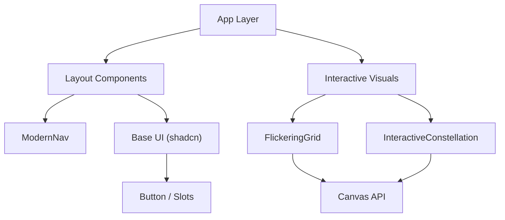

# UI Component System

The GitDex UI layer is engineered for high-performance visual fidelity and a modern, minimal aesthetic. It employs a hybrid approach, combining a robust design system based on **shadcn/ui** for structural elements with custom **HTML5 Canvas** implementations for immersive, interactive backgrounds.

## Architecture Overview

The component hierarchy is split between static atomic components and dynamic visual controllers.

## Base UI Layer

GitDex utilizes a modified implementation of `shadcn/ui`, leveraging `class-variance-authority` (CVA) to manage component states and styles.

### Button Component
The `Button` component is the primary atomic unit for user interaction. It supports a wide array of variants and sizes through a strictly typed configuration.

**Key Features:**
- **Polymorphism:** Uses `@radix-ui/react-slot` via the `asChild` prop, allowing the button to render as a different element (e.g., a `Link`) while maintaining button styles.
- **Styling Variants:** Includes `default`, `destructive`, `outline`, `secondary`, `ghost`, and `link`.
- **Responsive Sizing:** Offers specialized sizes ranging from `sm` to `lg`, including `icon` presets for square buttons.

## Specialized Interactive Elements

To create a "developer-centric" atmosphere, GitDex implements two high-performance canvas components that react to user input in real-time.

### Flickering Grid
The `FlickeringGrid` creates a subtle, digital-rain inspired background. It renders a grid of squares that independently oscillate in opacity.

**Technical Specifications:**
- **DPI Scaling:** Automatically detects `window.devicePixelRatio` to prevent blurriness on Retina/4K displays.
- **Theme Integration:** Dynamically parses the `--primary` CSS variable from the document root to ensure the grid color matches the active theme.
- **Interactivity:** Implements a "cursor aura" effect where cells near the mouse position increase in opacity.

### Interactive Constellation
The `InteractiveConstellation` is a particle-based system that simulates a neural network or star map.

**Technical Specifications:**
- **Magnetic Physics:** Particles are attracted to the mouse cursor when it enters the canvas bounds.
- **Dynamic Linking:** Lines are drawn between particles that fall within a specific distance threshold, with alpha transparency scaled by proximity.
- **Parallax Drift:** A slow, sinusoidal rotation is applied to the entire particle set to create a subtle 3D depth effect.

## Navigation & Layout

### ModernNav
The `ModernNav` component serves as the primary application gateway. It is designed as a floating "island" with a glassmorphism effect.

**Implementation Details:**
- **Glassmorphism:** Uses `backdrop-blur-md` combined with semi-transparent background colors (`bg-background/45`) for a frosted glass look.
- **Hydration Safety:** Implements a `mounted` state check to prevent hydration mismatch when accessing `next-themes` on the server.
- **Adaptive UI:** Transitions from a horizontal desktop menu to a vertical mobile drawer via a state-driven toggle.

## Implementation Summary Table

| Component | Technology | Key Performance Logic | Purpose |
| :--- | :--- | :--- | :--- |
| `Button` | React + CVA | Tailwind utility merging | Standard Actions |
| `ModernNav` | React + Lucide | `next-themes` integration | App Navigation |
| `FlickeringGrid` | Canvas 2D | `requestAnimationFrame` | Ambient Texture |
| `InteractiveConstellation` | Canvas 2D | Distance-based vector math | Hero Interaction |