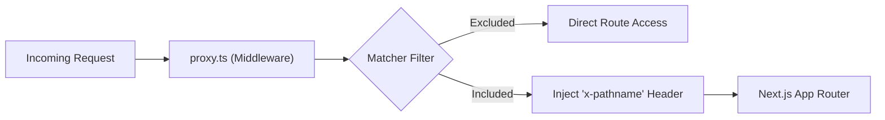

# API Layer & Communication

The API layer in GitDex serves as a mediation point between the frontend user interface and the backend processing services or external APIs (such as GitHub). This layer is implemented using Next.js Route Handlers and Edge Middleware to handle request proxying, authentication headers, and data filtering.

## Request Middleware & Proxying

GitDex utilizes a proxy mechanism via Edge Middleware to intercept incoming requests and enrich them with metadata before they reach the application routes.

### Proxy Configuration
The `client/proxy.ts` file implements a middleware function that ensures the current request pathname is available in the request headers.

```typescript
export function proxy(request: NextRequest) {
  const requestHeaders = new Headers(request.headers);
  requestHeaders.set('x-pathname', request.nextUrl.pathname);

  return NextResponse.next({
    request: {
      headers: requestHeaders,
    },
  });
}
```

The middleware is configured to ignore specific paths to optimize performance and avoid unnecessary overhead on static assets:
- `/api/*`
- `/_next/static/*`
- `/_next/image*`
- `/favicon.ico`

### Request Flow Diagram



## Internal API Routes

The client application implements internal API routes that act as bridges to the backend server or external services. This architecture prevents the exposure of sensitive environment variables (like `GITHUB_TOKEN`) to the client-side browser.

### Route Mapping

| Endpoint | Method | Purpose | Target |
| :--- | :--- | :--- | :--- |
| `/api/index` | `POST` | Triggers repository indexing | Backend Server (`NEXT_PUBLIC_API_URL`) |
| `/api/search` | `GET` | Searches GitHub repositories | GitHub API (via Octokit) |

### Indexing Request Proxy (`/api/index`)
The index route forwards indexing requests from the frontend to the backend processing pipeline. It validates the presence of a `repoUrl` and passes the `force` flag to allow re-indexing of existing repositories.

**Request Payload:**
- `repoUrl` (string, required): The URL of the GitHub repository to index.
- `force` (boolean, optional): If true, forces a re-index of the repository.

### Repository Search (`/api/search`)
The search route integrates with the GitHub API using the `@octokit/rest` library. It performs a search and applies a secondary filtering layer to improve the relevance of partial-name matches.

**Search Logic Flow:**
1. **Fetch:** Requests up to 50 repositories from GitHub using the query `q` in names and descriptions.
2. **Filter:** Performs a case-insensitive check to ensure the query string is contained within the `full_name`, `name`, or `description`.
3. **Limit:** Slices the result set to return the top 7 most relevant items.

```typescript
const items = (res.data.items || [])
  .filter((repo: any) => {
    const qLower = q.toLowerCase();
    const name = (repo.name || '').toLowerCase();
    const full = (repo.full_name || '').toLowerCase();
    const desc = (repo.description || '').toLowerCase();
    return full.includes(qLower) || name.includes(qLower) || desc.includes(qLower);
  })
  .slice(0, 7);
```

## Communication Sequence

The following sequence diagram illustrates the interaction between the Client UI, the Next.js Route Handlers, and the external/backend destinations.

```mermaid
sequenceDiagram
    autonumber
    participant UI as "Client UI"
    participant RH as "Route Handler"
    participant Ext as "Backend / GitHub API"

    rect rgb(240, 240, 240)
    Note over UI, Ext: Indexing Flow
    UI ->> RH: POST /api/index {repoUrl, force}
    activate RH
    RH ->> Ext: fetch(NEXT_PUBLIC_API_URL/api/index)
    Ext -->> RH: JSON Response
    RH -->> UI: JSON Response
    deactivate RH
    end

    rect rgb(230, 240, 255)
    Note over UI, Ext: Search Flow
    UI ->> RH: GET /api/search?q=query
    activate RH
    RH ->> Ext: octokit.request('GET /search/repositories')
    Ext -->> RH: Raw Repo List
    Note right of RH: Filter & Slice (top 7)
    RH -->> UI: Filtered JSON Items
    deactivate RH
    end