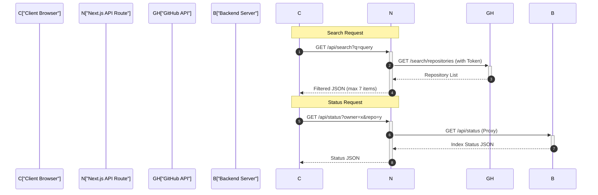
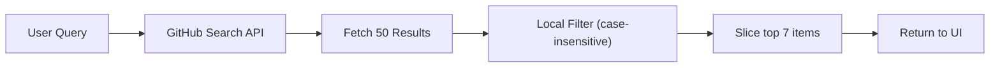

# API & Proxy Layer

The API and Proxy layer of GitDex manages the communication between the frontend client, the dedicated backend server, and external third-party services like the GitHub API. This layer is primarily implemented using Next.js Route Handlers and Edge Middleware to handle request routing, authentication proxying, and data retrieval.

## Edge Proxy Middleware

GitDex utilizes a proxy configuration to handle request headers and routing logic at the edge. This ensures that specific path information is preserved and passed through the request pipeline.

### Proxy Logic
The `proxy` function intercepts incoming requests and injects the current pathname into the request headers as `x-pathname`. This allows downstream handlers to identify the original request path. Sources: [client/proxy.ts:4-13]()

### Routing Matcher
To prevent unnecessary processing, the proxy middleware is configured with a matcher that excludes static assets and internal API routes. Sources: [client/proxy.ts:15-19]()

```typescript
export const config = {
  matcher: [
    '/((?!api|_next/static|_next/image|favicon.ico).*)',
  ],
};
```
Sources: [client/proxy.ts:15-19]()

## Internal API Routes

The client implementation includes several API routes that act as intermediaries to hide sensitive tokens or bridge the gap between the Next.js frontend and the Node.js backend.

### Repository Search API
The search route provides a way for users to find repositories by querying the GitHub API via Octokit. Sources: [client/src/app/api/search/route.ts:4-40]()

1. **Authentication**: It uses a server-side environment variable `GITHUB_TOKEN` to authenticate requests to GitHub, preventing the token from being exposed to the client. Sources: [client/src/app/api/search/route.ts:14]()
2. **Querying**: It fetches up to 50 repositories matching the query `q` in the name or description. Sources: [client/src/app/api/search/route.ts:17-20]()
3. **Filtering**: To improve the user experience during partial typing, it performs a lightweight local filter to ensure the query string is present in the `full_name`, `name`, or `description` fields. Sources: [client/src/app/api/search/route.ts:23-30]()
4. **Output**: The API returns a sliced array of a maximum of 7 items. Sources: [client/src/app/api/search/route.ts:31]()

### Status Proxy API
The status route acts as a proxy between the frontend and the backend server to check if a specific repository has been indexed. Sources: [client/src/app/api/status/route.ts:4-38]()

- **Target URL**: The request is forwarded to the backend URL defined in `process.env.NEXT_PUBLIC_API_URL` (defaulting to `http://localhost:3001`). Sources: [client/src/app/api/status/route.ts:15]()
- **Parameters**: It requires `owner` and `repo` as query parameters. Sources: [client/src/app/api/status/route.ts:7-8]()
- **Error Handling**: If the backend response is not valid JSON or the request fails, it defaults to returning `{ indexed: false }`. Sources: [client/src/app/api/status/route.ts:22-27]()

## Communication Workflow

The following sequence diagram illustrates how the client interacts with the various API layers depending on the request type.



## API Reference

| Endpoint | Method | Purpose | Source | Key Parameters |
| :--- | :--- | :--- | :--- | :--- |
| `/api/search` | `GET` | Search GitHub repositories | `client/src/app/api/search/route.ts` | `q` (string) |
| `/api/status` | `GET` | Check indexing status via backend | `client/src/app/api/status/route.ts` | `owner`, `repo` |

### Data Flow Logic

The system utilizes a filtering flow for searches to ensure relevance:


Sources: [client/src/app/api/search/route.ts:17-31]()