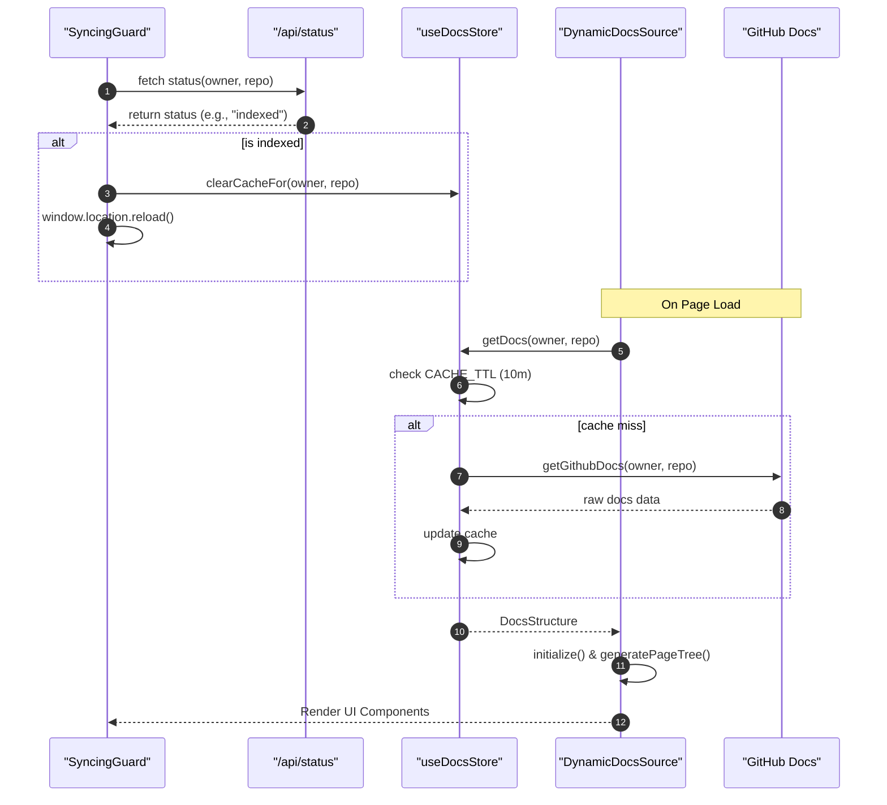
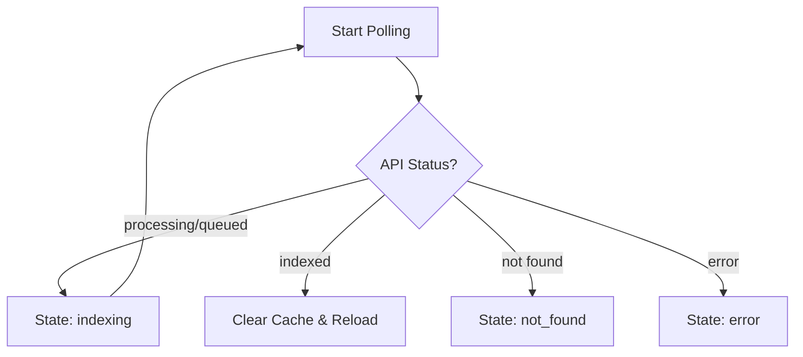

# Client-Side State and Data Flow

This section describes the architecture used to fetch, cache, and transform documentation data from the backend into a navigable structure on the client side. GitDex utilizes a combination of a global state store, a dynamic data source transformer, and a synchronization guard to ensure users see the most up-to-date documentation.

## Data Flow Architecture

The flow of data begins with a status check to ensure the repository has been indexed, followed by a cached retrieval of documentation files, which are then parsed into a hierarchical page tree for the UI.



## State Management and Caching

GitDex uses **Zustand** to manage the client-side documentation state. The `useDocsStore` acts as a middleware between the raw API responses and the UI components, preventing redundant network requests via a Time-To-Live (TTL) cache.

### Cache Implementation
The store implements a simple key-value cache where the key is a combination of the repository owner and name.

| Feature | Detail |
| :--- | :--- |
| **Cache TTL** | 10 minutes (`10 * 60 * 1000` ms) |
| **Storage Key** | `${owner}/${repo}` |
| **State Store** | Zustand |

### Core Store Methods
```typescript
interface DocsStore {
  cache: DocsCache;
  getDocs: (owner: string, repo: string) => Promise<DocsStructure>;
  clearCache: () => void;
  clearCacheFor: (owner: string, repo: string) => void;
}
```
*   `getDocs`: Checks if valid cached data exists; if not, it fetches fresh data via `getGithubDocs`.
*   `clearCacheFor`: Specifically removes a repository from the cache, used primarily by the `SyncingGuard` when a status change is detected.

## Dynamic Documentation Transformation

Once the raw documentation data is retrieved, the `DynamicDocsSource` class transforms it into a format compatible with `fumadocs-core`.

### The Transformation Pipeline
1.  **Filtering**: Only files ending in `.mdx` are processed; `meta.json` files are excluded.
2.  **Frontmatter Extraction**: The class parses the top of MDX files to extract `title`, `description`, and `sidebar_position`.
3.  **Slug Generation**: Filenames are converted into URL paths.
4.  **Sorting**: Pages are sorted based on the `sidebar_position` extracted from frontmatter (defaulting to 999).
5.  **Tree Generation**: A hierarchical page tree is built by analyzing filename prefixes (e.g., `1.1` is nested under `1`).

### DocPage Structure
The resulting `DocPage` object used by the UI contains:

| Field | Type | Description |
| :--- | :--- | :--- |
| `url` | `string` | The relative path to the page |
| `title` | `string` | Extracted from frontmatter or formatted filename |
| `content` | `string` | Raw MDX content |
| `sidebar_position`| `number` | Order of appearance in the navigation |
| `slugs` | `string[]` | Array of path segments |

## Lifecycle Guarding

The `SyncingGuard` component acts as a gatekeeper, preventing the user from interacting with empty or outdated documentation while the AI agent is still processing the repository.

### Status Polling Logic
The guard polls the `/api/status` endpoint every **3 seconds**. It manages the UI state based on the following mapping:



### Guard States and UI Response
| Status | UI Indicator | Action |
| :--- | :--- | :--- |
| `loading` | "Checking status..." | Show `DocsSkeleton` |
| `indexing` | "Agent is reading repository..." | Show `DocsSkeleton` |
| `not_found` | "Documentation Not Found" | Link to `/status` to start indexing |
| `error` | "Error Checking Status" | Show error message and Retry button |