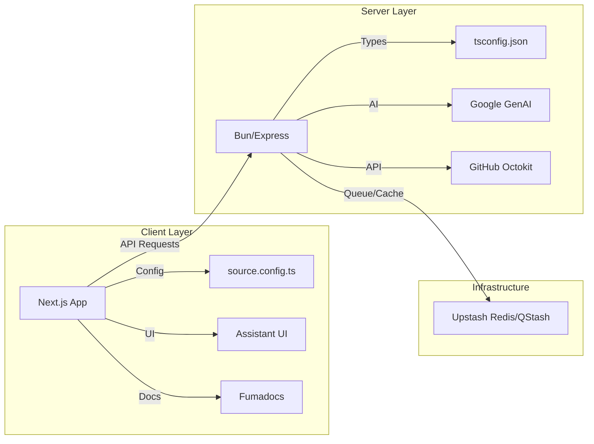

# Configuration & Deployment

This section provides the technical specifications for the GitDex environment, including dependency management, TypeScript configurations, and the build pipeline for both the client and server components.

## Server Configuration

The GitDex server is built as a Node.js application optimized for the **Bun** runtime, utilizing Express for API routing and a variety of AI and data persistence integrations.

### Runtime and TypeScript Setup

The server utilizes a modern TypeScript configuration to support ESNext features and efficient module resolution.

**Key TypeScript Options (`server/tsconfig.json`):**
- **Target/Lib**: `ESNext` for maximum modern JavaScript capability.
- **Module Resolution**: `bundler`, allowing for flexible import strategies.
- **Strictness**: `strict: true` and `noUncheckedIndexedAccess: true` are enabled to ensure type safety across the indexing pipeline.

### Server Dependencies

The server architecture relies on several critical third-party integrations for AI processing, queue management, and GitHub API interaction.

| Dependency | Purpose | Version |
| :--- | :--- | :--- |
| `express` | Web framework for API endpoints | `^5.2.1` |
| `@ai-sdk/google` / `@google/genai` | Integration with Google Gemini AI | `^3.0.83` / `^1.52.0` |
| `@octokit/rest` | GitHub API client for repository access | `^22.0.1` |
| `@upstash/redis` / `ioredis` | Fast data caching and state management | `^1.38.0` / `^5.11.1` |
| `@upstash/qstash` | Distributed queue for indexing jobs | `^2.11.1` |
| `js-tiktoken` | Token counting for AI prompt optimization | `^1.0.21` |
| `dotenv` | Environment variable management | `^17.4.2` |

### Execution Scripts

The server is managed via Bun scripts defined in `server/package.json`:

```json
"scripts": {
  "start": "bun index.ts",
  "dev": "bun --watch index.ts"
}
```

---

## Client Configuration

The frontend is a **Next.js** application utilizing the App Router and Turbopack for optimized build times.

### Documentation & MDX Pipeline

GitDex uses a sophisticated MDX pipeline powered by `fumadocs` to render technical documentation with support for mathematics and diagrams.

**MDX Configuration (`client/source.config.ts`):**
The client is configured to support Mermaid diagrams within MDX files using the `remarkMdxMermaid` plugin.

```typescript
export default defineConfig({
  mdxOptions: {
    remarkPlugins: [remarkMdxMermaid],
  },
});
```

### Frontend Technology Stack

The client-side architecture is divided into UI components, AI interaction layers, and documentation rendering.

| Category | Technologies |
| :--- | :--- |
| **Core Framework** | `next` (^16.2.9), `react` (^19.2.7) |
| **AI Interface** | `@assistant-ui/react`, `@ai-sdk/react`, `ai` |
| **UI Components** | `@radix-ui`, `@shadcn/ui`, `lucide-react`, `tailwindcss` (^4.3.1) |
| **Docs Rendering** | `fumadocs`, `next-mdx-remote`, `remark-gfm`, `rehype-katex` |
| **State & Search** | `zustand`, `flexsearch`, `fuse.js` |
| **Visualization** | `three`, `mermaid`, `react-svg-pan-zoom` |

---

## System Dependency Map

The following diagram illustrates how the client and server interact with the external configuration and service dependencies.



---

## Deployment and Build Pipeline

### Build Process

The project uses a monorepo-style structure where the client and server are managed independently but deployed in tandem.

**Client Build Sequence:**
1. **Linting**: `npm run lint` (via `eslint`).
2. **Build**: `next build --turbopack` to compile the optimized production bundle.
3. **Start**: `next start` to launch the production server.

**Server Runtime:**
The server is designed to run in an environment supporting **Bun**, utilizing `index.ts` as the entry point.

### Environment Variable Requirements

Based on the dependency list, the following environment configurations are required for production deployment:

| Variable | Source Dependency | Purpose |
| :--- | :--- | :--- |
| `GOOGLE_GENAI_API_KEY` | `@google/genai` | Authentication for AI models |
| `GITHUB_TOKEN` | `@octokit/rest` | Rate-limited access to GitHub Repos |
| `UPSTASH_REDIS_REST_URL` | `@upstash/redis` | Connection to serverless Redis |
| `UPSTASH_QSTASH_TOKEN` | `@upstash/qstash` | Authentication for the job queue |