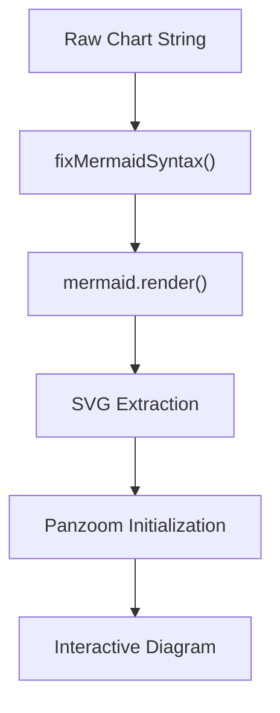

# UI Components & Design System

The GitDex UI is designed as a modern, high-performance interface that blends technical precision with interactive visual elements. The design system prioritizes clarity, accessibility, and a "developer-first" aesthetic, utilizing a Bento-grid layout and dynamic AI-driven visualizations.

## Design Tokens & Global Styling

The visual foundation of GitDex is managed through a centralized set of CSS variables in the global stylesheet, supporting a seamless transition between light and dark modes.

### Color Palette & Theming
GitDex utilizes a semantic naming convention for its colors, ensuring consistency across the application. The primary brand color is a vibrant emerald green.

| Token | Light Mode Value | Dark Mode Value | Purpose |
| :--- | :--- | :--- | :--- |
| `--primary` | `#059669` | `#10b981` | Primary actions and accents [client/src/app/globals.css:21, 54]() |
| `--background` | `#ffffff` | `#09090b` | Main application background [client/src/app/globals.css:17, 51]() |
| `--foreground` | `#09090b` | `#fafafa` | Primary text color [client/src/app/globals.css:18, 52]() |
| `--border` | `#d4d4d8` | `#3f3f46` | Component borders and dividers [client/src/app/globals.css:32, 63]() |
| `--card` | `#ffffff` | `#18181b` | Container backgrounds [client/src/app/globals.css:19, 53]() |

### Typography
The system employs a sophisticated font stack to differentiate between UI elements and branded headings:
- **Sans-serif**: "Plus Jakarta Sans" is the primary font for the general interface [client/src/app/globals.css:1, 15]().
- **Headings**: `h1` through `h6` elements use the `var(--font-mzh)` (MozillaHeadline) font [client/src/app/globals.css:116-118]().

## Backgrounds & Animations

To create a high-tech, immersive atmosphere, GitDex implements several custom CSS-based visual patterns and animations.

### Visual Patterns
The UI uses overlapping gradients and patterns to add depth to the layout [client/src/app/globals.css:147-166]():
- **Grid Pattern**: A subtle linear gradient creating a 40px square grid (`.bg-grid-pattern`).
- **Dot Pattern**: A radial gradient creating a 24px spaced dot matrix (`.bg-dot-pattern`).

### Motion System
Several keyframes are defined to drive the "living" feel of the interface:
- **Marquee**: A linear infinite scroll for ticker-style information [client/src/app/globals.css:169-176]().
- **Aurora**: Three distinct slow-motion animations (`aurora-slow-1`, `aurora-slow-2`, `aurora-slow-3`) that rotate and scale elements to simulate an organic, shifting background [client/src/app/globals.css:179-201]().

## Interactive Components

### Interactive Constellation
The `InteractiveConstellation` component provides a dynamic, canvas-based background that reacts to user input.

**Technical Implementation:**
1. **Particle Physics**: Generates a set of particles with random velocities (`vx`, `vy`) and base positions [client/src/components/InteractiveConstellation.tsx:63-76]().
2. **Magnetic Interaction**: When the mouse is active, particles within a `maxDist` of 180px are pulled toward the cursor [client/src/components/InteractiveConstellation.tsx:102-112]().
3. **Dynamic Linkage**: Lines are drawn between particles if their distance is less than 100px, with opacity based on proximity [client/src/components/InteractiveConstellation.tsx:124-134]().

### Feature Grid (Bento Layout)
The `FeatureGrid` component organizes the project's value propositions into a responsive Bento-style layout [client/src/components/FeatureGrid.tsx:14-126]().

**Key Feature Modules:**
- **Smart AI Analysis**: Displays a mockup of the repository scanning process [client/src/components/FeatureGrid.tsx:21-43]().
- **Architecture Flowcharts**: Visualizes structural relationships using SVG node representations [client/src/components/FeatureGrid.tsx:46-74]().
- **AI Codebase Assistant**: A chat-style mockup demonstrating contextual file referencing [client/src/components/FeatureGrid.tsx:77-110]().
- **On-Demand Updates**: Includes a simulated re-indexing state using a `syncState` loop [client/src/components/FeatureGrid.tsx:113-138]().

## Dynamic Diagramming with Mermaid

GitDex integrates Mermaid.js to render complex architectural diagrams from text descriptions, transforming AI-generated strings into interactive SVGs.

### Rendering Pipeline
The `Mermaid` component handles the lifecycle of a diagram from raw string to an interactive UI element.

### Syntax Normalization
To ensure stability, the component implements `fixMermaidSyntax`, which performs several regex-based transformations [client/src/components/mermaid.tsx:42-115]():
- **Label Wrapping**: Automatically inserts ` ` tags in long labels via `wrapLabelText` to prevent horizontal overflow [client/src/components/mermaid.tsx:32-51]().
- **Syntax Correction**: Normalizes arrow notations (e.g., converting `==>` or `-.->` to standard Mermaid formats) and ensures labels are quoted.
- **Subgraph Formatting**: Converts `SubGraph` declarations into standard `subgraph` syntax [client/src/components/mermaid.tsx:97-99]().

### Interactivity & UX
The final rendered SVG is wrapped in a container that provides advanced navigation capabilities:
- **Pan & Zoom**: Integration with the `panzoom` library allows users to drag to pan and use `Ctrl/Cmd + Scroll` to zoom [client/src/components/mermaid.tsx:225-248]().
- **Custom Styling**: Diagrams use a "handDrawn" look with the `Plus Jakarta Sans` font for consistency with the rest of the design system [client/src/components/mermaid.tsx:135-145]().
- **Error Recovery**: If rendering fails, the component displays a detailed error boundary including the raw chart code for debugging [client/src/components/mermaid.tsx:174-210]().