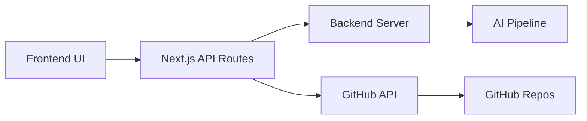
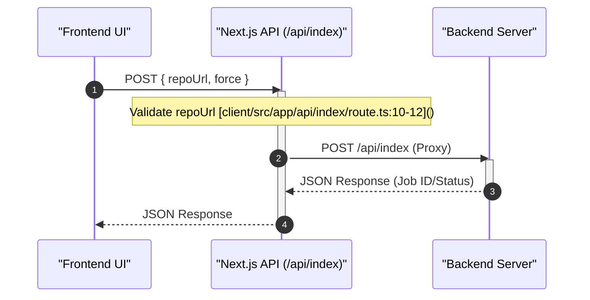

# API Routes & Edge Functions

The client-side API routes in GitDex serve as a mediation layer between the frontend user interface and external services. These routes, implemented as Next.js App Router handlers, perform two primary roles: proxying requests to the dedicated backend server and interfacing directly with the GitHub API via Octokit.

## Architecture Overview

The client API routes act as an orchestration layer that abstracts the backend infrastructure and secures sensitive credentials (like the GitHub Token) from the client browser.

## API Endpoint Specifications

### 1. Index Management
The `/api/index` route allows users to trigger the AI indexing process for a specific repository.

**Endpoint:** `POST /api/index` [client/src/app/api/index/route.ts:5-28]()

| Parameter | Type | Required | Description |
| :--- | :--- | :--- | :--- |
| `repoUrl` | String | Yes | The full URL of the GitHub repository to index. |
| `force` | Boolean | No | If true, forces a re-indexing of the repository. |

**Implementation Details:**
This route validates the presence of the `repoUrl` [client/src/app/api/index/route.ts:10-12]() and proxies the request to the backend server defined by the `NEXT_PUBLIC_API_URL` environment variable [client/src/app/api/index/route.ts:14-18]().

### 2. Repository Search
The `/api/search` route provides a way to find repositories using GitHub's search capabilities with custom client-side filtering.

**Endpoint:** `GET /api/search` [client/src/app/api/search/route.ts:5-37]()

| Query Parameter | Type | Required | Description |
| :--- | :--- | :--- | :--- |
| `q` | String | Yes | The search query string. |

**Processing Logic:**
1. **Octokit Integration:** Uses a `GITHUB_TOKEN` to authenticate requests to the `/search/repositories` endpoint [client/src/app/api/search/route.ts:16-20]().
2. **Broad Fetch:** Retrieves up to 50 repositories based on name and description [client/src/app/api/search/route.ts:21-23]().
3. **Refined Filtering:** Performs a case-insensitive check to ensure the query string is present in the `full_name`, `name`, or `description` [client/src/app/api/search/route.ts:26-31]().
4. **Result Limiting:** Slices the final list to return a maximum of 7 items [client/src/app/api/search/route.ts:32-33]().

### 3. Indexing Status
The `/api/status` route checks whether a specific repository has already been processed by the AI indexing pipeline.

**Endpoint:** `GET /api/status` [client/src/app/api/status/route.ts:5-34]()

| Query Parameter | Type | Required | Description |
| :--- | :--- | :--- | :--- |
| `owner` | String | Yes | The GitHub username or organization. |
| `repo` | String | Yes | The name of the repository. |

**Data Flow:**
The route extracts the `owner` and `repo` from the search parameters [client/src/app/api/status/route.ts:7-9](). It then forwards these parameters to the backend server's status endpoint [client/src/app/api/status/route.ts:15-17](). If the backend response is empty or invalid, it defaults to `{ indexed: false }` [client/src/app/api/status/route.ts:21-25]().

## Request Sequence: Indexing Workflow

The following sequence diagram illustrates the interaction between the client UI, the Next.js edge route, and the backend server when a user requests a repository index.

## Environment Configuration

The API routes depend on the following environment variables to function correctly:

| Variable | Usage | Source File |
| :--- | :--- | :--- |
| `NEXT_PUBLIC_API_URL` | Base URL for the backend server proxy. | [client/src/app/api/index/route.ts:14](), [client/src/app/api/status/route.ts:13]() |
| `GITHUB_TOKEN` | Authentication for GitHub Octokit searches. | [client/src/app/api/search/route.ts:16]() |

## Error Handling

Across all routes, GitDex implements a consistent error handling pattern:
- **Validation Errors:** Returns a `400 Bad Request` if required parameters (like `repoUrl` or `owner`) are missing [client/src/app/api/index/route.ts:11](), [client/src/app/api/status/route.ts:11]().
- **Server Errors:** Wraps logic in `try...catch` blocks to return a `500 Internal Server Error` when unexpected failures occur [client/src/app/api/index/route.ts:26-28](), [client/src/app/api/status/route.ts:29-31]().
- **Graceful Degradation:** The search route returns an empty items list `[]` with a `200 OK` status even if the Octokit request fails, ensuring the UI doesn't crash [client/src/app/api/search/route.ts:35-37]().