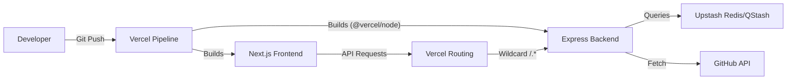

# Deployment & Configuration

This section provides the technical specifications and procedural guides for configuring the GitDex environment, managing package dependencies for both the frontend and backend, and deploying the server to Vercel.

## Environment Setup

GitDex is structured as a monorepo consisting of a Next.js client and a Node.js server. The system utilizes different runtimes and build tools for each layer.

### Backend Runtime
The server is designed to run using the **Bun** runtime, as evidenced by the start and development scripts. Sources: [server/package.json:11-14]()

- **Development**: `bun --watch index.ts`
- **Production**: `bun index.ts`

### Frontend Runtime
The client is built on **Next.js 16.2.9** and utilizes **Turbopack** for optimized development and build cycles. Sources: [client/package.json:5-7]()

## Dependency Management

The project maintains separate dependency trees for the client and server to optimize bundle sizes and execution environments.

### Server-Side Dependencies
The backend focuses on AI orchestration, queue management, and API routing.

| Category | Dependency | Purpose | Source |
| :--- | :--- | :--- | :--- |
| **AI/LLM** | `@ai-sdk/google`, `@google/genai`, `ai` | Integration with Google Gemini and AI SDK | [server/package.json:20-22]() |
| **Data/Cache** | `@upstash/redis`, `ioredis` | Redis connectivity for state and caching | [server/package.json:23-24, 27]() |
| **Queue** | `@upstash/qstash` | Managing asynchronous indexing jobs | [server/package.json:23]() |
| **GitHub** | `@octokit/rest` | Interfacing with GitHub API | [server/package.json:22]() |
| **Web Framework**| `express`, `cors` | REST API server and Cross-Origin Resource Sharing | [server/package.json:25-26]() |
| **Utilities** | `js-tiktoken`, `mermaid` | Token counting and diagram generation | [server/package.json:28-29]() |

### Client-Side Dependencies
The frontend is a rich interface combining documentation rendering, AI chat, and 3D visualizations.

| Category | Key Dependencies | Purpose | Source |
| :--- | :--- | :--- | :--- |
| **Framework** | `next`, `react`, `react-dom` | Core UI framework and rendering | [client/package.json:21-23]() |
| **AI Interface** | `@assistant-ui/react`, `ai` | Pre-built AI chat components and hooks | [client/package.json:13-17, 20]() |
| **Docs/MDX** | `fumadocs`, `@fumadocs/mdx-remote` | Documentation framework and MDX processing | [client/package.json:18, 41-43]() |
| **Styling** | `tailwindcss`, `lucide-react`, `clsx` | Utility-first CSS and iconography | [client/package.json:48, 47, 19]() |
| **Visualization** | `three`, `ogl`, `mermaid` | 3D graphics and diagram rendering | [client/package.json:54-56, 46]() |
| **Search** | `flexsearch`, `fuse.js` | Client-side full-text search | [client/package.json:39-40]() |

## Server Deployment to Vercel

The backend is configured for deployment on Vercel using a `vercel.json` configuration file, which treats the server as a set of serverless functions.

### Vercel Configuration
The deployment is governed by the following rules:

1. **Build Process**: Vercel uses `@vercel/node` to compile the `index.ts` entry point. Sources: [server/vercel.json:3-6]()
2. **Routing**: All incoming requests are routed to the `index.ts` file, ensuring the Express server handles all API logic. Sources: [server/vercel.json:7-14]()
3. **Caching**: A `Cache-Control: no-store, must-revalidate` header is applied to all routes to prevent stale AI responses or job status updates. Sources: [server/vercel.json:11-13]()

```json
{
  "version": 2,
  "builds": [
    {
      "src": "index.ts",
      "use": "@vercel/node"
    }
  ],
  "routes": [
    {
      "src": "/(.*)",
      "dest": "index.ts",
      "headers": {
        "Cache-Control": "no-store, must-revalidate"
      }
    }
  ]
}
```
Sources: [server/vercel.json:1-16]()

## Frontend Configuration

The client utilizes a specific configuration for handling MDX content and plugins, specifically for rendering Mermaid diagrams within documentation.

### MDX & Plugin Configuration
The `source.config.ts` file defines the processing pipeline for documentation files. Sources: [client/source.config.ts:1-8]()

- **Plugin**: `remarkMdxMermaid` is registered as a remark plugin to enable the conversion of Mermaid syntax into renderable diagrams. Sources: [client/source.config.ts:2, 5-7]()

```typescript
export default defineConfig({
  mdxOptions: {
    remarkPlugins: [remarkMdxMermaid],
  },
});
```
Sources: [client/source.config.ts:4-8]()

## Deployment Workflow

The following diagram illustrates the deployment and request flow from the client to the Vercel-hosted backend.


Sources: [server/vercel.json:7-14](), [server/package.json:23-24](), [server/package.json:22]()