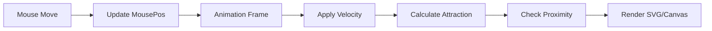
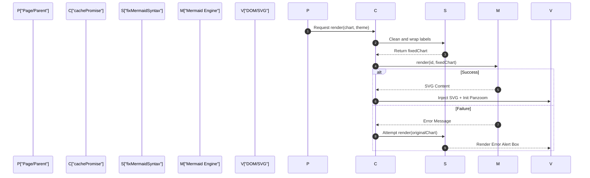

# UI Component Library

The GitDex UI Component Library consists of specialized, high-performance React components designed to provide an immersive and interactive experience for analyzing code repositories. This library blends data visualization, simulated interfaces, and dynamic rendering to make technical documentation engaging and accessible.

## Component Overview

The library focuses on three primary areas: marketing/feature showcasing, interactive background aesthetics, and dynamic technical diagramming.

| Component | Purpose | Key Technologies |
| :--- | :--- | :--- |
| `FeatureGrid` | Visual showcase of platform capabilities using a bento-box layout. | Tailwind CSS, Lucide React |
| `InteractiveConstellation` | High-performance canvas animation with mouse-responsive physics. | HTML5 Canvas, RequestAnimationFrame |
| `Mermaid` | Dynamic rendering of Mermaid.js diagrams with syntax correction and pan-zoom. | Mermaid.js, Panzoom, Next-themes |

---

## FeatureGrid

The `FeatureGrid` is a responsive bento-style layout used to communicate the core value propositions of GitDex. It uses simulated interfaces to demonstrate functionality without requiring live backend calls during the showcase.

### Layout Structure
The grid is composed of four primary "Bento Cards":
1.  **Smart AI Analysis**: Simulates a repository analyzer scanning a codebase tree and generating MDX documentation.
2.  **Architecture Flowcharts**: A visual representation of modular diagrams showing parent-child linkages (e.g., Router $\rightarrow$ AuthCtx/Database).
3.  **Interactive AI Assistant**: A chat mockup simulating context-aware questions about specific files like `pipeline.ts`.
4.  **On-Demand Updates**: A simulated re-indexing trigger that cycles through "Up to date", "Indexing Repository", and "Syncing commits" states.

### State Simulation
The component utilizes a `syncState` loop via `useEffect` to simulate the indexing lifecycle:

```tsx
useEffect(() => {
  const timer = setInterval(() => {
    setSyncState((prev) => (prev + 1) % 4);
  }, 2500);
  return () => clearInterval(timer);
}, []);
```

---

## InteractiveConstellation

The `InteractiveConstellation` component provides a sophisticated, interactive background. It utilizes a particle-based system rendered on an HTML5 Canvas to create a "neural network" aesthetic.

### Physics Engine
The component implements a custom physics loop with the following behaviors:
- **Velocity & Collision**: Particles move with random velocities and bounce off the container boundaries.
- **Magnetic Attraction**: When the mouse is active, particles within a $180\text{px}$ radius are pulled toward the cursor.
- **Dynamic Linking**: Lines are drawn between particles if the distance between them is less than $100\text{px}$, with opacity scaling based on proximity.
- **Parallax Drift**: A slow rotation/drift is applied to all coordinates using `Math.sin` and `Math.cos` to create a 3D depth feel.

### Technical Implementation Flow


---

## Mermaid Diagram Integration

The `Mermaid` component is a production-ready wrapper around `mermaid.js` that transforms text-based chart definitions into interactive SVG diagrams.

### Syntax Correction Pipeline
One of the most critical features of this component is the `fixMermaidSyntax` function. It ensures that AI-generated or raw chart strings are compatible with the Mermaid renderer by:
- **Label Wrapping**: Automatically inserting `<br/>` tags into long labels to prevent overflow.
- **Quote Normalization**: Cleaning quotes and backticks from node content.
- **Arrow Correction**: Normalizing various arrow styles (e.g., converting `-.->` or `==>` to standard formats where necessary).
- **SubGraph Formatting**: Ensuring `SubGraph` blocks are correctly closed and titled.

### Rendering Workflow
The component employs a caching strategy and a fallback mechanism to ensure stability.



### Key Features & Configuration
- **Pan & Zoom**: Integrated with the `panzoom` library, allowing users to drag the diagram and zoom using `Ctrl/Cmd + Scroll`.
- **Fullscreen Mode**: Uses a `Dialog` component to expand the diagram to $85\%$ of the viewport for detailed analysis.
- **Theming**: Dynamically switches between `dark` and `default` themes based on the system's `resolvedTheme`.
- **Styling**: Forced use of "Plus Jakarta Sans" and a `handDrawn` look for a professional architectural feel.

### Component API
| Prop | Type | Default | Description |
| :--- | :--- | :--- | :--- |
| `chart` | `string` | Required | The Mermaid syntax string to render. |
| `border` | `boolean` | `true` | Whether to wrap the diagram in a bordered container. |
| `margin` | `boolean` | `true` | Adds standard spacing around the diagram. |