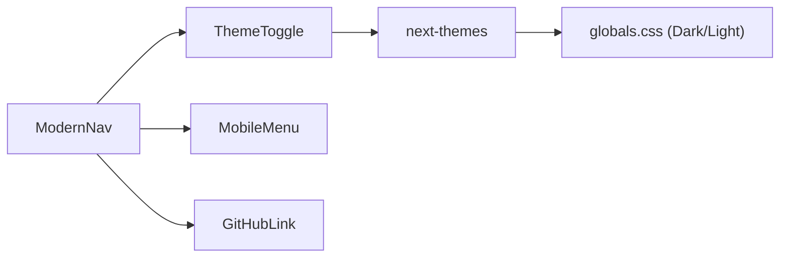
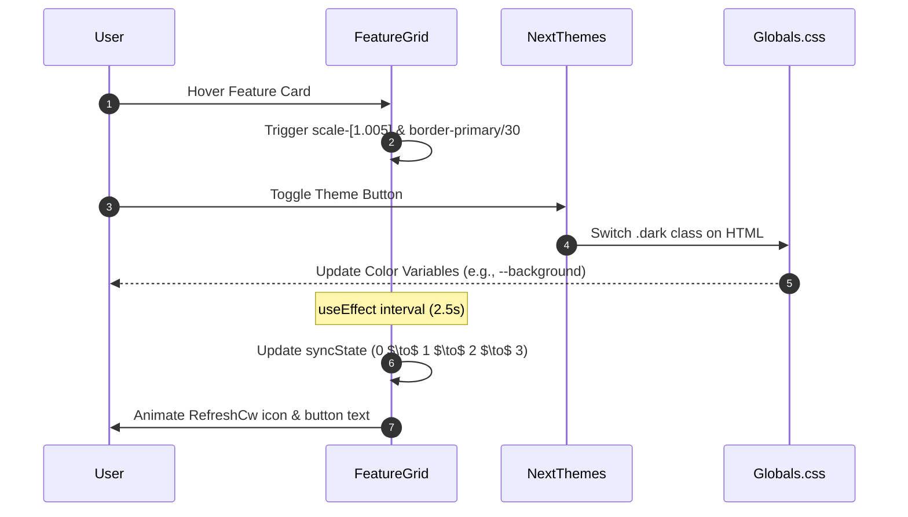

# UI Components & Design System

The GitDex design system is built upon a modern, token-based architecture using Tailwind CSS and CSS variables. It emphasizes glassmorphism, fluid animations, and a strict light/dark mode color palette to provide a high-end developer experience.

## Design Tokens

The system utilizes a centralized set of CSS variables defined in `globals.css` to ensure consistency across the application.

### Typography
GitDex employs a multi-font strategy to distinguish between UI elements and content headings.

| Font Variable | Source / Family | Primary Use Case |
| :--- | :--- | :--- |
| `--font-jakarta` | Plus Jakarta Sans | General UI and body text |
| `--font-mzh` | MozillaHeadline | Headings (h1 through h6) |
| `--font-mzt` | MozillaText | Serif content elements |
| `--font-mono` | Monospace | Code snippets and technical logs |

### Color Palette
The application uses a semantic naming convention for colors, allowing for seamless switching between light and dark modes.

| Token | Light Mode | Dark Mode | Role |
| :--- | :--- | :--- | :--- |
| `--primary` | `#059669` | `#10b981` | Brand primary, active states, rings |
| `--background` | `#ffffff` | `#09090b` | Main page background |
| `--foreground` | `#09090b` | `#fafafa` | Primary text color |
| `--card` | `#ffffff` | `#18181b` | Component backgrounds |
| `--muted` | `#f4f4f5` | `#18181b` | Low-emphasis backgrounds |
| `--border` | `#d4d4d8` | `#3f3f46` | Dividers and borders |

### Elevation and Geometry
Consistent rounding and shadowing are applied via global tokens:
- **Radius**: Base radius is `0.5rem`, with variants `sm` (-4px), `md` (-2px), `lg` (base), and `xl` (+4px).
- **Shadows**: A comprehensive scale from `shadow-2xs` to `shadow-2xl` utilizing HSL alpha channels for soft, natural depth.

## Visual Effects & Backgrounds

GitDex implements several decorative CSS classes to create a sophisticated visual environment.

### Decorative Patterns
These classes are used to add texture to large background areas without impacting performance.

```css
/* Grid Pattern: Suble lines creating a technical blueprint feel */
.bg-grid-pattern {
  background-size: 40px 40px;
  background-image: 
    linear-gradient(to right, rgba(120, 120, 120, 0.05) 1px, transparent 1px),
    linear-gradient(to bottom, rgba(120, 120, 120, 0.05) 1px, transparent 1px);
}

/* Dot Pattern: Subtle radial dots for a modern UI look */
.bg-dot-pattern {
  background-size: 24px 24px;
  background-image: radial-gradient(rgba(0, 0, 0, 0.12) 1px, transparent 1px);
}
```

### Advanced Animations
The system includes complex keyframe animations for atmospheric effects:
- **Aurora**: `animate-aurora-slow-1/2/3` creates shifting, organic background movements.
- **Marquee**: `animate-marquee` provides a continuous horizontal scroll for tickers.

## Layout Components

### Modern Navigation (`ModernNav`)
The navigation bar is a high-performance, fixed-position element featuring glassmorphism and responsive behaviors.

**Key Technical Features:**
- **Hydration Strategy**: Uses a `mounted` state to render a skeleton nav during the initial load, preventing layout shift.
- **Glassmorphism**: Combines `backdrop-blur-md` with semi-transparent backgrounds (`bg-background/45`).
- **Dynamic Width**: Scales from `w-[90%]` (mobile) to `w-[68%]` (large screens).



### Feature Showcase (`FeatureGrid`)
The `FeatureGrid` implements a "Bento Box" layout, utilizing CSS Grid to create a non-uniform arrangement of feature cards.

**Layout Composition:**
- **Grid Setup**: `grid-cols-1 md:grid-cols-3` with `auto-rows-auto`.
- **Card Styling**: Cards use `rounded-[2rem]`, `backdrop-blur-md`, and a custom cubic-bezier transition (`cubic-bezier(0.32,0.72,0,1)`) for hover scaling.

#### Feature Card Breakdown

| Card Feature | Column Span | Interaction/Visual |
| :--- | :--- | :--- |
| AI Analysis | 2/3 (md) | Mockup interface with pulsing status indicators |
| Arch Flowcharts | 1/3 (md) | SVG node representation (Router $\to$ AuthCtx/DB) |
| AI Assistant | 2/3 (md) | Chat bubble mockup with simulated file context |
| On-Demand Updates| 1/3 (md) | State-driven button (Idle $\to$ Indexing) |

## Component State Management

The UI components utilize local React state to simulate real-time system activity and handle user preferences.



### State Implementation Example
The `FeatureGrid` uses a `syncState` loop to simulate the background indexing process:

```tsx
useEffect(() => {
  const timer = setInterval(() => {
    setSyncState((prev) => (prev + 1) % 4);
  }, 2500);
  return () => clearInterval(timer);
}, []);