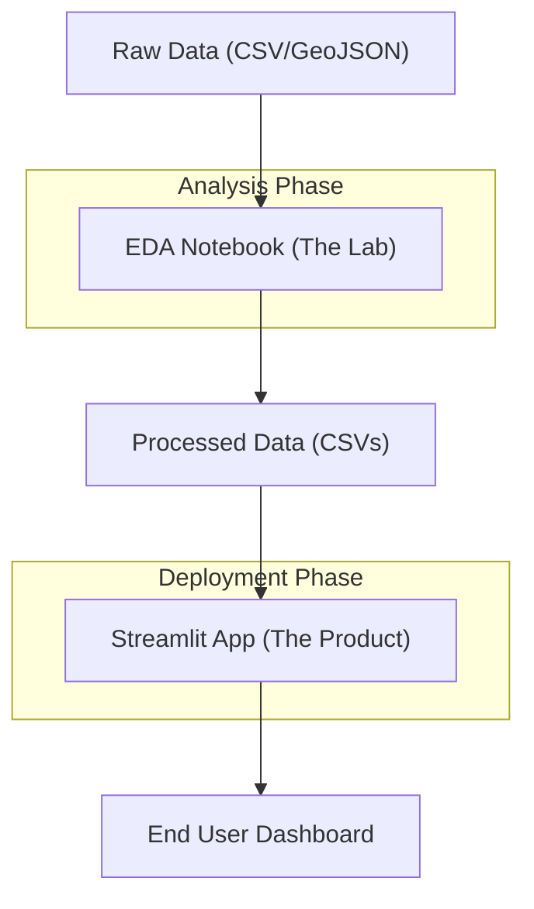

# Project Introduction

InClimate is an interactive data science storytelling dashboard designed to narrate over 120 years of climate change within the Indian subcontinent. By synthesizing historical rainfall records, state-level temperature normals, and high-resolution daily city weather data, the project transforms raw meteorological datasets into a visual narrative of rising temperatures, shifting monsoon patterns, and increasing weather volatility.

## Core Vision

The primary goal of InClimate is to bridge the gap between raw climate science and accessible data storytelling. Rather than presenting static charts, the project allows users to explore climate shifts through five distinct lenses:
- **Temperature Trends:** Analyzing warming rates across Indian states.
- **Monsoon Dynamics:** Comparing historical rainfall baselines against recent volatility.
- **Geospatial Distribution:** Visualizing climate anomalies across a choropleth map of India.
- **Urban Micro-climates:** Performing deep-dives into city-specific heat signatures using STL decomposition.
- **Future Projections:** Modeling potential warming scenarios up to 2050 using bootstrap confidence intervals.

## Project Philosophy: The "Lab to Product" Pipeline

InClimate follows a strict architectural separation between data analysis and data presentation. This ensures that the final application remains performant and the analytical process remains transparent and reproducible.

### 1. The Lab (EDA Notebook)
The `notebooks/eda.ipynb` serves as the analytical engine. This is where "messy" data science happens: auditing raw files, mapping IMD subdivisions to administrative states, handling missing values via interpolation, and computing statistical baselines. Every transformation is documented with the reasoning behind the decision.

### 2. The Handoff (Processed Data)
The `data/processed/` directory acts as the single source of truth. The notebook writes cleaned, aggregated CSVs to this folder, and the application reads from it. No raw data wrangling is permitted within the application code.

### 3. The Product (Streamlit App)
The `app/` directory is a pure rendering layer. It consumes the processed CSVs and utilizes a modular tab-based structure to present findings via Plotly visualizations and Streamlit metrics.




## Initial Setup

To get InClimate running locally, follow these steps to prepare the environment and data.

### 1. Environment Installation
Install the required dependencies defined in `requirements.txt`:

```bash
pip install -r requirements.txt
```

### 2. Data Acquisition
The project requires four primary data sources. Place them in the `data/raw/` directory.

**GeoJSON Setup:**
Run the following command to download the required state boundary polygons:
```bash
curl -L "https://raw.githubusercontent.com/adarshbiradar/maps-geojson/master/india.json" \
     -o data/raw/india_state.geojson
```

**Kaggle Datasets:**
Download the following datasets and ensure they match the filenames in the directory structure:
- `rainfall_india.csv`
- `temperature_states.csv`
- `cities_daily_weather.csv`

### 3. Execution Workflow
For the application to function, the data pipeline must be executed in sequence:

1. **Run EDA:** Open `notebooks/eda.ipynb` and run all cells to generate the files in `data/processed/`.
2. **Launch App:** 
   ```bash
   cd app
   streamlit run app.py
   ```

## Directory Structure Overview

| Directory | Purpose |
| :--- | :--- |
| `notebooks/` | Contains the full EDA pipeline from audit to export. |
| `data/raw/` | Immutable source files. Never modify these files directly. |
| `data/processed/` | Cleaned datasets consumed by the Streamlit app. |
| `app/tabs/` | Modular UI components for each dashboard section. |
| `app/utils/` | Shared logic for cached data loading and statistical computations. |