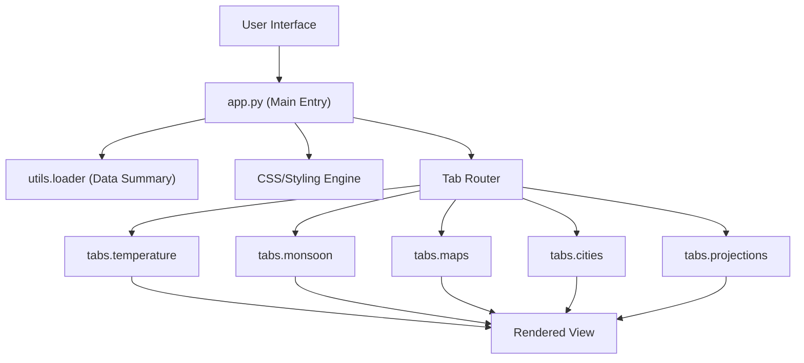

# Application Architecture

The InClimate application is built using **Streamlit**, following a modular design pattern that separates global configuration and layout from specific feature implementations. The architecture is designed to handle large climate datasets by utilizing a centralized loader and decoupled view modules.

## System Overview

The application follows a "Hub-and-Spoke" architectural pattern. The main entry point (`app.py`) acts as the hub, managing the global state, styling, and navigation, while the individual tab modules act as spokes that encapsulate the logic for specific climate analysis perspectives.




## Main Entry Point (`app.py`)

The `app/app.py` file serves as the application's orchestrator. It performs four primary roles:

1.  **Environment Configuration**: Sets page metadata, layout (wide mode), and the initial sidebar state using `st.set_page_config`.
2.  **UI Theming**: Injects a custom CSS layer to implement the "Space Grotesk" typography and a refined dark-theme aesthetic, overriding default Streamlit components to ensure a production-grade look and feel.
3.  **Global State Initialization**: Invokes `load_summary()` from the utility layer to fetch aggregate climate metrics (e.g., fastest warming city, drought stats) used in the persistent sidebar.
4.  **Routing**: Implements a tab-based navigation system that dynamically loads feature modules.

## Layout Organization

### The Sidebar
The sidebar serves as a **High-Level Dashboard**. Instead of housing navigation links, it provides immediate analytical value by displaying key performance indicators (KPIs) derived from the climate summary data. This ensures that users have a constant reference point for India's overall climate trajectory regardless of which tab they are browsing.

### Tab-Based Navigation
To maintain a clean user experience and prevent a single monolithic file, the application utilizes a modular tab system. Each tab is mapped to a specific Python module within the `app/tabs/` directory.

| Tab | Module | Responsibility |
| :--- | :--- | :--- |
| 🌡️ Temperatures | `tabs.temperature` | Analysis of thermal trends and anomalies. |
| 🌧️ Monsoons | `tabs.monsoon` | Precipitation patterns and seasonal shifts. |
| 🗺️ India Map | `tabs.maps` | Geospatial visualization of climate data. |
| 🏙️ City Dive | `tabs.cities` | Granular, city-specific climate exploration. |
| 🔮 Projections | `tabs.projections` | Predictive modeling and future climate scenarios. |

## Module Execution Pattern

The application uses a consistent `render()` function pattern across all tab modules. This decoupling allows developers to modify the logic of a specific view without risking regressions in the main application loop:

```python
with tab1:
    from tabs.temperature import render; render()
```

This lazy-loading approach ensures that the specific dependencies for a tab are only called when the main application structure is already initialized.