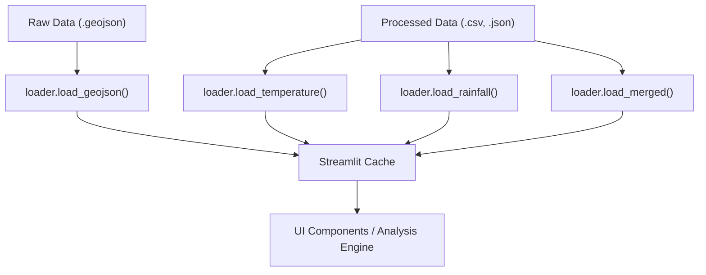

# Data Infrastructure

The data infrastructure layer of Inclimate serves as the utility backbone, decoupling raw data retrieval from the presentation layer. It is divided into two primary concerns: **Data Loading** (persistence and caching) and **Statistical Processing** (time-series analysis and trend projection).

## Data Loading Architecture

Inclimate utilizes a tiered directory structure to separate raw geospatial files from cleaned, analysis-ready datasets. To optimize performance within the Streamlit environment, the `loader.py` module implements a caching strategy that prevents redundant I/O operations during user interactions.

### Data Flow




### Loader Implementation Details

All loading functions are decorated with `@st.cache_data`, ensuring that dataframes are stored in memory across session reruns.

| Function | Source | Description |
| :--- | :--- | :--- |
| `load_temperature()` | `temperature_clean.csv` | Loads cleaned historical temperature records. |
| `load_rainfall()` | `rainfall_clean.csv` | Loads cleaned precipitation data. |
| `load_cities_daily()` | `cities_daily_clean.csv` | Daily resolution climate data with parsed dates. |
| `load_merged()` | `states_merged.csv` | Aggregated state-level climate metrics. |
| `load_geojson()` | `india_state.geojson` | Geospatial boundaries for mapping. |
| `load_summary()` | `summary.json` | Pre-computed summary statistics for quick lookup. |

---

## Statistical Processing Layer

The `stats.py` module provides the mathematical foundations for interpreting climate trends. It focuses on noise reduction, linear trend extraction, and uncertainty quantification.

### 1. Time-Series Smoothing
To mitigate short-term volatility and highlight long-term climate signals, the system employs a rolling mean:

```python
def rolling_mean(series: pd.Series, window: int = 10) -> pd.Series:
    return series.rolling(window=window, min_periods=window // 2).mean()
```

### 2. Trend Analysis (OLS)
Linear trends are computed using Ordinary Least Squares (OLS) regression. The `compute_ols` function calculates the slope (rate of change), intercept, and the Coefficient of Determination ($R^2$) to measure the strength of the linear relationship.

**Constraints:** A minimum of 5 non-NaN data points is required to produce a valid regression; otherwise, the function returns `NaN` to prevent misleading projections.

### 3. Uncertainty Estimation
For future climate projections, Inclimate uses **Bootstrapping** to generate confidence intervals (CI). 

- **Method:** The function samples with replacement from the historical residuals of a projection.
- **Confidence:** Defaults to $95\%$, calculating the $2.5^{th}$ and $97.5^{th}$ percentiles of the bootstrapped samples.

### 4. Seasonal-Trend Decomposition (STL)
To isolate the underlying climate signal from annual seasonality, the system implements STL decomposition:

```python
def decompose_daily(series: pd.Series, period: int = 365):
    return STL(series, period=period, robust=True).fit()
```

**Key Technical Specifications:**
- **Periodicity:** Set to 365 for daily climate data.
- **Robustness:** `robust=True` is enabled to ensure that extreme weather events (heat spikes/floods) are treated as residuals rather than distorting the seasonal component.
- **Output:** Returns an `STLFit` object containing the `trend`, `seasonal`, and `resid` components.