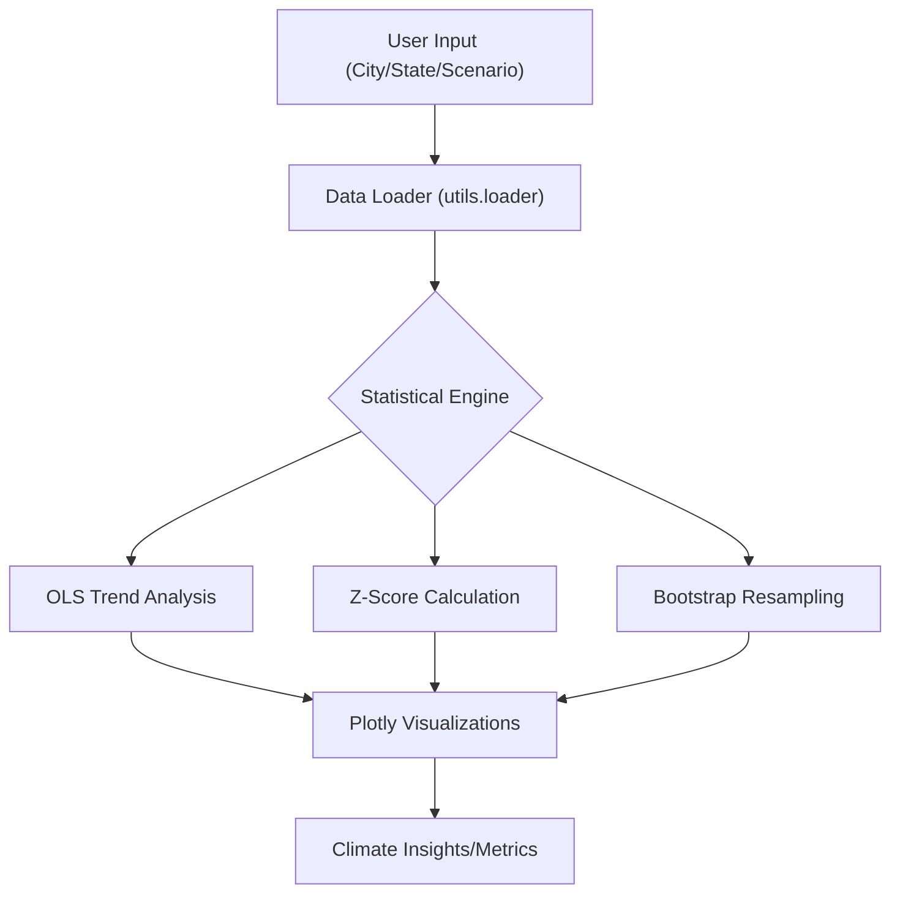

# Climate Analysis Modules

The Climate Analysis suite provides a set of specialized diagnostic tools to evaluate historical climate shifts and project future temperature trajectories across the Indian subcontinent. Each module is implemented as a Streamlit fragment to ensure efficient state management and reactive updates.

## Analysis Workflow

The following diagram illustrates the data flow from user input through the statistical processing layer to the final visualization.

---

## Temperature Trends Module
The Temperature Trends module focuses on urban warming patterns using daily maximum temperature data.

### Key Features
- **City-Level Comparison**: Supports multi-city selection to compare warming trajectories across different geographical zones.
- **Signal Smoothing**: Implements a 10-year rolling average to filter out inter-annual variability and highlight long-term climatic shifts.
- **Warming Rate Calculation**: Uses Ordinary Least Squares (OLS) regression to quantify the warming rate in $^\circ\text{C}$ per decade.

### Technical Implementation
The module calculates the warming rate by fitting a linear trend to the annual mean maximum temperatures:
$$\text{Warming Rate} = \text{Slope of OLS} \times 10$$

---

## Monsoon Patterns Module
This module analyzes precipitation volatility and the shifting timing of the Indian Summer Monsoon.

### Analysis Components
1. **Baseline Comparison**: Compares monthly rainfall of a selected recent decade against the climatological normal (1951–1980).
2. **Extreme Event Detection**: Utilizes Z-scores to identify anomalies:
   - **Flood**: $Z > 1.5$
   - **Drought**: $Z < -1.5$
3. **Monsoon Fraction**: Tracks the percentage of total annual rainfall occurring between June and September, providing a proxy for monsoon intensity and reliability.

### Visual Diagnostics
- **Grouped Bar Charts**: Visualizes monthly rainfall deviations from the baseline.
- **Z-Score Timeline**: A scatter plot mapping annual rainfall anomalies to identify clusters of drought or flood years.
- **Fraction Trends**: A line chart combining raw monsoon fractions with a 10-year smoothed trend.

---

## Future Projections Module
The Projections module provides a predictive framework for city-level temperature increases up to the year 2050.

### Scenario Modeling
Instead of fixed RCP paths, the module uses a **Trend Multiplier** to simulate different emissions outcomes:
- **0.5×**: Aggressive mitigation (halves the historical warming rate).
- **1.0×**: Status quo (historical trend continues linearly).
- **2.0×**: Accelerated warming (doubles the historical rate).

### Uncertainty Quantification
To avoid overconfidence in linear projections, the module implements **Bootstrap Confidence Intervals**:
1. **Residual Analysis**: Calculates residuals from the historical OLS fit.
2. **Resampling**: Performs 1,000 bootstrap resamples of the residuals to simulate potential variance in future years.
3. **CI Mapping**: Generates a shaded region representing the 90% or 95% confidence interval around the projected mean.

### Summary Table: Module Capabilities

| Module | Primary Metric | Statistical Method | Input Granularity |
| :--- | :--- | :--- | :--- |
| **Temperature** | $\Delta^\circ\text{C}$ / Decade | OLS Regression | City |
| **Monsoon** | Z-Score / Fraction | Standard Deviation $\sigma$ | State |
| **Projections** | Projected Max Temp | Bootstrap + Linear Extrapolation | City |