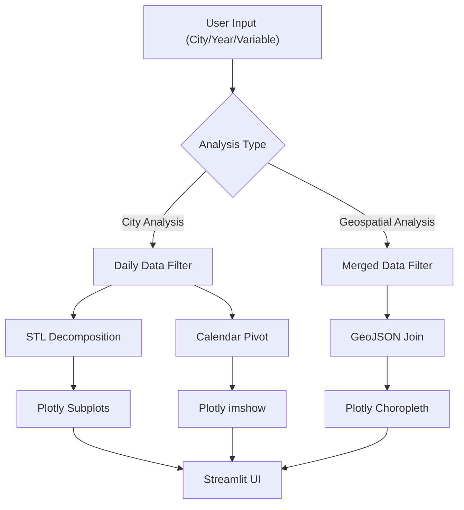

# Geospatial and City Analysis

The Geospatial and City Analysis modules provide a dual-layered approach to climate data visualization: macro-level regional trends via interactive choropleth maps and micro-level urban analysis through time-series decomposition and heatmaps.

## City-Specific Analysis

The city analysis implementation focuses on high-resolution temporal data, allowing users to isolate specific urban centers and analyze temperature anomalies.

### Implementation Details

Located in `app/tabs/cities.py`, the analysis is wrapped in an `@st.fragment` to ensure that interactions within the city tab do not trigger a full application rerun, optimizing performance for heavy Plotly renders.

#### 1. Data Filtering and Preprocessing
The system employs a dynamic filtering pipeline based on user input:
- **Selection**: Users select a city and a specific year range.
- **Resampling**: For time-series analysis, the data is resampled to a daily frequency (`"D"`) and interpolated to fill gaps, ensuring a continuous signal for mathematical decomposition.

#### 2. STL Decomposition
To separate long-term climate signals from seasonal noise, the app implements **Seasonal-Trend decomposition using LOESS (STL)** via the `decompose_daily` utility:
- **Trend**: Captures the long-term warming signal.
- **Seasonality**: Isolates the annual temperature cycle.
- **Residual**: Represents unexplained noise or extreme weather events.
- **Constraint**: A minimum of 730 days (2 years) of data is required to perform a valid 365-day period decomposition.

#### 3. Visual Analytics
- **Extreme Heat Tracking**: A bar chart utilizing `px.bar` tracks days exceeding the 95th percentile of temperature.
- **Calendar Heatmaps**: A pivot table transforms daily data into a `Year` $\times$ `Week of Year` matrix, rendered via `px.imshow` to visualize seasonal shifts over decades.

## Geospatial Mapping

The mapping module transforms tabular climate data into spatial insights using GeoJSON boundaries.

### Implementation Details

Located in `app/tabs/maps.py`, the module integrates merged climate datasets with geospatial feature properties.

#### 1. Variable Mapping
The system uses a mapping dictionary `VARIABLE_LABELS` to translate raw column names into human-readable labels, supporting various climate metrics:
- **Rainfall**: Annual and Monsoon totals.
- **Variability**: Z-scores and Coefficients of Variation (CV) by decade.
- **Temperature**: Climatological normals.

#### 2. Temporal Logic
The mapping engine handles three distinct temporal states:
- **Static Mode**: For `mean_temp`, which uses a single climatological normal regardless of the year.
- **Annual Mode**: Filters the `merged` dataframe for a specific year.
- **Decade Mode**: Groups data by the decade (calculated as `(year // 10) * 10`) and computes the mean for each state.

#### 3. Choropleth Rendering
The `px.choropleth` function links the `state` column in the dataframe to the `properties.st_nm` key in the GeoJSON file. Dynamic color scales are applied based on the variable type:
- **Blues**: Applied to rainfall metrics (`mm`).
- **RdYlBu_r**: Applied to temperature and normalized scores.

## Data Flow Architecture

