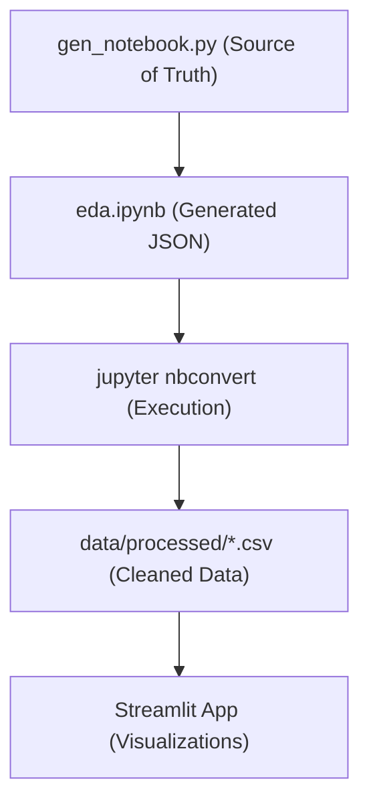

# Automation and Tooling

InClimate employs a **Notebook-as-Code** architecture to ensure that the Exploratory Data Analysis (EDA) and data preprocessing pipelines are reproducible, version-controllable, and transparent. 

Rather than treating Jupyter Notebooks (`.ipynb`) as the primary source of truth—which often leads to merge conflicts and opaque version histories—the project uses a programmatic generation script to build the notebook from raw Python source.

## The Generation Pipeline

The core of the automation is the `gen_notebook.py` script. This script defines the notebook structure as a Python list of cell objects (Markdown and Code) and serializes them into a valid `.ipynb` JSON format.




## Regenerating the EDA Notebook

If you need to modify the data cleaning logic, outlier thresholds, or state-mapping dictionaries, you must edit the source script rather than the notebook itself.

### 1. Modify the Source
Edit `scripts/gen_notebook.py` to update the analysis logic.

### 2. Generate the Notebook
Run the script to overwrite the `notebooks/eda.ipynb` file:
```bash
uv run python3 scripts/gen_notebook.py
```

### 3. Execute the Pipeline
Use `nbconvert` to execute the generated notebook headlessly. This processes the raw data and populates the `data/processed/` directory:
```bash
uv run jupyter nbconvert --to notebook --execute \
    notebooks/eda.ipynb --output eda.ipynb --output-dir notebooks/
```

## Automated Data Workflows

The automated pipeline handles several critical data engineering tasks that would otherwise be prone to manual error:

### Subdivision-to-State Mapping
The Indian Meteorological Department (IMD) provides rainfall data by "subdivisions." The automation script handles the complex mapping of these 36 subdivisions into administrative states, including:
- **Multi-state expansion**: Duplicating data for regions like "Assam & Meghalaya" to ensure both states are represented.
- **Aggregation**: Grouping duplicate-state rows by averaging to maintain statistical consistency.

### Data Cleaning & Feature Engineering
The script automates the following transformations before the data reaches the Streamlit app:
- **Z-Score Calculation**: Computing rainfall anomalies per state to categorize years as `drought`, `normal`, or `flood`.
- **Outlier Detection**: Applying IQR (Interquartile Range) flags to identify extreme weather years.
- **Temperature Normalization**: Coercing typos in raw CSVs (e.g., cleaning parentheses in numeric fields) and calculating annual means.
- **Extreme Heat Thresholds**: Calculating the 95th percentile temperature for each city to identify "extreme heat days."

## Output Artifacts

Once the automation pipeline is executed, the following production-ready files are generated in `data/processed/`:

| File | Description | Used In |
|------|-------------|----------|
| `rainfall_clean.csv` | State-wise annual rainfall with Z-scores and monsoon fractions. | India Map / Monsoons Tab |
| `temperature_clean.csv` | Climatological temperature normals per state. | India Map |
| `cities_daily_clean.csv` | Cleaned daily weather for 10 key cities. | City Dive Tab |
| `cities_heat_annual.csv` | Annual counts of extreme heat days per city. | City Dive Tab |
| `summary.json` | High-level metrics (fastest warming city, etc.). | App Header / Summary |