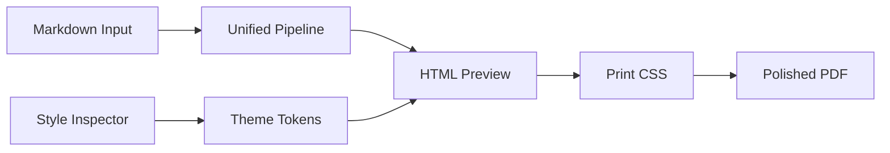

# Project Vision and Goals

Markeon is designed as a professional-grade, client-side Markdown authoring and PDF publishing suite. Rather than acting as a simple converter, Markeon serves as a design-centric bridge between the speed of plain-text writing and the precision of desktop publishing.

The architectural philosophy is defined by a synthesis of three industry benchmarks:
*   **Notion:** For a fluid, modern writing experience.
*   **Canva:** For intuitive, visual style controls.
*   **Microsoft Word:** For rigorous page layout and print precision.

## Core Philosophy and Inspiration

The project's identity is rooted in the concept of "transformation." Named after the Eevee evolution family, Markeon transforms raw Markdown into a polished, aesthetically curated document. This is reflected in the visual identity, which draws inspiration from the Pokémon **Umbreon**—utilizing a "dark and moody" palette with glowing amber-gold accents to create a premium, focused environment for creators.

### The Value Proposition
Most existing Markdown-to-PDF pipelines fall into two extremes: they are either too simplistic (offering no styling control) or overly complex (requiring LaTeX knowledge or command-line configurations). Markeon occupies the middle ground, providing high-fidelity design control through a visual interface—specifically a **Style Inspector**—eliminating the need for configuration files or code-heavy stylesheets.

## Intended Use Cases

Markeon is tailored for users who require professional output without the friction of traditional typesetting software:
*   **Academic Research:** Students writing papers that require LaTeX math equations and structured bibliographies.
*   **Technical Documentation:** Developers creating polished project guides with high-quality code highlighting (via Shiki) and architectural diagrams (via Mermaid).
*   **Editorial Content:** Writers seeking a "journal" or "editorial" feel using curated serif typography and precise margin controls.

## Architectural Goals

To achieve the vision of a "premium tool" rather than a prototype, the project adheres to several strict technical goals:

### 1. Client-Side Sovereignty
The application operates entirely in the browser. To ensure privacy and offline capability, there is no backend server and no account system. Data persistence is handled via a **Virtual File System** implemented through IndexedDB.

### 2. Print-First Preview
Unlike standard Markdown editors that render to a generic web page, Markeon's preview pane is designed to mimic a physical printed page. This "WYSIWYG" approach ensures that what the user sees in the browser is exactly what is produced by the `window.print()` PDF export.

### 3. Visual Style Orchestration
Styling is decoupled from the content. A theme in Markeon is a JSON-defined set of CSS custom properties (tokens), allowing users to swap the entire visual identity of a document instantly.

## Feature Roadmap

The project is developed in phased milestones to ensure a polished final product.

### Phase 1: The Core Engine (v1)
*   **Markdown Pipeline:** Integration of `remark` and `rehype` for GFM, KaTeX (Math), and Mermaid (Diagrams).
*   **Virtual File System:** Full CRUD operations against IndexedDB for file and theme storage.
*   **Visual Editor:** CodeMirror 6 implementation with debounced auto-save.
*   **Print Engine:** High-fidelity PDF export using a dedicated `print.css` layer and `window.print()`.
*   **Style Inspector:** Live manipulation of document tokens.

### Phase 2: Advanced Publishing (v2)
*   **Batch Export:** Ability to merge multiple virtual files into a single PDF document.
*   **Advanced Layouts:** More complex page-breaking logic and sophisticated header/footer templates.

## System Workflow

The following diagram illustrates the transformation flow from raw input to the final polished PDF:



## Technical Implementation Detail: The Virtual File

To maintain the goal of "no server required," Markeon implements a virtualized file structure. Instead of relying on the restricted File System Access API, it treats IndexedDB as a disk.

```javascript
// Conceptual structure of a Markeon file record
{
  id: "uuid",
  name: "research-paper.md",
  content: "# Introduction\nThis is a polished doc...",
  createdAt: 1715424000,
  updatedAt: 1715425000,
  order: 0 // Maintains sidebar sequence
}
```

By storing content as plain text blobs and metadata in a structured database, Markeon provides the illusion of a traditional file explorer while remaining fully portable within the browser's storage limits.