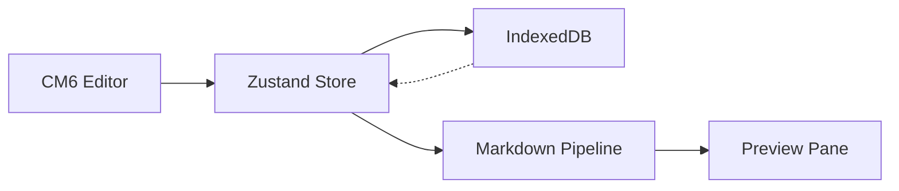

# Development Progress

The Development Progress module serves as the living chronicle of Markeon's evolution from a conceptual pitch to a production-ready browser-based editor. Unlike traditional roadmaps that are static, Markeon utilizes an append-only progress log to track implementation milestones, architectural pivots, and the rationale behind critical engineering decisions.

This module provides transparency into the current state of the application, ensuring that the gap between the initial technical specification (`PROJECT.md`) and the actual codebase is documented and understood.

## Implementation Milestones

The development of Markeon is categorized into focused bursts of implementation. The current state of the project has transitioned through several critical phases:

| Phase | Focus | Key Deliverables | Status |
| :--- | :--- | :--- | :--- |
| **Phase 1** | Documentation & Spec | `IDEA.md`, `PROJECT.md`, Tech Stack confirmation | Completed |
| **Phase 2** | Core Infrastructure | Vite/Bun setup, IndexedDB layer, Zustand stores | Completed |
| **Phase 3** | App Shell & Editor | CM6 Integration, 3-pane layout, Markdown pipeline | Completed |
| **Phase 4** | UI/UX Refinement | Tailwind CSS v4 migration, Umbreon theme system | Completed |
| **Phase 5** | Feature Extension | Base64 image support, PDF print styles | In Progress |

## Architectural Evolution & Decisions

During development, several "pivots" were made to prioritize browser compatibility, performance, and development velocity.

### Virtual File System (VFS)
Instead of utilizing the File System Access API—which suffers from limited browser support (primarily Chromium)—Markeon implements a virtual file system. 

**The Logic:**
- Files are stored as plain text records within **IndexedDB**.
- The sidebar "File Tree" is a UI representation of these database records.
- This ensures the app remains fully functional across all modern browsers without requiring specialized permissions.

### UI and Theming Strategy
The project underwent a significant migration to **Tailwind CSS v4**. To prevent the "utility-class soup" from interfering with the highly specific needs of a document editor, a hybrid styling architecture was adopted:

1.  **Tailwind CSS v4:** Handles layout (Flex/Grid), spacing, and responsive UI components.
2.  **CSS Custom Properties (Vars):** Handles the "Umbreon" color palette and glassmorphism tokens.
3.  **Scoped Document CSS:** A dedicated `document.css` file targets the `.markeon-document` class, ensuring that rendered Markdown looks identical in the browser preview and the final PDF export.

### Data Flow Architecture
The interaction between the editor, the state store, and the persistent storage follows a unidirectional flow to ensure data integrity and a responsive UI.



## Feature Deep Dive: Implementation Details

### The Markdown Rendering Pipeline
Markeon does not use a simple "markdown-to-html" library. It implements a unified pipeline to allow for extensibility (e.g., adding math and diagrams).

**The Pipeline Sequence:**
`remark-parse` $\rightarrow$ `gfm` $\rightarrow$ `remark-math` $\rightarrow$ `rehype` $\rightarrow$ `rehype-katex` $\rightarrow$ `stringify`.

This allows the application to handle GitHub Flavored Markdown (GFM), complex mathematical formulas via KaTeX, and lazy-loaded Mermaid diagrams without bloating the initial bundle size.

### Image Handling Logic
To maintain the "no server" requirement, images are not linked via URLs but are embedded directly into the Markdown content as Base64 data URIs.

```javascript
// Simplified logic from src/lib/images.js
export const fileToBase64 = (file) => {
  return new Promise((resolve, reject) => {
    const reader = new FileReader();
    reader.readAsDataURL(file);
    reader.onload = () => resolve(reader.result);
    reader.onerror = reject;
  });
};
```

**Implementation Constraints:**
- **Size Limit:** Files exceeding 1MB are flagged as "oversized" to prevent IndexedDB performance degradation.
- **Insertion:** The `insertImageMarkdown` utility interacts directly with the CodeMirror 6 view to inject the `` syntax at the current cursor position.

### PDF Export Mechanism
Rather than implementing a heavy JS-based PDF generator, Markeon leverages the browser's native printing engine via `window.print()`. 

The development focus here was on `print.css`, which uses `@media print` queries to:
- Hide the UI chrome (toolbar, sidebar, inspector).
- Expand the `PreviewPane` to fill the page.
- Force page breaks and apply "paper-like" typography.