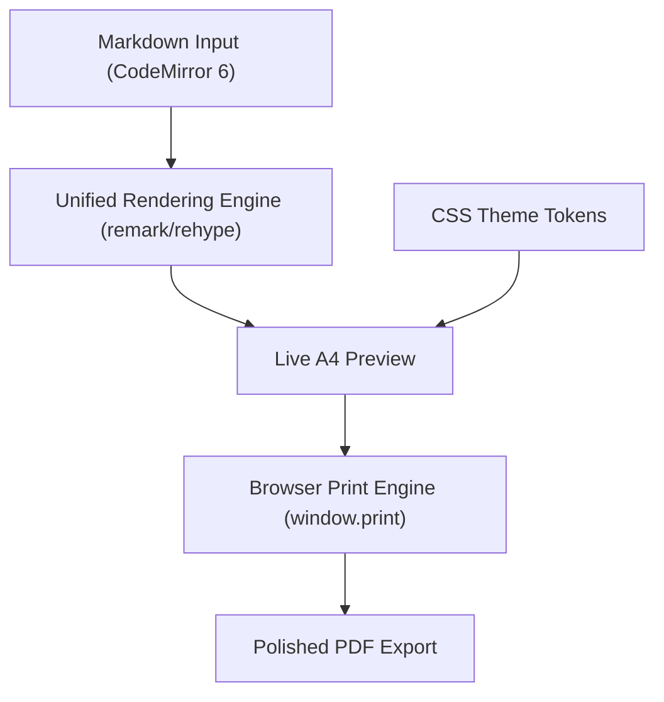

# Introduction

Markeon is a professional-grade Markdown authoring and PDF publishing suite designed to bridge the gap between the simplicity of plain-text writing and the precision of high-end graphic design. 

The core vision of Markeon is to provide a "design-first" writing experience. While most Markdown tools focus on the conversion process, Markeon focuses on the *output*. It transforms the standard Markdown workflow into a visual design process, allowing users to create documents that look intentionally designed rather than programmatically generated.

## The Design Philosophy

Markeon is conceptually built on the intersection of three industry-leading experiences:

*   **Notion**: For a fluid, modern, and distraction-free writing experience.
*   **Canva**: For intuitive visual style controls and theme management.
*   **Microsoft Word**: For rigorous layout precision and print-ready output.

The aesthetic identity of the application is inspired by the "Umbreon" color palette—utilizing deep, moody blacks and surfaces accented by glowing amber-gold highlights—reflecting the transformation of raw text into a polished gem.

## How it Works

At its heart, Markeon is a local-first web application. It eliminates the need for accounts, servers, or internet connectivity after the initial load. All documents, themes, and assets are stored directly in your browser using a virtual file system powered by IndexedDB.

The workflow follows a linear path from raw input to a pixel-accurate PDF:

## Key Capabilities

Markeon is built for power users who require technical documentation capabilities without sacrificing visual elegance:

-   **Rich Rendering**: Full support for GitHub Flavored Markdown (GFM), including tables, task lists, and footnotes.
-   **Technical Tooling**: Integrated **KaTeX** for mathematical equations and **Mermaid.js** for text-based diagrams (flowcharts, sequence diagrams, etc.).
-   **Developer Experience**: High-fidelity syntax highlighting powered by **Shiki**, bringing VS Code-quality code blocks to your documents.
-   **Visual Control**: A robust theme system that manages typography, spacing, and color tokens, coupled with a live preview that mimics actual A4/Letter page boundaries.
-   **Local Sovereignty**: No cloud syncing or external APIs. Your data stays on your machine, ensuring total privacy and offline availability.

## Who is Markeon for?

Markeon is designed for anyone who writes in Markdown but finds existing PDF export options either too basic or prohibitively complex (such as LaTeX). It is ideal for:

-   **Students** writing research papers or academic reports.
-   **Developers** creating professional project documentation or whitepapers.
-   **Writers** who want the speed of Markdown with the polish of a designed journal or resume.