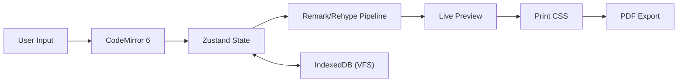

# Project Overview

Markeon is a fully client-side Markdown authoring and PDF publishing suite. It is designed to bridge the gap between the simplicity of Markdown and the layout precision of professional design tools, operating entirely within the browser to ensure data privacy and offline availability.

## Project Goals

- **Privacy First**: No server-side storage; all data remains in the user's browser.
- **Designer-Grade Output**: Provide high-fidelity control over typography and styling for PDF export.
- **Zero-Config Setup**: Immediate accessibility via browser without account creation or installation.
- **High Compatibility**: Use a virtual file system to avoid the limitations and browser-specific constraints of the File System Access API.

## High-Level Architecture

Markeon utilizes a unidirectional data flow for content rendering and a decoupled storage layer for persistence. The application is split into two primary views: a landing `HomePage` and the main `AppPage` workspace.



## Core Tech Stack

| Layer | Technology | Purpose |
| :--- | :--- | :--- |
| **Runtime/Build** | Bun + Vite | Package management and fast SPA bundling. |
| **UI Framework** | React (JSX) | Component-based UI orchestration. |
| **State Mgmt** | Zustand | Lightweight global state for editor and theme settings. |
| **Editor** | CodeMirror 6 | Extensible text editing core. |
| **MD Pipeline** | remark $\rightarrow$ rehype | Transformation of Markdown to HTML. |
| **Rendering** | Shiki / KaTeX / Mermaid | Syntax highlighting, math, and diagrams. |
| **Storage** | IndexedDB | Virtual File System for document persistence. |
| **Styling** | CSS Custom Properties | Dynamic theme tokens for live-swappable styles. |

## Application Structure

The application is divided into two distinct entry points managed within the routing logic:

### 1. Home Page (`HomePage.jsx`)
The landing page serves as the entry point. It is primarily visual, featuring an "Aurora" animated background and introductory content to guide the user into the application.

### 2. Main Application (`AppPage.jsx`)
The workspace is a complex 3-pane layout designed for a professional authoring workflow:

- **Left Sidebar**: Manages the virtual file tree and the document's Table of Contents (TOC).
- **Center Workspace**: A split-pane view containing the CodeMirror editor and the live rendered HTML preview.
- **Right Inspector**: A context-sensitive panel allowing users to manipulate CSS tokens and style properties of the rendered document.
- **Ribbon Toolbar**: A tabbed interface (File, Format, Style, Layout, Export) providing global commands.

## Storage Architecture

Markeon implements a Virtual File System (VFS) to bypass browser compatibility issues associated with direct OS file access.

### Data Distribution

| Storage | Data Type | Examples |
| :--- | :--- | :--- |
| **localStorage** | UI Preferences | Active file ID, current theme, keybinding profiles. |
| **IndexedDB** | Document Data | Plain text content, project metadata, custom font buffers. |

### Virtual File Model

Files are stored as objects within IndexedDB. The sidebar represents a UI projection of these records rather than a literal directory structure.

```json title="IndexedDB Record Schema"
{
  "id": "uuid-string",
  "name": "document.md",
  "content": "# Document Content\n...",
  "createdAt": 1700000000000,
  "updatedAt": 1700000000000,
  "order": 0
}
```

## PDF Export Mechanism

Unlike many web editors that use heavy JS libraries (like jsPDF) which often introduce canvas artifacts, Markeon leverages the browser's native printing engine.

1. **Transformation**: The Markdown is rendered to HTML via the `unified` pipeline.
2. **Styling**: A specialized set of `@media print` CSS rules is applied to define page boundaries and margins.
3. **Execution**: The application invokes `window.print()`, allowing the browser to generate a pixel-accurate PDF using the system's print-to-PDF driver.