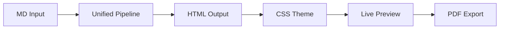

# Project Overview

Markeon is a sophisticated, browser-based Markdown authoring and PDF publishing suite designed to bridge the gap between the simplicity of plain-text writing and the precision of professional graphic design. Unlike traditional Markdown editors that rely on external CSS files or complex LaTeX configurations for styling, Markeon integrates visual design controls directly into the writing workflow.

The project's architectural philosophy is centered on **zero-friction professionalism**. It aims to provide the fluid editing experience of Notion, the granular visual control of Canva, and the layout precision of Microsoft Word, all while remaining entirely client-side.

## Core Purpose and Vision

The primary objective of Markeon is to transform Markdown—a format often relegated to "developer notes" or "basic web pages"—into a medium for high-fidelity, print-ready documents. The project removes the "technical tax" associated with professional PDF generation by replacing configuration files with a live, visual style inspector.

### Key Design Pillars
*   **Privacy by Default:** No accounts, no servers, and no cloud synchronization. All data resides in the user's browser via IndexedDB.
*   **Visual-First Styling:** A "click-to-style" interface allows users to modify document tokens (fonts, colors, margins) in real-time.
*   **Print-Centric Rendering:** The preview pane is not just a web view; it is a digital representation of a physical page, ensuring that "what you see is what you get" (WYSIWYG) during PDF export.
*   **The "Umbreon" Aesthetic:** The UI follows a specific visual identity—dark, moody surfaces with glowing amber-gold accents—designed to feel like a premium tool rather than a prototype.

## High-Level Architecture

Markeon operates as a Single Page Application (SPA) where the frontend manages the entire lifecycle of the document—from raw text input to PDF generation. 

### Conceptual Data Flow
The application processes data through a unidirectional pipeline: raw Markdown is parsed into an Abstract Syntax Tree (AST), transformed into HTML, and then styled via a dynamic system of CSS custom properties before being sent to the browser's print engine.



### Core Technology Stack

The stack is chosen for performance and extensibility, avoiding heavy dependencies in favor of specialized, best-in-class libraries.

| Layer | Technology | Role |
| :--- | :--- | :--- |
| **Build Tool** | Vite | Fast HMR and optimized bundling |
| **UI Framework** | React (JSX) | Component-based interface management |
| **State Management**| Zustand | Lightweight store for app settings and active files |
| **Editor Core** | CodeMirror 6 | Extensible text editing with high performance |
| **MD Engine** | remark + rehype | Modular pipeline for MD $\rightarrow$ HTML conversion |
| **Persistence** | IndexedDB | Virtual file system for local-first storage |
| **Typography** | Google Fonts / API | Dynamic registration of curated and custom fonts |
| **Math & Diagrams** | KaTeX & Mermaid | Rendering complex technical notation and charts |

## The Virtual File System

A critical architectural decision in Markeon is the rejection of the File System Access API to ensure maximum browser compatibility (specifically for Firefox and Safari). Instead, Markeon implements a **Virtual File System (VFS)**.

The VFS treats IndexedDB as the primary disk. When a user "creates a file," the app generates a record in the database rather than writing to the OS.

```javascript
// Conceptual structure of a document record in IndexedDB
{
  id: "uuid",
  name: "research-paper.md",
  content: "# Introduction\nThis is a professional document...",
  createdAt: 1715432000,
  updatedAt: 1715435000,
  order: 0
}
```

This approach allows Markeon to maintain a persistent project state—including file order and metadata—without requiring the user to manage a folder structure on their local machine, while keeping all data strictly private.

## Project Goals

The ultimate goal of Markeon is to move beyond the "side project" feel. The roadmap focuses on polishing the interaction model to ensure it feels like a professional-grade publishing suite. This includes:
1.  **Pixel-Perfect PDFs:** Leveraging `window.print()` and sophisticated Print CSS to eliminate canvas artifacts.
2.  **Dynamic Theme Engine:** Allowing users to swap entire visual identities via JSON-defined CSS tokens.
3.  **Contextual Editing:** Ensuring the Style Inspector knows exactly which element is being targeted in the preview to provide the most relevant controls.