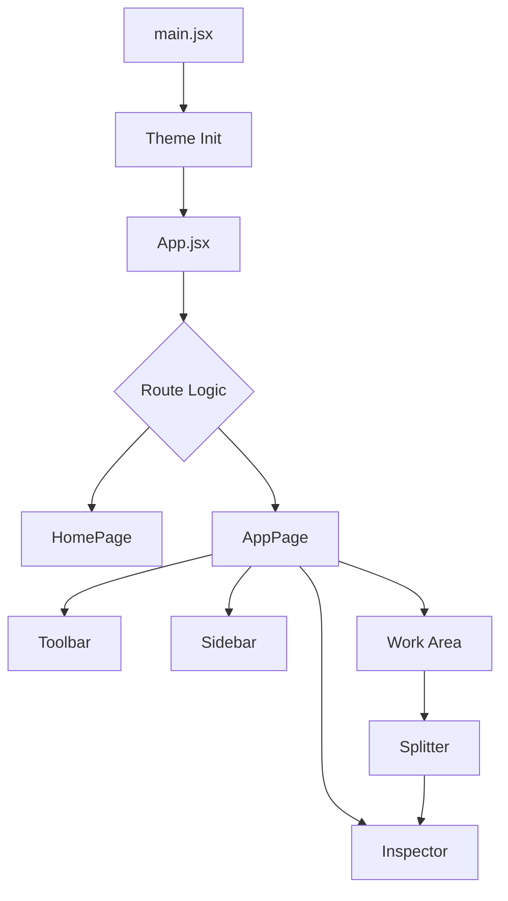

# System Architecture Overview

The Markeon application is architected as a single-page application (SPA) built with React, utilizing a dual-mode interface design that separates the public-facing landing experience from the heavy-duty markdown editing environment. The architecture emphasizes a "shell-and-panel" layout for the core editor, where a centralized application state governs the visibility and behavior of modular UI components such as the ribbon toolbar, the file sidebar, and the property inspector.

Architecturally, Markeon separates the bootstrapping process (theme initialization and style injection) from the component rendering logic. The application employs a CSS-variable-driven theming system, where the theme state is persisted in `localStorage` and applied directly to the document root before the React tree mounts to prevent Flash of Unstyled Content (FOUC).

### Core Module Summary

| Component | Responsibility | Primary Dependencies |
| :--- | :--- | :--- |
| `main.jsx` | Application bootstrapping, theme hydration, and global CSS injection. | `react-dom`, `localStorage` |
| `App.jsx` | Top-level routing and conditional rendering of page-level views. | `HomePage`, `AppPage` |
| `HomePage.jsx` | Public landing page with visual "Aurora" effects and entry points. | CSS Aurora Animations |
| `AppPage.jsx` | Core editor workspace managing the layout, splitter, and inspector. | Toolbar, Sidebar, Inspector |
| `Global CSS` | Foundation styles, print-specific overrides, and document formatting. | CSS Variables |

## Architecture, State & Data Flow

The application follows a hierarchical data flow. The theme state is the only piece of global state initialized outside the React lifecycle to ensure immediate visual consistency. Once `App.jsx` mounts, the application transitions into a component-driven state model.

### Application Boot Sequence
1. **Theme Hydration**: `main.jsx` accesses `localStorage` to retrieve the `markeon-theme` key.
2. **DOM Injection**: The `data-theme` attribute is set on `document.documentElement`, triggering the CSS variable cascade.
3. **React Mounting**: `createRoot` initializes the `App` component.
4. **Route Resolution**: `App.jsx` determines whether to render the `HomePage` (marketing/entry) or the `AppPage` (editor).

### Component Interaction Flow
In the core editor (`AppPage`), the layout is managed through a coordinated system of panels. The `Splitter` component acts as the primary interaction point for modifying the dimensions of the `Work area` and `Inspector`.



## In-Depth Code Walkthrough & Implementation Details

### Theme Initialization and Bootstrapping
The application prevents theme flickering by performing a synchronous check of the user's preferences before the React application renders.

```javascript title="src/main.jsx"
const saved = localStorage.getItem('markeon-theme')
let mode = 'dark'
try { mode = JSON.parse(saved)?.state?.mode || 'dark' } catch {}
document.documentElement.setAttribute('data-theme', mode)

createRoot(document.getElementById('root')).render(
  <StrictMode>
    <App />
  </StrictMode>
)
```

In this block, the `try...catch` wrapper is critical. Since `localStorage` data can be corrupted or manually edited by the user, `JSON.parse` could throw a `SyntaxError`. The fallback to `'dark'` ensures the application remains functional. By calling `setAttribute` on the `documentElement`, the developer ensures that all CSS selectors targeting `[data-theme='dark']` or `[data-theme='light']` are applied instantly.

### The Editor Workspace Layout
The `AppPage` component implements a complex grid-like structure that manages several independent UI regions.

```jsx title="src/pages/AppPage.jsx"
{/* Toolbar */}
<Toolbar />
{/* Tab panel strip — hidden in reading mode */}
{!isReadingMode && <TabStrip />}
{/* Sidebar */}
<Sidebar />
{/* Sidebar toggle — outline panel in reading mode, full sidebar otherwise */}
<SidebarToggle mode={isReadingMode} />
{/* Work area */}
<div className="work-area">
  <EditorCanvas />
</div>
{/* Splitter */}
<Splitter onMouseDown={onMouseDown} />
{/* Inspector */}
<Inspector />
```

The layout utilizes conditional rendering based on the `isReadingMode` state. When `isReadingMode` is true, the `TabStrip` is unmounted to maximize screen real estate, and the `SidebarToggle` changes its behavior to trigger an "Outline" panel rather than the full file explorer. This allows the application to pivot between a "Creation" context and a "Consumption" context without reloading the page.

### Splitter Interaction Logic
The `AppPage` manages the resizing of the inspector panel through mouse event listeners that track movement relative to the splitter bar.

```javascript title="src/pages/AppPage.jsx"
function onMouseMove(e) {
  if (!isDragging) return;
  const newWidth = window.innerWidth - e.clientX;
  setInspectorWidth(newWidth);
}

function onMouseUp() {
  setIsDragging(false);
  document.body.style.cursor = 'default';
}
```

The `onMouseMove` handler calculates the width of the `Inspector` by subtracting the current mouse X-coordinate from the total window width. This creates a "right-to-left" resizing feel. The `isDragging` flag (implied state) prevents the resize logic from executing when the user is not interacting with the splitter, optimizing performance by reducing unnecessary state updates.

## API / Method Reference

### `AppPage` Internal Handlers

#### `onMouseMove(e: MouseEvent)`
- **Input**: `e` (MouseEvent)
- **Behavior**: Calculates the delta between the cursor position and the right edge of the viewport.
- **State Mutation**: Updates the `inspectorWidth` state variable.
- **Invariant**: Only executes if the internal `isDragging` state is `true`.

#### `onMouseUp()`
- **Input**: None
- **Behavior**: Terminates the dragging session.
- **Side Effect**: Resets the global `document.body.style.cursor` to `'default'` to remove the resize cursor.

### Global Styles Hierarchy
The application loads styles in a specific order in `main.jsx` to manage CSS specificity:
1. `global.css`: Base resets, typography, and theme variable definitions.
2. `print.css`: Media queries for `@media print`, ensuring the editor UI (toolbars, sidebars) is hidden during PDF export.
3. `document.css`: Specialized styles for the rendered markdown output, overriding global styles for the "document" look.

## Error Handling, Edge Cases & Performance

### Robust Theme Parsing
The application handles invalid `localStorage` entries using a `try-catch` block. If the stored theme is not a valid JSON string or if the `state.mode` property is missing, the system defaults to `'dark'`. This prevents the entire application from crashing during the bootstrapping phase.

### Performance Optimizations
- **Conditional Rendering**: Components like the `Tab panel strip` are completely removed from the DOM in reading mode, reducing the number of active React components and DOM nodes.
- **Event Throttling**: The `onMouseMove` handler is tied to the browser's repaint cycle. While not explicitly wrapped in `requestAnimationFrame` in the snippet, the use of a simple state update for width ensures that React's reconciliation process handles the UI update efficiently.
- **CSS-Based Theming**: By using `data-theme` attributes on the root element, the application avoids passing theme props through every single component (prop-drilling), which would otherwise cause massive re-renders across the entire application tree whenever the theme changes.

### Edge Case: Viewport Resizing
The `Splitter` logic depends on `window.innerWidth`. If the user resizes the browser window while the inspector is open, the inspector's width remains absolute based on the last calculated pixel value. This is handled by the CSS layout (likely using `flex` or `absolute` positioning) to ensure the `Work area` consumes the remaining space.