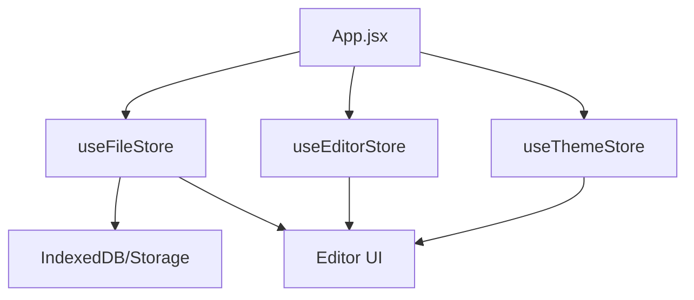
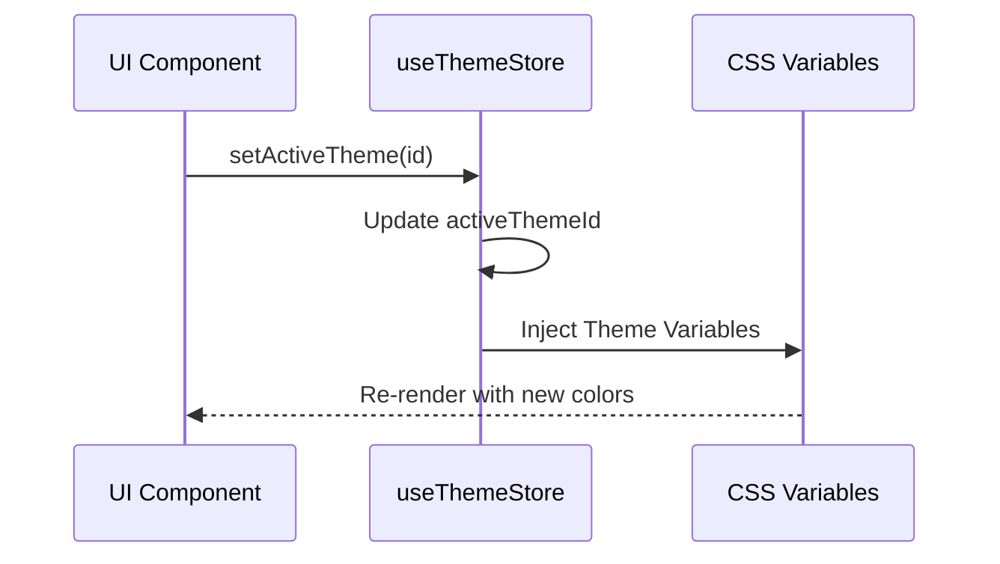

# System Architecture & State

Markeon employs a decoupled, domain-driven state management architecture built on **Zustand**. Rather than a single monolithic store, the application splits state into three specialized stores to minimize re-render cycles and separate concerns between document data, editor configuration, and visual styling.

## Architectural Overview

The application follows a unidirectional data flow where the `App` component serves as the orchestrator, and specialized stores act as the single source of truth for different domains.



## State Domain Breakdown

### 1. File Store (`useFileStore`)
The `useFileStore` manages the virtual filesystem and the lifecycle of markdown documents. It handles asynchronous CRUD operations and tracks the currently active document.

**Core State Schema:**

| Field | Type | Description |
| :--- | :--- | :--- |
| `files` | `Array<File>` | Collection of document objects containing content and metadata. |
| `activeFileId` | `String` | The UUID of the currently focused file. |
| `fileOrder` | `Array<String>` | Ordered list of file IDs for the sidebar layout. |

```js title="src/store/useFileStore.js"
export const useFileStore = create(
  persist(
    (set, get) => ({
      files: [],
      activeFileId: null,
      setActiveFile: (id) => set({ activeFileId: id }),
      updateContent: async (id, content) => {
        set((state) => ({
          files: state.files.map((f) => (f.id === id ? { ...f, content } : f)),
        }));
      },
      // ...other CRUD methods
    }),
    {
      name: 'markeon-files',
      partialize: (state) => ({ files: state.files, activeFileId: state.activeFileId }),
    }
  )
);
```

The `partialize` function is used here to ensure only essential data is persisted to local storage, preventing volatile runtime state from being cached.

### 2. Editor Store (`useEditorStore`)
The `useEditorStore` manages the behavioral configuration of the editor interface. These settings are global and apply to the current session regardless of which file is open.

**Configuration Parameters:**

| Setting | Type | Default/Range | Description |
| :--- | :--- | :--- | :--- |
| `fontSize` | `Number` | `14px` | Base font size for the editor and preview. |
| `wordWrap` | `Boolean` | `true` | Toggles soft wrapping of long lines. |
| `scrollSync` | `Boolean` | `true` | Synchronizes scroll position between editor and preview. |
| `readingZoom` | `Number` | `1.0` | Scaling factor for the reading mode view. |

```js title="src/store/useEditorStore.js"
export const useEditorStore = create((set) => ({
  fontSize: 14,
  wordWrap: true,
  scrollSync: true,
  readingMode: 'split',
  setReadingZoom: (readingZoom) => set({ readingZoom }),
  toggleWordWrap: () => set((s) => ({ wordWrap: !s.wordWrap })),
  setMargin: (side, value) => set((s) => ({ 
    margins: { ...s.margins, [side]: value } 
  })),
}));
```

### 3. Theme Store (`useThemeStore`)
The `useThemeStore` controls the visual skinning of the application. It manages a hierarchy of styles: Global Mode $\rightarrow$ Active Theme $\rightarrow$ Specific Overrides.



```js title="src/store/useThemeStore.js"
export const useThemeStore = create(
  persist(
    (set) => ({
      mode: 'dark',
      activeThemeId: 'default',
      overrides: {},
      setMode: (mode) => set({ mode }),
      setActiveTheme: (id) => set({ activeThemeId: id }),
      setThemeOverride: (key, value) => 
        set((s) => ({ overrides: { ...s.overrides, [key]: value } })),
    }),
    { name: 'markeon-theme' }
  )
);
```

## State Interaction Flow

The interaction between stores allows for complex behavior, such as per-file theme settings. While `useThemeStore` handles the global UI, `useFileStore` can store a `themeId` specific to a document, which the rendering pipeline resolves at runtime.

**Data Resolution Priority:**
1. **Inline Overrides:** `useThemeStore.overrides` (Highest priority)
2. **File Specific:** `useFileStore.files[active].themeId`
3. **Global Theme:** `useThemeStore.activeThemeId`
4. **System Default:** Base CSS variables (Lowest priority)