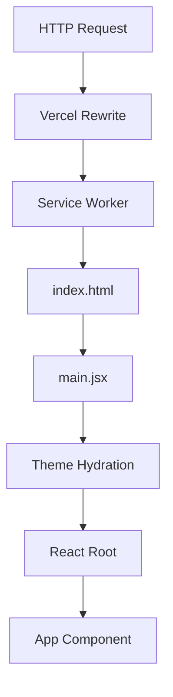

# System Infrastructure

The System Infrastructure layer serves as the foundational bootstrapping mechanism for Markeon. It encompasses the build-time configuration, the Progressive Web App (PWA) manifest, deployment routing rules, and the initial runtime environment hydration. This layer ensures that the application transitions from a static asset bundle to a fully initialized React environment with consistent theme state and optimized asset delivery.

## System Role & Architectural Position

The infrastructure acts as the interface between the host environment (Vercel/Browser) and the application logic. It manages the dependency graph via Vite and enforces the Single Page Application (SPA) routing pattern.

### Core Infrastructure Specifications

| Component | Technology | Responsibility | Critical Invariant |
| :--- | :--- | :--- | :--- |
| **Build Engine** | Vite 5.4 | Module bundling, HMR, and asset optimization. | `optimizeDeps` must exclude Shiki to prevent pre-bundling errors. |
| **Deployment** | Vercel | Edge hosting and routing. | All requests must resolve to `index.html` for client-side routing. |
| **Service Worker** | VitePWA | Asset caching and offline availability. | Google Fonts and CDN assets must use specific cache strategies. |
| **Styling Pipeline** | Tailwind CSS v4 | Just-in-Time (JIT) CSS generation. | Integration via `@tailwindcss/vite` for zero-config build. |
| **Entry Point** | `main.jsx` | DOM mounting and theme hydration. | `data-theme` must be set before `createRoot` to prevent FOUC. |

## Core Execution & Data Flow Mechanics

The system follows a strict linear sequence from network request to interactive UI. The orchestration prioritizes theme persistence and asset availability to minimize layout shift.



### Bootstrapping Sequence
1.  **Request Interception**: Vercel's `rewrites` intercept all incoming paths and route them to `index.html`, ensuring `react-router-dom` can handle deep-linking.
2.  **Asset Resolution**: The VitePWA service worker checks the `CacheFirst` and `StaleWhileRevalidate` strategies for fonts and KaTeX CSS to reduce TTFB (Time to First Byte).
3.  **Environment Hydration**: `main.jsx` executes a synchronous read of `localStorage` to retrieve the `markeon-theme` key.
4.  **DOM Mutation**: The `data-theme` attribute is applied to the `document.documentElement` to trigger CSS variable overrides before the React tree is mounted.
5.  **Component Mounting**: The `createRoot` API initializes the React 18 concurrent renderer.

## Implementation Deep Dive

### PWA and Build Optimization
The build configuration is optimized for heavy dependencies like `shiki` and `mermaid`, which are excluded from the pre-bundling phase to avoid compatibility issues with Vite's dependency optimizer.

```javascript title="vite.config.js"
export default defineConfig({
  plugins: [
    react(),
    tailwindcss(),
    VitePWA({
      registerType: 'autoUpdate',
      includeAssets: ['favicon.svg'],
      manifest: {
        name: 'Markeon',
        theme_color: '#0C0C0C',
        display: 'standalone',
        // ... icons configuration
      },
      workbox: {
        globPatterns: ['**/*.{js,css,html,svg,woff2}'],
        runtimeCaching: [
          {
            urlPattern: /^https:\/\/fonts\.googleapis\.com\/.*/i,
            handler: 'StaleWhileRevalidate',
            options: { cacheName: 'google-fonts-stylesheets' },
          },
          {
            urlPattern: /^https:\/\/fonts\.gstatic\.com\/.*/i,
            handler: 'CacheFirst',
            options: {
              cacheName: 'google-fonts-webfonts',
              expiration: { maxEntries: 30, maxAgeSeconds: 31536000 },
              cacheableResponse: { statuses: [0, 200] },
            },
          },
        ],
      },
    }),
  ],
  optimizeDeps: {
    exclude: ['shiki', '@shikijs/rehype'],
  },
})
```
**Mechanics:**
- **`registerType: 'autoUpdate'`**: Forces the service worker to update and reload the page automatically when a new version is detected.
- **`StaleWhileRevalidate`**: Used for stylesheets where immediate availability is critical, but updates are acceptable in the background.
- **`CacheFirst`**: Used for binary font files to eliminate redundant network requests.
- **`optimizeDeps.exclude`**: Prevents Vite from attempting to pre-bundle Shiki, which uses complex WASM/ESM structures that can break during the `esbuild` phase.

### Runtime Entry and Theme Injection
The entry point ensures that the user's visual preference is locked in before the first paint.

```jsx title="src/main.jsx"
const saved = localStorage.getItem('markeon-theme')
let mode = 'dark'
try { 
  mode = JSON.parse(saved)?.state?.mode || 'dark' 
} catch {}
document.documentElement.setAttribute('data-theme', mode)

createRoot(document.getElementById('root')).render(
  <StrictMode>
    <App />
  </StrictMode>
)
```
**Mechanics:**
- **Synchronous Execution**: The theme check happens in the main execution thread before React's `render` cycle.
- **Graceful Degradation**: The `try...catch` block handles corrupted `localStorage` strings, defaulting to `'dark'`.
- **CSS Variable Injection**: Setting `data-theme` on the root element allows the Global Design System to resolve colors via `[data-theme='dark']` selectors.

### Deployment Orchestration
The SPA nature of Markeon requires a catch-all rewrite to prevent 404 errors on hard refreshes of nested routes.

```json title="vercel.json"
{
  "rewrites": [
    { "source": "/(.*)", "destination": "/index.html" }
  ]
}
```
**Mechanics:**
- **`source: "/(.*)"`**: A regular expression matching all incoming URI paths.
- **`destination: "/index.html"`**: Redirects all traffic to the entry HTML file, handing control over to the client-side router.

## Method / State Reference & Error Recovery

### PWA Cache Strategy Matrix

| Asset Type | Strategy | Cache Name | TTL / Max Entries |
| :--- | :--- | :--- | :--- |
| Google Font CSS | `StaleWhileRevalidate` | `google-fonts-stylesheets` | Default |
| Google Font WOFF2 | `CacheFirst` | `google-fonts-webfonts` | 30 entries / 1 year |
| CDN (KaTeX/JS) | `StaleWhileRevalidate` | `cdn-assets` | Default |
| Application Bundles | `Precache` | `vite-pwa-cache` | Versioned |

### Failure Modes and Recovery

| Failure Scenario | Impact | Recovery Mechanism |
| :--- | :--- | :--- |
| **LocalStorage Corruption** | Theme reset to default. | `try...catch` wrapper in `main.jsx` defaults state to `'dark'`. |
| **CDN Outage (KaTeX)** | Math formulas fail to render. | Fail-safe raw markdown fallback in the Processing Engine. |
| **SW Registration Fail** | App works as standard SPA. | `vite-plugin-pwa` fails silently; app relies on standard browser cache. |
| **Rewrite Misconfiguration** | 404 on refresh. | Vercel deployment fails if `vercel.json` is missing or malformed. |