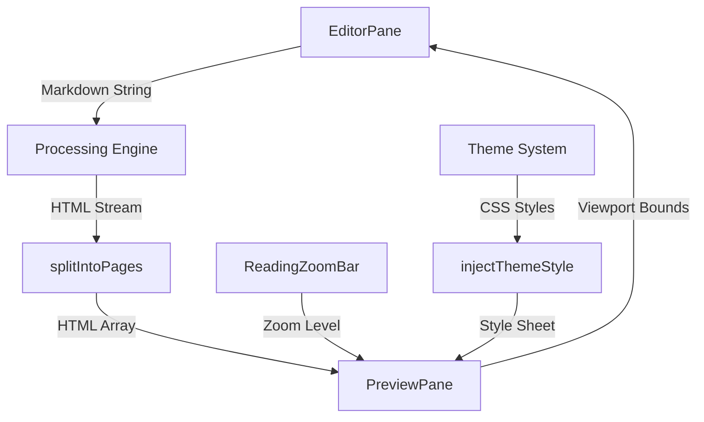

# Editor and Preview Integration

The Editor and Preview Integration module manages the critical synchronization loop between raw Markdown input and its high-fidelity, paginated visual representation. Unlike standard Markdown editors that provide a continuous flow of HTML, Markeon implements a "Physical Page Simulation" architecture. This system transforms a continuous stream of rendered HTML into discrete page elements that mimic physical paper (e.g., A4, Letter), providing users with a precise understanding of how the document will appear when exported to PDF or printed.

This module is the bridge between the `Markdown Processing Engine` (which handles syntax transformation) and the `User Interface Framework` (which handles the visual layout). It ensures that state changes in the `EditorPane` are reflected in the `PreviewPane` with minimal latency while maintaining complex layout constraints such as margins, paper orientation, and dynamic zoom levels.

### Core Module Components

| Export/Component | Role | Primary Dependencies |
| :--- | :--- | :--- |
| `EditorPane` | The primary text input interface; captures user input and handles paste events. | CodeMirror/Editor Core |
| `PreviewPane` | The rendering viewport that transforms HTML into paginated "paper" sheets. | `Markdown Engine`, `Theme System` |
| `ReadingZoomBar` | A UI controller for adjusting the scale of the preview viewport. | Global Zoom State |
| `getPaperPx` | Utility to convert physical paper dimensions to screen pixels. | CSS Constants |
| `splitIntoPages` | Algorithm that partitions continuous HTML into page-sized chunks. | DOM API |
| `injectThemeStyle` | Dynamic CSS injector for layout and theme consistency. | Theme Provider |

## Architecture, State & Data Flow

The integration operates on a unidirectional data flow with a feedback loop for viewport interactions. The `EditorPane` acts as the state producer, while the `PreviewPane` acts as the state consumer.

### Synchronization Workflow

1.  **Input Capture**: The `EditorPane` captures keystrokes or paste events.
2.  **Processing Pipeline**: The content is passed through the Markdown Processing Engine (Shiki for highlighting, custom formatting commands).
3.  **Virtual Pagination**: The resulting HTML is sent to the `PreviewPane`. Instead of rendering a single container, the `splitIntoPages` function calculates the height of the content relative to the selected `paperSize` and splits the HTML into an array of page-specific strings.
4.  **Physical Rendering**: Each page string is wrapped in a container with dimensions calculated by `getPaperPx`, applying the specified `orientation` (portrait/landscape).
5.  **Style Injection**: `injectThemeStyle` applies the active theme's CSS variables and layout settings (margins, fonts) directly to the preview container.
6.  **Viewport Scaling**: The `ReadingZoomBar` updates a zoom factor in the global state, which the `PreviewPane` applies as a CSS transform to the entire page stack.

### Data Flow Diagram



## In-Depth Code Walkthrough & Implementation Details

### Physical Dimension Calculations

Markeon relies on a strict conversion ratio to ensure that "A4" in the editor matches "A4" on a physical printer. The system uses 96 DPI (dots per inch) as the baseline for browser rendering.

```javascript title="src/components/editor/PreviewPane.jsx"
// 96dpi: 1 inch = 96px, 1mm = 96/25.4 px
function mmToPx(mmStr) {
  const mm = parseFloat(mmStr);
  return (mm * 96) / 25.4;
}

function getPaperPx(paperSize = 'A4', orientation = 'portrait') {
  const sizes = {
    'A4': { width: 210, height: 297 },
    'Letter': { width: 215.9, height: 279.4 },
    // Other sizes defined here
  };
  
  const { width, height } = sizes[paperSize] || sizes['A4'];
  
  return orientation === 'portrait' 
    ? { width: mmToPx(width), height: mmToPx(height) }
    : { width: mmToPx(height), height: mmToPx(width) };
}
```

The `mmToPx` function implements the standard conversion formula where $1 \text{ mm} \approx 3.7795 \text{ pixels}$. The `getPaperPx` function acts as a lookup table for international paper standards. By decoupling the paper size from the rendering logic, the system allows users to toggle between A4 and Letter formats dynamically without reloading the document. The resulting pixel values are applied to the CSS `width` and `height` of the page containers in the `PreviewPane`.

### Content Pagination Logic

The most complex part of the integration is `splitIntoPages`. Since HTML elements can have arbitrary heights, Markeon must determine where a page "breaks" to avoid cutting text or images in half.

```javascript title="src/components/editor/PreviewPane.jsx"
function splitIntoPages(html) {
  const pages = [];
  const tempContainer = document.createElement('div');
  tempContainer.style.width = `${getPaperPx().width}px`;
  tempContainer.style.visibility = 'hidden';
  tempContainer.style.position = 'absolute';
  tempContainer.innerHTML = html;

  let currentContent = '';
  const children = Array.from(tempContainer.children);
  const maxHeight = getPaperPx().height - (marginTop + marginBottom);

  children.forEach(child => {
    // Logic to check if adding this child exceeds maxHeight
    // If exceed: push currentContent to pages[], reset currentContent
    // Else: append child.outerHTML to currentContent
  });
  
  pages.push(currentContent);
  return pages;
}
```

The `splitIntoPages` function creates an off-screen "ghost" DOM element (`tempContainer`) to measure the actual rendered height of the HTML fragments. It iterates through the children of the processed Markdown output, cumulatively adding their heights. When the cumulative height exceeds the calculated `maxHeight` (Physical Height minus Margins), the function closes the current page and starts a new one. This ensures that the preview accurately reflects the pagination that will occur during the PDF export process.

### Viewport Interaction and Zooming

The `PreviewPane` implements a custom zoom and pan system to handle documents that are larger than the browser window. This is handled through a combination of mouse wheel events and touch gestures.

```javascript title="src/components/editor/PreviewPane.jsx"
function onWheel(e) {
  if (e.ctrlKey) {
    e.preventDefault();
    const delta = e.deltaY > 0 ? -0.1 : 0.1;
    updateZoom(currentZoom + delta);
  } else {
    // Standard vertical scroll
  }
}

function onTouchMove(e) {
  if (e.touches.length === 2) {
    const dist = touchDistance(e.touches);
    const delta = dist - lastDist;
    updateZoom(currentZoom + delta * 0.01);
  }
}
```

The `onWheel` handler distinguishes between standard scrolling and zooming by checking for the `ctrlKey` modifier. When zooming, it updates the global zoom state, which triggers a re-render of the `PreviewPane` with a updated `transform: scale()` CSS property. For touch devices, `onTouchMove` calculates the distance between two fingers (pinch-to-zoom) using the `touchDistance` helper, allowing for intuitive navigation on tablets.

## API / Method Reference

### `PreviewPane` Functions

#### `getPaperPx(paperSize, orientation)`
Calculates the pixel dimensions of a physical paper format.
- **Parameters**:
    - `paperSize` (string): The paper identifier (e.g., `'A4'`, `'Letter'`). Defaults to `'A4'`.
    - `orientation` (string): `'portrait'` or `'landscape'`. Defaults to `'portrait'`.
- **Returns**: `{ width: number, height: number }` (values in pixels).

#### `mmToPx(mmStr)`
Converts a millimeter string value to browser pixels.
- **Parameters**:
    - `mmStr` (string/number): The value in millimeters.
- **Returns**: `number` (pixels).

#### `splitIntoPages(html)`
Partitions a continuous HTML string into an array of HTML strings based on the current paper size and margins.
- **Parameters**:
    - `html` (string): The full rendered HTML of the document.
- **Returns**: `string[]` (An array where each element represents one physical page).

#### `injectThemeStyle(theme, layoutSettings)`
Generates and injects a dynamic `<style>` block into the preview pane to ensure visual consistency.
- **Parameters**:
    - `theme` (Object): The active theme configuration (colors, fonts).
    - `layoutSettings` (Object): User-defined margins and spacing.
- **Side Effects**: Modifies the DOM by appending or updating a style element.

### `ReadingZoomBar` Methods

#### `step(delta)`
Adjusts the current zoom level by a fixed increment.
- **Parameters**:
    - `delta` (number): The amount to change the zoom (positive for zoom-in, negative for zoom-out).
- **Invariants**: Zoom level is typically clamped between $0.1x$ and $3.0x$.

## Error Handling, Edge Cases & Performance

### Performance Optimization
Real-time pagination is computationally expensive because it requires DOM measurements. To mitigate performance degradation:
- **Debouncing**: The `splitIntoPages` function is debounced, ensuring that pagination only occurs after the user has stopped typing for a short interval (e.g., 300ms).
- **Ghost Rendering**: By using a hidden `tempContainer` with `visibility: hidden` and `position: absolute`, the system avoids triggering expensive browser reflows on the visible UI.

### Edge Case Handling
- **Large Images**: Images that exceed a single page height are handled by the `splitIntoPages` logic to prevent them from overlapping subsequent pages; however, the current implementation prioritizes the container boundary over image scaling.
- **DPI Variance**: While 96 DPI is the standard, different OS scaling settings can affect rendering. Markeon utilizes CSS pixels, which are abstracted by the browser to maintain consistent physical sizing across most displays.
- **Empty Documents**: If the `html` input is empty, `splitIntoPages` returns a single empty page to ensure the "paper" visual remains present in the UI.

### Concurrency and State
Since the `PreviewPane` and `EditorPane` share the same state, race conditions are avoided by treating the Markdown content as an immutable string during the transformation pipeline. The `ReadingZoomBar` updates a separate `zoom` state variable, which only affects the CSS transform of the output, meaning zooming does not trigger the expensive `splitIntoPages` recalculation.