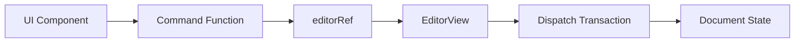

# Editor Manipulation & Commands

The Editor Manipulation system in Markeon provides a decoupled interface for modifying the document content. It utilizes a Command Pattern to abstract the complexities of the CodeMirror 6 `EditorView` transactions, allowing external UI components—such as the Ribbon toolbar—to trigger text transformations without maintaining a direct reference to the editor state.

## Architectural Flow

The system relies on a shared mutable reference to the active editor instance. When a formatting command is invoked, it retrieves the current view, calculates the necessary text changes based on the current selection, and dispatches a transaction to the editor.



## The Editor Reference

To avoid prop-drilling the `EditorView` instance through the React component tree, Markeon uses a shared reference object. This acts as a bridge between the `EditorPane` (which creates the view) and the toolbar panels (which manipulate it).

```js title="src/lib/editorRef.js"
// Shared mutable ref to the active CodeMirror EditorView instance.
export const editorRef = {
  current: null
};
```

The `EditorPane` updates `editorRef.current` during the CodeMirror initialization phase and sets it to `null` upon destruction to prevent memory leaks and stale references.

## Command Implementation Logic

Formatting commands are implemented in `src/lib/formatCommands.js`. Rather than writing unique logic for every markdown symbol, the module uses several higher-order utility functions to handle common text manipulation patterns.

### Core Utilities

| Function | Purpose | Mechanism |
| :--- | :--- | :--- |
| `wrapSelection` | Inline formatting | Wraps selection with `before` and `after` markers. |
| `toggleLinePrefix` | Block formatting | Prepends/removes a string at the start of the current line. |
| `insertAtCursor` | Text insertion | Inserts a specific string at the current cursor position. |
| `setHeading` | Structural change | Removes existing heading markers and applies a new level (1-3). |

### Selection Wrapping

The `wrapSelection` function handles inline styles like bold, italic, and inline code. If no text is selected, it inserts the markers and places the cursor between them.

```js title="src/lib/formatCommands.js"
function wrapSelection(before, after = before) {
  const view = getView();
  if (!view) return;

  const { from, to } = view.state.selection.main;
  const text = view.state.doc.sliceString(from, to);
  
  view.dispatch({
    changes: { from, to, insert: `${before}${text}${after}` },
    selection: { anchor: from + before.length, head: to + before.length }
  });
}
```

### Line Prefix Toggling

The `toggleLinePrefix` function is used for elements like blockquotes and lists. It checks if the current line already starts with the specified prefix to determine whether to add or remove it.

```js
// Simplified logic representation of toggleLinePrefix
function toggleLinePrefix(prefix) {
  const view = getView();
  const { from } = view.state.selection.main;
  const line = view.state.doc.lineAt(from);
  const lineStart = line.from;
  const currentText = view.state.doc.sliceString(lineStart, lineStart + prefix.length);

  const change = currentText === prefix 
    ? { from: lineStart, to: lineStart + prefix.length, insert: "" }
    : { from: lineStart, to: lineStart, insert: prefix };

  view.dispatch({ changes: change });
}
```

## Command API Reference

The following constants are exported and mapped to toolbar buttons. Each invokes the underlying utility functions with specific Markdown syntax.

| Export | Utility Used | Syntax Applied |
| :--- | :--- | :--- |
| `bold` | `wrapSelection` | `**text**` |
| `italic` | `wrapSelection` | `*text*` |
| `strikethrough` | `wrapSelection` | `~~text~~` |
| `inlineCode` | `wrapSelection` | `` `text` `` |
| `codeBlock` | `wrapSelection` | ` ```text``` ` |
| `h1` / `h2` / `h3` | `setHeading` | `#`, `##`, `###` |
| `blockquote` | `toggleLinePrefix` | `> ` |
| `bulletList` | `toggleLinePrefix` | `- ` |
| `orderedList` | `toggleLinePrefix` | `1. ` |
| `horizontalRule` | `insertAtCursor` | `---` |

### Complex Commands

For commands requiring user input, such as `link()`, the function typically triggers a prompt or a UI modal to collect the URL before executing the `wrapSelection` logic.

```js title="src/lib/formatCommands.js"
export function link() {
  const url = prompt("Enter URL:");
  if (url) {
    const view = getView();
    const { from, to } = view.state.selection.main;
    const text = view.state.doc.sliceString(from, to);
    view.dispatch({
      changes: { from, to, insert: `[${text}](${url})` }
    });
  }
}