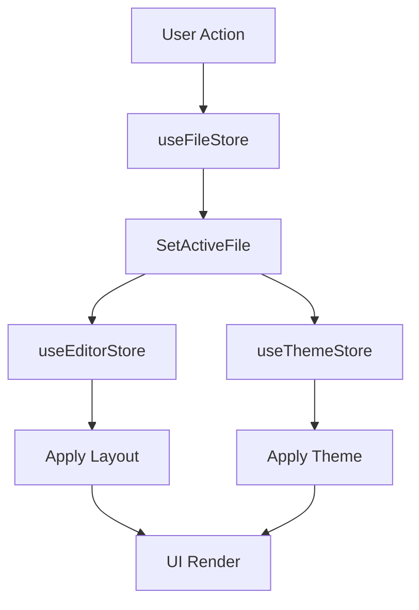

# State Management Strategy

The state management architecture of Markeon is designed around a decoupled, store-based approach. Rather than utilizing a single monolithic state tree, the application partitions its state into three specialized stores: **File**, **Editor**, and **Theme**. This separation of concerns ensures that high-frequency updates (like editor zoom or scroll synchronization) do not trigger unnecessary re-renders in the file system tree or global theme configuration.

This strategy allows Markeon to maintain a highly responsive user interface while handling complex asynchronous operations—such as file I/O and persistence—independently of the visual state.

### Store Architecture Overview

The state is divided into three distinct domains, each responsible for a specific layer of the application's operational logic.

| Store | Responsibility | Key State Properties | Primary Operations |
| :--- | :--- | :--- | :--- |
| `useFileStore` | Document lifecycle & content | `files`, `activeFileId`, `fileOrder` | CRUD operations, file renaming, content updates |
| `useEditorStore` | Editor behavior & layout | `fontSize`, `wordWrap`, `readingZoom` | Layout toggles, zoom clamping, margin adjustments |
| `useThemeStore` | Visual identity & mode | `mode`, `activeThemeId`, `overrides` | Mode switching, theme application, style overrides |

---

### State Transition Flow

State transitions in Markeon often happen in a coordinated sequence. For example, when a user selects a different file from the sidebar, the application must synchronize the active document, the specific layout preferences for that file, and its associated theme.



---

### Deep Dive: The Store Implementations

#### 1. File State Management (`useFileStore`)
The `useFileStore` acts as the data orchestration layer. It is the only store that heavily relies on asynchronous operations, as it interfaces with the persistence layer to ensure documents are saved and retrieved correctly.

A critical feature of this store is the ability to handle file-specific overrides. While global settings exist, individual files can have their own layouts and styles.

```javascript
// Example: Updating file content and persisting state
updateContent: async (id, content) => {
  // Logic to find the file and update its internal content buffer
  // followed by an asynchronous save to the local database
},
setFileTheme: async (id, themeId) => {
  // Associates a specific theme with a specific document
},
```

The store also implements a `partialize` function, which suggests a selective persistence strategy—ensuring only necessary state slices are mirrored to local storage to optimize performance.

#### 2. Editor Operational State (`useEditorStore`)
This store manages the "Workspace" experience. It handles the ephemeral state of the editor window and the specific configurations of the reading mode. To prevent UI breakage, the store includes utility logic such as `clampReadingZoom` to ensure the zoom level stays within a usable range.

Key operational toggles include:
*   **View Controls**: `toggleWordWrap`, `toggleLineNumbers`, and `toggleScrollSync`.
*   **Reading Mode**: A dedicated state for `readingMode` and `readingZoom`, allowing the user to transition from an editing environment to a focused reading environment.
*   **Layout**: Management of margins (`setMargin`) and overall editor layout (`setLayout`).

#### 3. Visual Theme State (`useThemeStore`)
The `useThemeStore` is responsible for the aesthetic layer. It manages the transition between light and dark modes and allows for granular "overrides," where specific theme keys can be modified without changing the base theme entirely.

```javascript
// Example: Theme mode orchestration
toggleMode: () => set((s) => ({ 
  mode: s.mode === 'light' ? 'dark' : 'light' 
})),
setThemeOverride: (key, value) => set((s) => ({
  overrides: { ...s.overrides, [key]: value }
})),
```

### Integration Summary

By splitting the state into these three domains, Markeon achieves a balance between **global consistency** (Themes) and **document-specific flexibility** (Files). The `useFileStore` serves as the anchor, while the `useEditorStore` and `useThemeStore` provide the reactive layer that modifies the user's immediate visual experience.