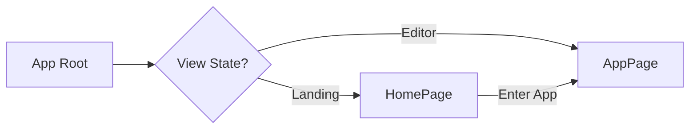
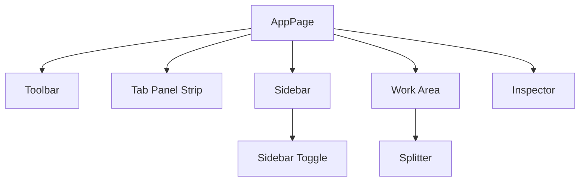

# Application Routing and Layout

The Application Routing and Layout module serves as the structural backbone of Markeon, governing the transition between the public-facing landing experience and the professional markdown editing environment. Rather than employing a complex routing library for a small number of views, Markeon utilizes a conditional rendering strategy at the root level to switch between the "Marketing" state and the "Application" state.

This architectural choice ensures a lightweight footprint and a seamless transition for the user as they move from discovering the tool to utilizing its full editor capabilities.

### Architectural Role

The routing system is designed as a binary switch managed within the root `App` component. This separates the concern of "landing" (attracting users) from "operating" (the core editor logic), preventing the overhead of the editor's complex state and layout from impacting the initial load of the home page.

| Component | Role | Primary Responsibility |
| :--- | :--- | :--- |
| `App` | Root Controller | Orchestrates the top-level switch between `HomePage` and `AppPage`. |
| `HomePage` | Landing Page | Presents the product vision via a curated visual experience (Aurora background). |
| `AppPage` | Workspace Shell | Manages the complex grid of the editor, including the toolbar, sidebar, and inspector. |

### Routing and View Transitions

The application logic follows a simple conditional flow. When the application initializes, the `App` component determines which page to mount. This approach allows the editor workspace to maintain its own internal state independently of the landing page.



In `App.jsx`, the implementation reflects this straightforward logic:

```jsx
export default function App() {
  // The App component acts as the primary router
  return (
    <>
      {/* Conditional rendering logic determines if 
          the user sees the Landing page or the Workspace */}
      {isLanding ? <HomePage /> : <AppPage />}
    </>
  );
}
```

### The Workspace Layout Architecture

Once the user enters the `AppPage`, the layout shifts from a simple page-based view to a sophisticated, multi-pane IDE-like interface. The `AppPage` component functions as a layout manager, coordinating several high-density UI zones.

#### Layout Component Hierarchy

The workspace is divided into functional zones that respond to the application's current mode (e.g., "Reading Mode" vs. "Editing Mode").



#### Layout Zones & Behavior

The `AppPage` manages the visibility and behavior of these zones dynamically:

1.  **The Toolbar**: A persistent top-level navigation and command bar.
2.  **Tab Panel Strip**: Displays open documents; this is conditionally hidden when the user enters **Reading Mode** to maximize screen real estate.
3.  **The Sidebar**: Handles file navigation and document outlines. Its behavior is context-aware:
    *   **Normal Mode**: Acts as a full sidebar for file management.
    *   **Reading Mode**: Transitions into an outline panel.
4.  **The Work Area & Splitter**: The core engine of the app where the editor and preview reside, separated by a draggable splitter for customizable viewing ratios.
5.  **The Inspector**: A right-aligned panel for document properties and metadata.

### Context-Aware UI Logic

A key feature of the layout is its ability to morph based on the user's intent. The `AppPage` utilizes state to modify the DOM structure in real-time.

```jsx
{/* Tab panel strip — hidden in reading mode */}
{!isReadingMode && <TabPanelStrip />}

{/* Sidebar toggle — outline panel in reading mode, full sidebar otherwise */}
<SidebarToggle mode={isReadingMode ? 'outline' : 'full'} />
```

This logic ensures that the interface removes distractions during the "Reading" phase while providing maximum utility during the "Composition" phase. The interaction is further refined by mouse event handlers (`onMouseMove`, `onMouseUp`) within the `AppPage`, which likely manage the resizing of the split-screen work area to provide a fluid user experience.