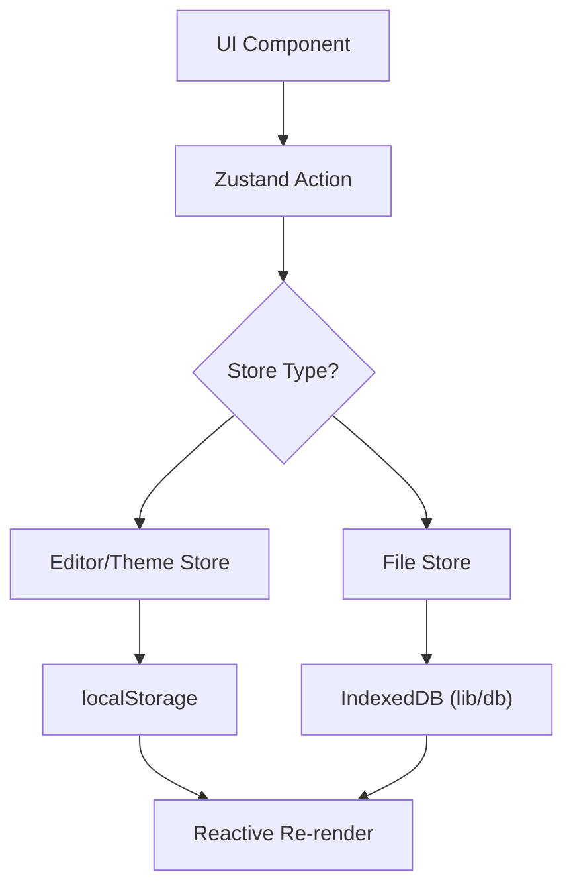

# Client State Orchestration

## System Role & Architectural Position

Client State Orchestration in Markeon serves as the reactive source of truth for the application's frontend. It utilizes **Zustand** to implement a decoupled, store-based architecture that separates volatile UI state from persistent document metadata. The orchestration layer is divided into three specialized stores to prevent unnecessary re-renders and isolate domain logic.

### State Domain Distribution

| Store | Responsibility | Persistence Mechanism | Sync Frequency |
| :--- | :--- | :--- | :--- |
| `useEditorStore` | UI preferences, zoom levels, and PDF export schemas. | `localStorage` via `persist` | Immediate/On-change |
| `useFileStore` | File system tree, active document tracking, and content buffers. | IndexedDB (`lib/db`) + `localStorage` | Async/Debounced |
| `useThemeStore` | Color modes, CSS variable overrides, and theme identifiers. | `localStorage` via `persist` | Immediate/DOM-synced |

## Core Execution & Data Flow Mechanics

The state orchestration follows a unidirectional data flow: **UI Event $\rightarrow$ Store Action $\rightarrow$ State Mutation $\rightarrow$ Persistence Layer $\rightarrow$ Reactive UI Update**. 

For file-system operations, the `useFileStore` acts as a proxy for the underlying database. When a file is modified, the store concurrently updates the in-memory state and triggers an asynchronous write to the IndexedDB layer.

### State Synchronization Workflow



### Key Orchestration Invariants
*   **Bootstrapping Lock**: The `_bootstrapping` flag in `useFileStore` prevents race conditions during the initial `loadFiles` call, ensuring the default "welcome.md" is not duplicated across multiple mount cycles.
*   **Partial Persistence**: The `partialize` filter is used in `useFileStore` and `useThemeStore` to prevent large data blobs (like the entire file list) from bloating `localStorage`, persisting only critical pointers like `activeFileId`.
*   **DOM Synchronization**: The `useThemeStore` implements a side-effect pattern where state mutations trigger direct manipulation of the `document.documentElement` attributes to ensure CSS variable injection occurs outside the React render cycle for performance.

## Implementation Deep Dive

### File System State Management
The `useFileStore` manages the lifecycle of documents. It integrates `nanoid` for unique identifier generation and `extractMarkeonImageIds` to ensure orphaned assets are purged from the database when a file is deleted.

```javascript title="src/store/useFileStore.js"
export const useFileStore = create(
  persist(
    (set, get) => ({
      files: [],
      activeFileId: null,

      loadFiles: async () => {
        if (_bootstrapping) return
        _bootstrapping = true
        const files = await getAllFiles()
        if (files.length === 0) {
          const defaultFile = makeFile('welcome.md')
          // ... default content assignment
          await saveFile(defaultFile)
          set({ files: [defaultFile], activeFileId: defaultFile.id })
        } else {
          const activeId = get().activeFileId
          set({ files, activeFileId: activeId && files.find(f => f.id === activeId) ? activeId : files[0].id })
        }
      },
      // ... other actions
    }),
    {
      name: 'markeon-files',
      partialize: (state) => ({ activeFileId: state.activeFileId }),
    }
  )
)
```
**Mechanics:**
1.  `loadFiles`: Initializes the application state by fetching all records from IndexedDB.
2.  `partialize`: Specifically excludes the `files` array from `localStorage` to avoid data duplication and size limits, relying on IndexedDB for the actual content.
3.  `activeFileId` resolution: Implements a fallback mechanism that selects the first available file if the persisted `activeFileId` is no longer valid.

### UI Configuration & Constraint Logic
The `useEditorStore` handles the complex mapping of the editor's visual state, including a clamping mechanism for the reading zoom to prevent layout collapse.

```javascript title="src/store/useEditorStore.js"
export const READING_ZOOM_MIN = 0.5
export const READING_ZOOM_MAX = 2.5

function clampReadingZoom(z) {
  return Math.min(READING_ZOOM_MAX, Math.max(READING_ZOOM_MIN, z))
}

// Inside store definition:
setReadingZoom: (readingZoom) => set({ readingZoom: clampReadingZoom(readingZoom) }),
setMargin: (side, value) =>
  set((s) => ({
    exportSettings: {
      ...s.exportSettings,
      margins: { ...s.exportSettings.margins, [side]: value },
    },
  })),
```
**Mechanics:**
1.  `clampReadingZoom`: Pure utility function enforcing a strict range $[0.5, 2.5]$ on the zoom scale.
2.  **Deep State Mutation**: The `setMargin` action demonstrates the immutable update pattern required for nested objects in Zustand, ensuring that only the specific margin axis (top, right, bottom, left) is updated while preserving other export settings.

### Theme & DOM Synchronization
The `useThemeStore` coordinates the visual identity of the application by bridging Zustand state with HTML data attributes.

```javascript title="src/store/useThemeStore.js"
setMode: (mode) => {
  document.documentElement.setAttribute('data-theme', mode)
  set({ mode })
},

toggleMode: () => {
  const next = document.documentElement.getAttribute('data-theme') === 'dark'
    ? 'light'
    : 'dark'
  document.documentElement.setAttribute('data-theme', next)
  set({ mode: next })
},
```
**Mechanics:**
1.  `setAttribute('data-theme', mode)`: Directly updates the root element, triggering an immediate CSS variable swap across the entire DOM tree.
2.  `toggleMode`: Performs a read-modify-write operation on the DOM attribute to determine the next state, ensuring the UI is perfectly synced with the underlying state store.

## Method & State Reference

### File Object Schema
Each file managed by `useFileStore` adheres to the following structural contract:

| Property | Type | Description | Default / Constraint |
| :--- | :--- | :--- | :--- |
| `id` | `string` | Unique identifier generated via `nanoid()`. | Required |
| `name` | `string` | Filename including extension (e.g., `.md`). | `untitled.md` |
| `content` | `string` | Raw markdown text content. | Empty string |
| `themeId` | `string` | Identifier for the associated visual theme. | `academic-serif` |
| `layoutSettings`| `Object` | Page-specific margins, paper size, and orientation. | `DEFAULT_LAYOUT` |
| `styleOverrides`| `Object` | Custom font and color overrides for the document. | `DEFAULT_STYLE` |

### Critical Failure Modes & Recovery

| Failure Scenario | System Impact | Recovery Mechanism |
| :--- | :--- | :--- |
| **IndexedDB Corruption** | `loadFiles` fails to resolve. | Application falls back to `makeFile('welcome.md')` and attempts to re-initialize the DB. |
| **localStorage Quota Exceeded**| `persist` middleware fails to save. | State remains in-memory for the session; UI remains functional but preferences are lost on refresh. |
| **Invalid `activeFileId`** | Null reference in editor view. | `loadFiles` logic validates the ID against the current file list and defaults to `files[0].id`. |
| **Zombie Attachments** | Storage leak in DB. | `deleteFile` invokes `extractMarkeonImageIds` to identify and purge linked image assets. |