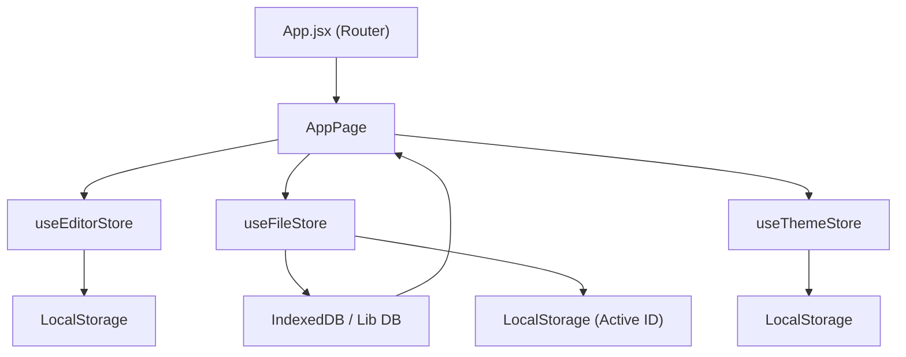

# Core Architecture

Markeon is built as a high-performance Markdown editor utilizing a decoupled state management architecture. The application separates UI preferences, document data, and visual themes into distinct stores to ensure optimal rendering performance and a clean separation of concerns.

## Application Routing

The application employs `react-router-dom` for navigation, utilizing a flat routing structure to distinguish between the landing experience and the core editor environment.

- `/`: Redirects to the `HomePage`, providing the entry point for users.
- `/app`: The main application workspace (`AppPage`) where the editor and preview are hosted.
- `*`: A catch-all route that redirects unauthorized or invalid paths back to the home page.

## State Management Strategy

Markeon leverages **Zustand** for state management, utilizing a distributed store pattern rather than a single monolithic state tree. Each store is enhanced with the `persist` middleware to ensure user settings and session states survive page reloads.

### 1. Editor Store (`useEditorStore`)
This store manages the ephemeral UI state and editor-specific configurations. It controls how the user interacts with the interface without affecting the underlying document content.

- **UI Controls**: Manages `layout` (e.g., split view), `fontSize`, `wordWrap`, and `lineNumbers`.
- **Reading Mode**: Implements a specialized reading experience with clamped zoom levels (between 0.5x and 2.5x).
- **Export Configuration**: Stores detailed settings for PDF/Print output, including page size, margins, and header/footer templates.

### 2. File Store (`useFileStore`)
The central data hub for document management. This store interfaces directly with the database layer (`../lib/db`) to synchronize local state with persistent storage.

- **Document CRUD**: Handles creation, renaming, updating, and deletion of Markdown files.
- **Active File Tracking**: Manages the `activeFileId` to determine which document is currently being edited.
- **Layout & Style Overrides**: Allows per-file customization of paper size and typography, overriding global defaults.
- **Persistence**: Only the `activeFileId` is persisted to local storage via Zustand; the actual document content is managed through the DB library to prevent local storage overflow.

### 3. Theme Store (`useThemeStore`)
Dedicated to the visual identity of the application and the rendered documents.

- **Color Mode**: Manages `light` and `dark` modes, directly manipulating the `data-theme` attribute on the document root for CSS variable injection.
- **Theme Selection**: Tracks the `activeThemeId` (e.g., `academic-serif`) and allows for specific CSS overrides.

## Data Flow Architecture

The following diagram illustrates the relationship between the routing layer, the specialized stores, and the persistence layer.

## Persistence Summary

| Store | Persistence Method | Scope |
| :--- | :--- | :--- |
| **Editor** | LocalStorage | Global UI Preferences |
| **File** | DB Lib $\rightarrow$ LocalStorage | Document Content & Active Session |
| **Theme** | LocalStorage | Visual Identity & Mode |