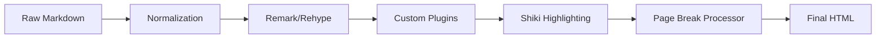

# Markdown Processing Engine

The Markdown Processing Engine is the core transformation layer of Markeon. It converts raw Markdown text into sanitized, styled HTML while integrating custom document logic such as page breaks, specialized image handling, and professional syntax highlighting via Shiki.

The engine utilizes a `unified` pipeline architecture, leveraging `remark` for Markdown parsing and `rehype` for HTML transformation.

## Rendering Pipeline

The transformation flow follows a linear sequence from raw input to final HTML output, including a pre-normalization step to handle edge cases in Markdown parsing.



## Core Processor Implementation

The rendering process is centralized in `renderMarkdown`, which utilizes a cached processor instance to minimize overhead during rapid editor updates.

```js title="src/lib/markdown.js"
export async function renderMarkdown(content) {
  const processor = await getProcessor();
  const normalized = normalizeThematicLines(content);
  const result = await processor.process(normalized);
  const processedHtml = processPageBreaks(result.toString());
  return processedHtml;
}
```

### Normalization & Sanitization
Standard Markdown parsers sometimes struggle with long sequences of thematic characters (e.g., `=====`), which can lead to text overflow or incorrect Setext heading interpretation. `normalizeThematicLines` ensures these are treated as horizontal rules.

```js title="src/lib/markdown.js"
export function normalizeThematicLines(content) {
  // Isolates divider lines so long ===== rows become <hr>, 
  // not overflow or merged setext.
  return content.replace(/^([=\-]{3,})$/gm, '<hr />');
}
```

## Document Transformation Plugins

Markeon extends the standard `rehype` pipeline with custom plugins to handle application-specific syntax.

### Custom Rehype Plugins
Two primary plugins modify the HTML Abstract Syntax Tree (HAST) before the final string conversion:

| Plugin | Function | Purpose |
| :--- | :--- | :--- |
| `rehypeThematicLineParagraphs` | Node Transformation | Prevents thematic lines from being wrapped in `<p>` tags. |
| `rehypeMarkeonImages` | Node Transformation | Resolves internal Markeon image IDs into valid URLs. |

```js title="src/lib/markdown.js"
function rehypeMarkeonImages() {
  return (tree) => {
    visit(tree, 'element', (node) => {
      if (node.tagName === 'img' && node.properties.src?.startsWith('markeon-img:')) {
        const id = node.properties.src.replace('markeon-img:', '');
        node.properties.src = markeonImageUrl(id);
      }
    });
  };
}
```

### Page Break Management
Page breaks are handled via post-processing of the generated HTML rather than inside the AST, allowing for precise CSS-driven print breaks.

```js title="src/lib/markdown.js"
export function processPageBreaks(html) {
  // Replaces custom page break markers with HTML elements 
  // targeting CSS print-break properties.
  return html.replace(/<!-- pagebreak -->/g, '<div class="page-break"></div>');
}
```

## Syntax Highlighting

Markeon uses **Shiki**, a professional syntax highlighter that uses TextMate grammars for accurate highlighting.

```js title="src/lib/shiki.js"
export function getHighlighter() {
  // Returns a singleton Shiki instance configured 
  // with specific themes and languages.
  return shikiInstance; 
}
```

The highlighter is integrated into the `getProcessor` pipeline, ensuring that code blocks are transformed from simple `<pre><code>` tags into richly styled HTML with line-by-line spans.

## Asset & Font Integration

### Image Handling
The engine manages images by decoupling the Markdown reference from the actual storage URL.

```js title="src/lib/images.js"
export function markeonImageUrl(id) {
  return `/api/images/${id}`;
}

export function extractMarkeonImageIds(content) {
  const regex = /markeon-img:([a-zA-Z0-9-]+)/g;
  return [...content.matchAll(regex)].map(match => match[1]);
}
```

### Dynamic Font Loading
To support diverse document themes without bloating the initial page load, the engine dynamically injects Google Fonts based on the active theme requirements.

```js title="src/lib/fontLoader.js"
export function ensureFont(family) {
  if (document.querySelector(`link[href*="${family}"]`)) return;
  
  const link = document.createElement('link');
  link.rel = 'stylesheet';
  link.href = `https://fonts.googleapis.com/css2?family=${family.replace(' ', '+')}`;
  document.head.appendChild(link);
}