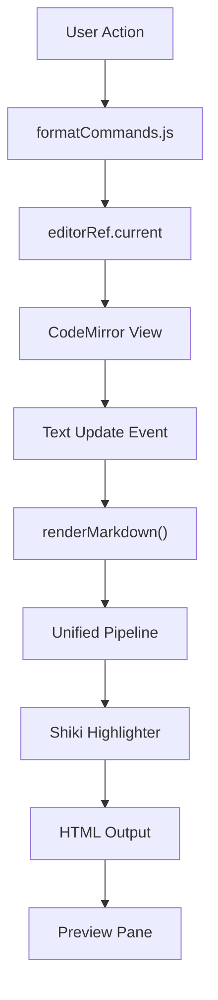

# Markdown Processing Engine

The Markdown Processing Engine is the core computational layer of Markeon, responsible for the bidirectional transformation between raw Markdown text and rendered HTML. It operates as a pipeline that integrates a unified transformation ecosystem (remark/rehype) with a high-performance syntax highlighting engine (Shiki) and a command-based text manipulation system for the editor.

The engine's primary objective is to provide a real-time, high-fidelity preview of Markdown content while ensuring that the underlying text remains editable and structurally sound. It decouples the editor state (managed via CodeMirror) from the rendering logic, allowing for specialized post-processing such as page-break insertion and heading extraction for navigation.

### Core Module Summary

| Module | Primary Role | Key Dependencies | Core Exports |
| :--- | :--- | :--- | :--- |
| `markdown.js` | Transformation pipeline & HTML rendering | `unified`, `remark`, `rehype` | `renderMarkdown`, `normalizeThematicLines`, `processPageBreaks` |
| `formatCommands.js` | Editor state manipulation & text wrapping | `editorRef.js` | `bold`, `italic`, `setHeading`, `bulletList`, `link` |
| `shiki.js` | Syntax highlighting initialization | `shiki` | `getHighlighter` |
| `editorRef.js` | Singleton reference to the active editor | `CodeMirror` | `editorRef` |

---

## Architecture, State & Data Flow

The processing engine functions as a unidirectional data flow for rendering, coupled with a command-driven mutation flow for editing.

### 1. The Rendering Pipeline
When the editor content changes, the text is passed through the `renderMarkdown` function. The flow is as follows:
1.  **Normalization**: The raw string is passed through `normalizeThematicLines` to prevent long sequences of underscores or dashes from breaking the layout or being misidentified as Setext-style headers.
2.  **Parsing**: The `unified` processor parses the Markdown into a Syntax Tree (mdast).
3.  **Transformation**: Remark plugins transform the AST, and `remark-rehype` converts the Markdown AST into an HTML AST (hast).
4.  **Highlighting**: The Shiki highlighter intercepts code blocks, applying theme-specific classes and inline styles to tokens.
5.  **Stringification**: `rehype-stringify` converts the hast into a final HTML string.
6.  **Post-Processing**: `processPageBreaks` scans the HTML for specific markers to inject CSS page-break properties for print optimization.

### 2. The Formatting Flow
Formatting commands do not modify the HTML; they modify the source text in the CodeMirror instance, which then triggers the rendering pipeline.



---

## In-Depth Code Walkthrough & Implementation Details

### Text Manipulation Logic
The `formatCommands.js` module implements a suite of utility functions that interact with the `editorRef`. Instead of simple string replacement, it uses CodeMirror's transaction system to maintain undo/redo history.

```js title="src/lib/formatCommands.js"
function wrapSelection(before, after = before) {
  const view = getView();
  if (!view) return;

  const { from, to } = view.state.selection.main;
  const selectedText = view.state.doc.sliceString(from, to);

  if (from === to) {
    view.dispatch({
      changes: { from, insert: `${before}${after}` },
      selection: { anchor: from + before.length }
    });
  } else {
    view.dispatch({
      changes: { from, to, insert: `${before}${selectedText}${after}` }
    });
  }
}

export const bold = () => wrapSelection('**', '**');
export const italic = () => wrapSelection('_', '_');
```

In the `wrapSelection` implementation, the engine first retrieves the current `EditorView` via `getView()`. It calculates the current selection boundaries (`from`, `to`). If no text is selected (`from === to`), it inserts the markers and intelligently places the cursor between them. If text is selected, it wraps the existing content. This ensures a seamless UX where the user can either highlight text to bold it or click and then type within the bold markers.

### The Unified Rendering Pipeline
The `markdown.js` file encapsulates the logic for converting Markdown to HTML. It utilizes a cached processor to avoid the overhead of re-initializing the `unified` pipeline on every keystroke.

```js title="src/lib/markdown.js"
async function getProcessor() {
  if (processor.current) return processor.current;

  const highlighter = await getHighlighter();
  const p = unified()
    .use(remarkParse)
    .use(remarkRehype)
    .use(rehypeShiki, { highlighter })
    .use(rehypeStringify);

  processor.current = p;
  return p;
}

export async function renderMarkdown(content) {
  const normalized = normalizeThematicLines(content);
  const processor = await getProcessor();
  const result = await processor.process(normalized);
  return result.toString();
}
```

The `getProcessor` function implements a singleton pattern to manage the `unified` instance. It integrates `rehypeShiki`, passing the highlighter instance obtained from `shiki.js`. The `renderMarkdown` function acts as the primary entry point, first applying `normalizeThematicLines` to sanitize the input before passing it to the async processor. This ensures that thematic breaks (like `---`) do not cause layout overflows in the preview pane.

### Handling Thematic Lines and Page Breaks
Specialized handlers are implemented to manage CSS-critical elements like horizontal rules and print page breaks.

```js title="src/lib/markdown.js"
export function normalizeThematicLines(content) {
  // Isolate divider lines so long ===== rows become <hr>, not overflow or merged setext.
  return content.replace(/^([=\-]{3,})$/gm, '\n$1\n');
}

export function processPageBreaks(html) {
  // Replaces a specific marker (e.g., [pagebreak]) with a div styled for printing
  return html.replace(/\[pagebreak\]/g, '<div class="page-break"></div>');
}
```

The `normalizeThematicLines` function uses a regular expression to identify lines consisting solely of three or more equals or dashes. By ensuring these lines are isolated by newlines, it prevents the Markdown parser from incorrectly interpreting them as Setext-style headers for the preceding paragraph. `processPageBreaks` allows the engine to support a non-standard Markdown extension `[pagebreak]`, converting it into a HTML element that the CSS print stylesheets can target to force new pages in PDF exports.

---

## API / Method Reference

### `markdown.js`

#### `renderMarkdown(content: string): Promise<string>`
The main pipeline entry point.
- **Input**: Raw Markdown string.
- **Return**: A promise resolving to a sanitized HTML string.
- **Process**: Normalization $\rightarrow$ Processing $\rightarrow$ Stringification.

#### `normalizeThematicLines(content: string): string`
- **Input**: Raw Markdown string.
- **Return**: String with thematic lines isolated.
- **Invariant**: Ensures that `---` or `===` lines are treated as `<hr>` rather than headers.

#### `processPageBreaks(html: string): string`
- **Input**: Rendered HTML string.
- **Return**: HTML string with `[pagebreak]` markers replaced by `<div class="page-break"></div>`.

#### `extractHeadingsFromPreview(root: HTMLElement): Array<{text, id, level}>`
- **Input**: The DOM root of the rendered preview.
- **Return**: An array of heading objects for the Table of Contents (TOC).
- **Logic**: Queries all `h1, h2, h3` tags and extracts their inner text and IDs.

### `formatCommands.js`

#### `wrapSelection(before: string, after: string = before): void`
- **Input**: The prefix and suffix to wrap around the selection.
- **Action**: Dispatches a CodeMirror transaction to modify the document.

#### `setHeading(level: number): void`
- **Input**: Heading level (1, 2, or 3).
- **Action**: Removes existing `#` prefixes from the current line and prepends the correct number of `#` symbols.

#### `toggleLinePrefix(prefix: string): void`
- **Input**: A string (e.g., `> ` for blockquotes, `- ` for bullets).
- **Action**: Toggles the prefix on the current line or all selected lines.

### `shiki.js`

#### `getHighlighter(): Promise<Highlighter>`
- **Return**: An initialized Shiki highlighter instance.
- **Note**: This is an asynchronous operation as it loads the theme and language grammar.

---

## Error Handling, Edge Cases & Performance

### 1. Performance Optimization
To prevent UI lag during rapid typing, the engine relies on two strategies:
- **Processor Caching**: The `unified` pipeline is created once and cached in `processor.current`. Re-initializing the pipeline on every character change would cause significant CPU spikes.
- **Asynchronous Highlighting**: Shiki's highlighter is loaded asynchronously. The `getProcessor` function awaits the highlighter, ensuring that rendering doesn't start until the syntax highlighting engine is ready.

### 2. Edge Case: Thematic Line Overflow
A common issue in Markdown rendering is when a user enters a very long sequence of dashes (e.g., 100 dashes) to create a visual divider. Without normalization, this can result in a single `<p>` tag containing a massive string that exceeds the container width, causing horizontal scrollbars. `normalizeThematicLines` forces these into separate lines, which the `rehypeThematicLineParagraphs` plugin (or the default remark-rehype logic) converts into a standard `<hr />` tag.

### 3. Error Recovery
The engine implements a "fail-soft" approach:
- **Null Ref Handling**: All `formatCommands` check for the existence of `editorRef.current` via `getView()`. If the editor is not yet mounted or has been destroyed, the commands return silently rather than throwing a `TypeError`.
- **Async Safety**: Since `renderMarkdown` is async, the preview component typically handles the loading state or preserves the previous render until the new HTML string is resolved, preventing "flicker" during the transformation process.