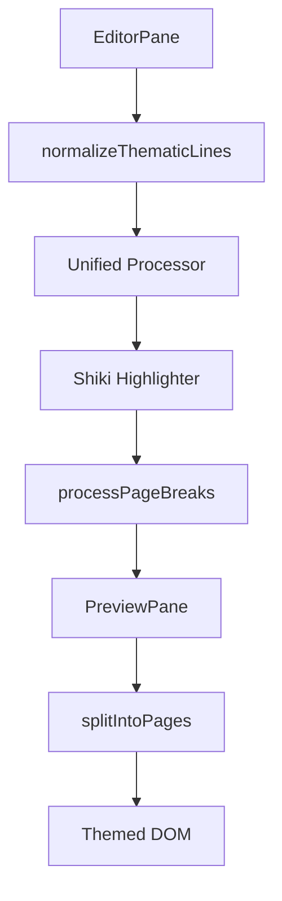

# Markdown Rendering Pipeline

The Markdown Rendering Pipeline is the core transformation loop of Markeon. It converts raw Markdown text from the `EditorPane` into a paginated, themed HTML preview in the `PreviewPane`. The system leverages a `unified` pipeline (remark/rehype) integrated with Shiki for high-fidelity syntax highlighting and a custom pagination engine to simulate physical paper dimensions.

## High-Level Data Flow

The pipeline operates as a reactive loop. Changes in the editor trigger a re-render process that passes through several stages of normalization and transformation before reaching the DOM.



## The Transformation Core

The transformation logic resides in `src/lib/markdown.js`. It utilizes the `unified` ecosystem to parse Markdown into an Abstract Syntax Tree (AST) and then transform that AST into HTML.

### 1. Content Normalization
Before parsing, raw content is normalized to prevent layout breakage caused by long strings of thematic characters (e.g., `=====`) which can cause horizontal overflow in the preview pane.

```javascript title="src/lib/markdown.js"
export function normalizeThematicLines(content) {
  // Isolate divider lines so long ===== rows become <hr>, 
  // not overflow or merged setext.
  return content.replace(/^([ \t]*)([=-]{3,})$/gm, '$1<hr>$2');
}
```

### 2. Unified Processor Configuration
The `getProcessor` function initializes the pipeline. It combines `remark` (Markdown parsing) and `rehype` (HTML transformation) with custom plugins.

```javascript title="src/lib/markdown.js"
async function getProcessor() {
  const highlighter = await getHighlighter();
  return unified()
    .use(remarkParse)
    .use(remarkRehype)
    .use(rehypeThematicLineParagraphs) // Custom plugin for <hr> logic
    .use(rehypeMarkeonImages)         // Custom image handling
    .use(rehypeStringify);
}
```

### 3. Rendering Execution
The `renderMarkdown` function orchestrates the entire flow, from normalization to the final HTML string.

```javascript title="src/lib/markdown.js"
export async function renderMarkdown(content) {
  const normalized = normalizeThematicLines(content);
  const processor = await getProcessor();
  const result = await processor.process(normalized);
  const html = result.toString();
  
  return processPageBreaks(html);
}
```

## Syntax Highlighting with Shiki

Markeon uses Shiki for syntax highlighting, which employs TextMate grammars to provide VS Code-like highlighting accuracy.

```javascript title="src/lib/shiki.js"
export function getHighlighter() {
  // Initializes and returns the Shiki highlighter instance
  // used by the rehype pipeline to wrap code blocks in 
  // themed <span> tags.
}
```

The highlighter is injected into the `unified` pipeline, ensuring that code blocks are highlighted before the final HTML string is generated.

## Synchronized Dual-Pane Rendering

The `PreviewPane` is responsible for taking the generated HTML and projecting it onto a virtual paper layout.

### Paper Dimension Logic
To maintain "What You See Is What You Get" (WYSIWYG) accuracy, Markeon converts physical paper dimensions (mm) to pixels based on a standard 96dpi density.

| Paper Size | Orientation | Width (px) | Height (px) |
| :--- | :--- | :--- | :--- |
| A4 | Portrait | 794px | 1123px |
| A4 | Landscape | 1123px | 794px |
| Letter | Portrait | 816px | 1056px |

```javascript title="src/components/editor/PreviewPane.jsx"
function getPaperPx(paperSize = 'A4', orientation = 'portrait') {
  const dims = {
    A4: { w: 210, h: 297 },
    Letter: { w: 215.9, h: 279.4 }
  };
  const { w, h } = dims[paperSize];
  const width = orientation === 'portrait' ? w : h;
  const height = orientation === 'portrait' ? h : w;
  
  return {
    width: mmToPx(width),
    height: mmToPx(height)
  };
}
```

### Pagination Engine
Because standard HTML is a continuous flow, `PreviewPane` implements a pagination strategy to split the rendered HTML into discrete "pages" that match the calculated paper dimensions.

```javascript title="src/components/editor/PreviewPane.jsx"
function splitIntoPages(html) {
  // 1. Injects the HTML into a hidden measuring container
  // 2. Iterates through DOM nodes
  // 3. Accumulates nodes until the height exceeds the paper height
  // 4. Slices the content into an array of page-specific HTML strings
}
```

### Theme Injection
The final rendering step applies dynamic styles based on the active theme. This is handled by injecting a CSS block directly into the preview container to ensure styles are scoped to the document.

```javascript title="src/components/editor/PreviewPane.jsx"
function injectThemeStyle(theme, layoutSettings) {
  // Generates a dynamic CSS string based on 
  // theme colors and layout settings (margins, fonts)
  // and applies it to the PreviewPane wrapper.
}