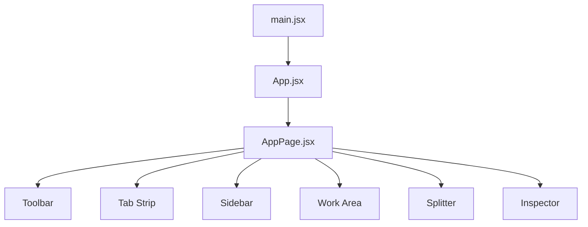
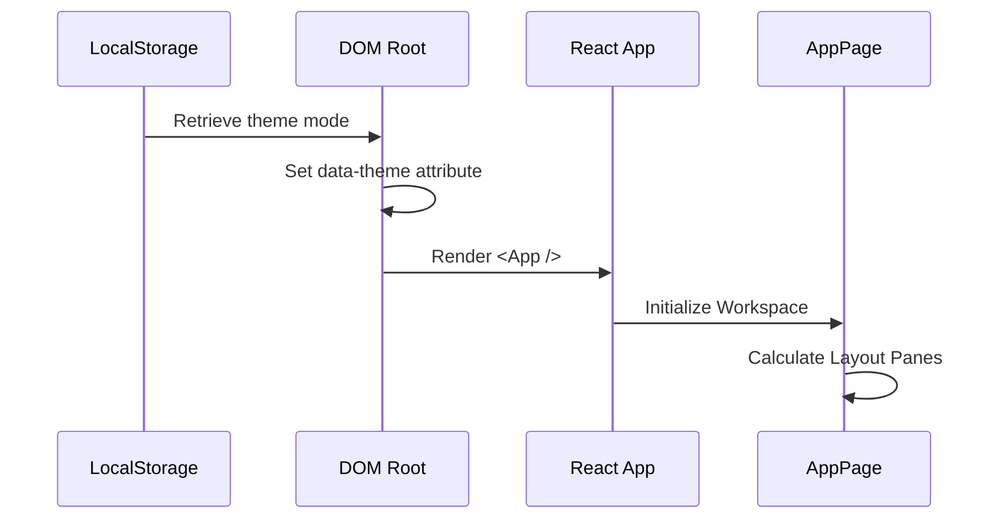

# System Architecture

The System Architecture of Markeon is designed as a high-performance, single-page React application focused on providing a distraction-free Markdown editing experience. The architecture follows a hierarchical structure where a centralized application shell manages global concerns (like theming and styles), while a specialized page component coordinates a complex, multi-pane workspace.

The primary goal of this architecture is to balance the flexibility of a full-featured IDE (with sidebars and inspectors) with the simplicity of a document processor, allowing the user to toggle between "editing" and "reading" contexts seamlessly.

## Frontend Component Hierarchy

The application is structured as a tree, starting from the DOM entry point and descending into a modular workspace. The `AppPage` serves as the orchestrator for the entire editor interface.

### Structural Breakdown

| Layer | Component | Responsibility |
| :--- | :--- | :--- |
| **Entry** | `main.jsx` | Bootstraps React, initializes global themes, and loads CSS. |
| **Root** | `App.jsx` | The top-level wrapper for the application logic. |
| **Workspace** | `AppPage.jsx` | Manages the complex layout, including the editor, preview, and sidebars. |
| **UI Modules** | `Toolbar`, `Sidebar`, `Inspector` | Specialized panels for formatting, navigation, and document metadata. |

### Component Relationship Diagram



## Layout and Data Flow

The `AppPage` is the core of the Markeon experience. Rather than a simple linear flow, it utilizes a coordinate-based layout system to handle a multi-pane interface. 

### Workspace Orchestration
The workspace is divided into functional zones that respond to the application's current mode (e.g., Reading Mode vs. Editing Mode). For example, the **Tab panel strip** is conditionally hidden when the user enters reading mode to maximize screen real estate.

The interaction between these components is managed through event handlers that control the physical layout of the UI. The presence of `onMouseMove` and `onMouseUp` handlers within `AppPage` indicates a manual implementation of a resizable interface, allowing users to dynamically adjust the width of the sidebar or the split between the editor and the preview.

### Global Initialization and Theming
Before the React tree is even mounted, Markeon performs a critical synchronization step to prevent "flash of unstyled content" (FOUC). It retrieves the user's theme preference from `localStorage` and applies it directly to the HTML root element.

```javascript
// src/main.jsx
const saved = localStorage.getItem('markeon-theme')
let mode = 'dark'
try { 
  mode = JSON.parse(saved)?.state?.mode || 'dark' 
} catch {}
document.documentElement.setAttribute('data-theme', mode)
```

This approach ensures that the `data-theme` attribute is present on the `<html>` tag before the first render, allowing the global CSS files (`global.css`, `print.css`, `document.css`) to apply the correct color palette immediately.

## Data Flow Sequence

The flow of data and control during the application startup sequence follows a strict linear path to ensure the environment is correctly configured before the user interacts with the editor.



This architecture ensures that the editor remains responsive and that the visual state—specifically the theme and the layout of the splitter and inspector—is maintained consistently across the session.