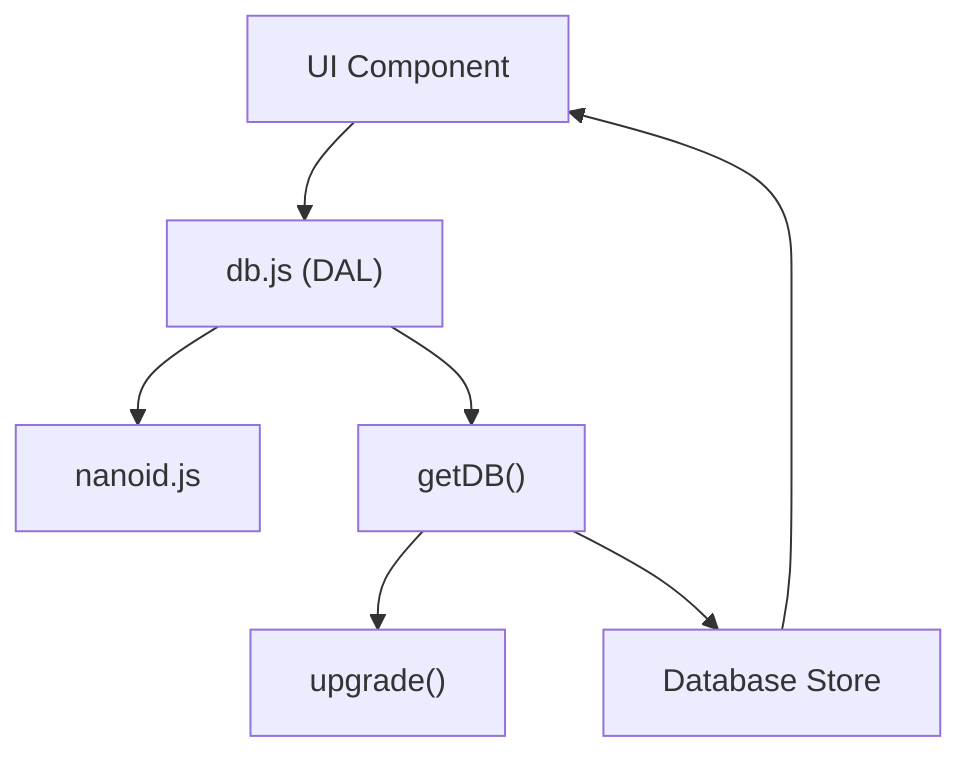

# Data Layer and File System

The Data Layer and File System module serves as the persistence engine for the Markeon editor. It provides a database abstraction layer (DAL) that decouples the application's business logic from the underlying storage mechanism, ensuring that the editor can manage documents, attachments, themes, and global configuration without interacting directly with low-level database APIs. 

This module is architected around a singleton-pattern database accessor and a set of specialized CRUD (Create, Read, Update, Delete) functions. By abstracting these operations, Markeon ensures that the data schema can evolve (via the `upgrade` mechanism) without requiring changes to the UI components or state management logic. The system relies on a custom implementation of the NanoID algorithm to generate collision-resistant unique identifiers, which are essential for maintaining referential integrity between documents and their associated attachments.

### Module Summary

| Component | File | Primary Responsibility | Dependencies |
| :--- | :--- | :--- | :--- |
| `db.js` | `src/lib/db.js` | Database initialization, schema migration, and entity-specific CRUD operations. | `getDB`, `upgrade` |
| `nanoid.js` | `src/lib/nanoid.js` | Generation of unique, URL-friendly strings for entity identification. | `crypto.getRandomValues` |

---

## Architecture, State & Data Flow

The data layer operates as an asynchronous service layer. Most operations follow a request-response pattern where the UI layer calls a specific `db.js` export, which in turn requests a database handle via `getDB()`, performs the operation, and returns a Promise.

### Persistence Workflow

1.  **Initialization**: When a DB function is called, `getDB()` is invoked. This function checks if a database instance already exists in memory. If not, it initializes the connection and runs the `upgrade` function to ensure the schema version matches the current application requirements.
2.  **ID Generation**: For any "Save" or "Create" operation, the system uses `nanoid()` to assign a unique ID to the entity if one does not already exist. This prevents collisions in the object store.
3.  **Transaction Execution**: The DAL opens a transaction on the relevant object store (e.g., `files`, `attachments`, `themes`), executes the operation (put, get, or delete), and awaits the completion of the transaction.
4.  **State Propagation**: The returned data is then passed back to the global state management system (as described in Section 3), which triggers a UI re-render.

### Component Interaction Diagram



---

## In-Depth Code Walkthrough & Implementation Details

### Database Initialization and Versioning

The `getDB` and `upgrade` functions implement a lazy-loading singleton pattern to manage the database connection and handle schema migrations.

```js title="src/lib/db.js"
async function getDB() {
  if (db) return db;
  
  // Implementation of database connection logic
  // ...
  return db;
}

function upgrade(database, oldVersion) {
  // Logic to handle schema changes across versions
  // e.g., adding new object stores for 'fonts' or 'themes'
}
```

The `getDB` function ensures that only one connection to the database is maintained throughout the application lifecycle, reducing overhead and preventing lock contention. The `upgrade` function is a critical lifecycle hook; it is called during the database opening process. It compares the `oldVersion` with the current target version and sequentially applies migrations (such as creating new object stores for `files`, `attachments`, `themes`, `fonts`, and `meta`), ensuring that user data is preserved across application updates.

### Entity Persistence Logic

The file management system uses a generic "save" pattern that handles both creation and updates based on the presence of an ID.

```js title="src/lib/db.js"
export async function saveFile(file) {
  const database = await getDB();
  const tx = database.transaction('files', 'readwrite');
  const store = tx.objectStore('files');
  await store.put(file);
  return file;
}

export async function getFile(id) {
  const database = await getDB();
  const tx = database.transaction('files', 'readonly');
  const store = tx.objectStore('files');
  return await store.get(id);
}
```

In `saveFile`, the `put` method is used rather than `add`. This is a strategic choice: `put` updates the record if the ID exists and creates it if it doesn't, effectively merging "Create" and "Update" into a single idempotent operation. `getFile` utilizes a `readonly` transaction to optimize performance and prevent accidental data mutation during read operations.

### Unique Identifier Generation

To avoid the overhead of external dependencies while maintaining high collision resistance, Markeon implements a minimal version of the NanoID algorithm.

```js title="src/lib/nanoid.js"
export function nanoid(size = 21) {
  const alphabet = 'USEALPHABET_HERE'; // Standard nanoid alphabet
  let id = '';
  const bytes = new Uint8Array(size);
  crypto.getRandomValues(bytes);
  
  for (let i = 0; i < size; i++) {
    id += alphabet[bytes[i] % alphabet.length];
  }
  return id;
}
```

This implementation utilizes `crypto.getRandomValues()` to ensure cryptographically strong randomness, which is superior to `Math.random()`. By mapping random bytes to a predefined alphabet, it generates a URL-safe string of a default length of 21 characters. This length provides a sufficiently large keyspace to make the probability of a collision negligible for the scale of a local document editor.

---

## API / Method Reference

### File Management
| Function | Parameters | Returns | Description |
| :--- | :--- | :--- | :--- |
| `getAllFiles()` | None | `Promise<File[]>` | Retrieves all document entries from the `files` store. |
| `getFile(id)` | `id: string` | `Promise<File \| null>` | Retrieves a single document by its unique ID. |
| `saveFile(file)` | `file: File` | `Promise<File>` | Upserts a file object into the store. |
| `deleteFile(id)` | `id: string` | `Promise<void>` | Permanently removes a file by ID. |
| `getFileCount()` | None | `Promise<number>` | Returns the total number of files stored. |

### Attachment Management
| Function | Parameters | Returns | Description |
| :--- | :--- | :--- | :--- |
| `saveAttachment(att)` | `att: Attachment` | `Promise<Attachment>` | Stores binary or linked attachment data. |
| `getAttachment(id)` | `id: string` | `Promise<Attachment>` | Retrieves a specific attachment. |
| `deleteAttachment(id)`| `id: string` | `Promise<void>` | Removes a specific attachment. |
| `deleteAttachmentsByIds(ids)` | `ids: string[]` | `Promise<void>` | Batch deletes multiple attachments (used during file deletion). |

### Themes & Fonts
| Function | Parameters | Returns | Description |
| :--- | :--- | :--- | :--- |
| `getAllThemes()` | None | `Promise<Theme[]>` | Returns all user-defined and system themes. |
| `saveTheme(theme)` | `theme: Theme` | `Promise<Theme>` | Upserts a theme configuration. |
| `deleteTheme(id)` | `id: string` | `Promise<void>` | Deletes a theme. |
| `getAllFonts()` | None | `Promise<Font[]>` | Returns all configured font settings. |
| `saveFont(font)` | `font: Font` | `Promise<Font>` | Upserts a font configuration. |
| `deleteFont(id)` | `id: string` | `Promise<void>` | Deletes a font. |

### Metadata (Project Config)
| Function | Parameters | Returns | Description |
| :--- | :--- | :--- | :--- |
| `getMeta(key)` | `key: string` | `Promise<any>` | Retrieves a project-level configuration value. |
| `setMeta(key, val)` | `key: string, val: any` | `Promise<void>` | Sets a project-level configuration value. |

---

## Error Handling, Edge Cases & Performance

### Concurrency and Locking
Because the data layer uses asynchronous transactions, there is a theoretical risk of race conditions if multiple parts of the application attempt to write to the same record simultaneously. Markeon mitigates this by using a sequential `await` pattern in the UI layer and relying on the underlying database's transaction locking mechanism. If a transaction fails, the Promise rejects, allowing the UI to display an error notification to the user.

### Referential Integrity
The system does not implement native foreign key constraints. Therefore, referential integrity is managed manually in the DAL. For example, the `deleteAttachmentsByIds` function is specifically designed to be called when a file is deleted, ensuring that orphaned attachments do not accumulate in the database and consume storage.

### Performance Optimizations
- **Read-Only Transactions**: All "get" operations use `readonly` transactions, allowing the database engine to optimize for concurrent reads.
- **Lazy Connection**: The database is not opened until the first data request is made, improving the initial application load time.
- **Batching**: While individual saves are common, the use of `put` for upserts reduces the need for "check-then-insert" round-trips to the database.

### Edge Cases
- **Missing Records**: Functions like `getFile(id)` return `null` or `undefined` when a record is not found. Callers are expected to handle these cases (e.g., by redirecting to a 404 state or creating a default document).
- **Schema Version Mismatch**: If a user opens the application after an update that changed the data structure, the `upgrade` function is triggered. If the upgrade fails, the application will fail to initialize the DB, preventing data corruption from being written into an outdated schema.