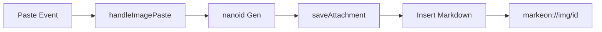
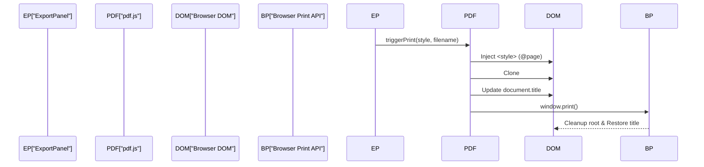

# Export & Asset Pipeline

The Export & Asset Pipeline constitutes the final stage of the Core Processing Engine, responsible for transforming volatile editor state and binary attachments into serialized formats and printable documents. It manages the lifecycle of binary assets via a custom URI scheme and orchestrates the browser's print subsystem through dynamic CSS injection and DOM manipulation.

## System Role & Architectural Position

The pipeline operates as a bridge between the `useFileStore` state management layer and the browser's native APIs. It decouples the visual representation of the editor from the physical constraints of document output (e.g., A4/Letter sizing).

### Pipeline Specification

| Component | Input | Processing Logic | Output |
| :--- | :--- | :--- | :--- |
| **Asset Handler** | `File` object (Paste/Upload) | `nanoid` $\rightarrow$ `ArrayBuffer` $\rightarrow$ IndexedDB | `markeon://img/{id}` |
| **Style Engine** | `layoutSettings` object | CSS `@page` & pseudo-element generation | Dynamic `<style>` block |
| **Export Orchestrator** | `activeFile` + `layout` | DOM Cloning $\rightarrow$ Page Title Sync $\rightarrow$ `window.print()` | PDF / Physical Print |

## Core Execution & Data Flow Mechanics

### Image Asset Lifecycle
Image handling utilizes a "Store-then-Reference" pattern to ensure that binary data does not bloat the markdown text files.



1. **Interception**: The `handleImagePaste` function intercepts `File` objects from the clipboard.
2. **Serialization**: Files are converted to `ArrayBuffer` for storage in the local IndexedDB via `saveAttachment`.
3. **Referencing**: A custom protocol `markeon://img/` is used to identify the asset, which is then injected into the editor as standard Markdown image syntax ``.
4. **Extraction**: `extractMarkeonImageIds` utilizes a global regex to identify all internal assets within a document for synchronization or cleanup.

### PDF Generation Workflow
PDF generation is achieved via a "Shadow Root" technique, isolating the printable content from the application UI.



## Implementation Deep Dive

### Asset Persistence Logic
The pipeline ensures that images are stored as binary blobs to maintain integrity and performance.

```javascript title="src/lib/images.js"
export async function handleImagePaste(view, file, fileId) {
  if (!file?.type?.startsWith('image/') || !fileId) return false
  const id = nanoid()
  const data = await file.arrayBuffer()
  await saveAttachment({
    id,
    fileId,
    name: file.name || 'image',
    mimeType: file.type,
    data,
  })
  insertImageMarkdown(view, markeonImageUrl(id), 'image')
  return true
}
```
- **`file.arrayBuffer()`**: Non-blocking read of the file into a raw binary buffer.
- **`saveAttachment`**: Persistence layer call to IndexedDB mapping the `nanoid` to the binary data.
- **`insertImageMarkdown`**: Dispatches a Prosemirror/Editor transaction to insert the custom URI at the current cursor selection.

### Print Style Synthesis
The system dynamically calculates CSS values based on the selected paper size and orientation.

```javascript title="src/lib/pdf.js"
export function buildPrintStyle(layoutSettings = {}) {
  const {
    paperSize = 'A4',
    orientation = 'portrait',
    margins = {},
    watermark = '',
  } = layoutSettings

  const size = PAPER_SIZES[paperSize] || PAPER_SIZES.A4
  const sizeValue = orientation === 'landscape'
    ? `${size.height} ${size.width}`
    : `${size.width} ${size.height}`

  const marginStr = [
    margins.top ?? '20mm',
    margins.right ?? '20mm',
    margins.bottom ?? '20mm',
    margins.left ?? '20mm',
  ].join(' ')

  const watermarkCSS = watermark
    ? `#markeon-print-root::after { content: '${watermark}'; ... }`
    : ''

  return `@media print { @page { size: ${sizeValue}; margin: ${marginStr}; } ${watermarkCSS} }`
}
```
- **`sizeValue`**: Swaps width/height dimensions if `orientation === 'landscape'`.
- **`marginStr`**: Coalesces individual margin settings into a single CSS shorthand string.
- **Watermark Injection**: Uses a fixed-position `::after` pseudo-element on the print root to ensure the watermark persists across all printed pages without disrupting document flow.

### DOM Orchestration for Export
The `triggerPrint` function handles the temporary modification of the global DOM to ensure a clean export.

```javascript title="src/lib/pdf.js"
export function triggerPrint(styleOverrides, filename) {
  // ... style injection ...
  const sourceEl = document.getElementById('markeon-all-pages')
  let printRoot = document.getElementById('markeon-print-root')
  if (!printRoot) {
    printRoot = document.createElement('div')
    printRoot.id = 'markeon-print-root'
    document.body.appendChild(printRoot)
  }

  printRoot.innerHTML = sourceEl.innerHTML
  // ... title management ...
  window.print()
  
  setTimeout(() => {
    printRoot.innerHTML = ''
    document.title = originalTitle
  }, 1000)
}
```
- **`markeon-print-root`**: A dedicated container used to isolate printable content from the editor's UI chrome (toolbars, sidebars).
- **`document.title`**: Temporarily updated to the filename to ensure the generated PDF filename defaults to the document name.
- **`setTimeout` cleanup**: Ensures the DOM is restored after the browser's print dialog has captured the current state.

## Method & State Reference

### Paper Size Configuration
The system utilizes a static map for physical dimensioning.

| Key | Width | Height | Label |
| :--- | :--- | :--- | :--- |
| `A4` | `210mm` | `297mm` | A4 |
| `Letter` | `8.5in` | `11in` | Letter |
| `Legal` | `8.5in` | `14in` | Legal |

### Layout Settings Schema
State managed via `useFileStore` and passed to `buildPrintStyle`.

| Property | Type | Default | Description |
| :--- | :--- | :--- | :--- |
| `paperSize` | `string` | `'A4'` | Key mapping to `PAPER_SIZES` |
| `orientation` | `'portrait' \| 'landscape'` | `'portrait'` | Axis of the page dimensions |
| `watermark` | `string` | `''` | Text content for the background overlay |
| `margins` | `Object` | `{top: '20mm', ...}` | Individual margin offsets |

### Failure Modes & Recovery

| Scenario | Impact | Recovery Mechanism |
| :--- | :--- | :--- |
| **IndexedDB Write Failure** | Image paste fails | `handleImagePaste` returns `false`; editor state remains unchanged. |
| **Missing `#markeon-all-pages`** | Export triggers empty page | `triggerPrint` falls back to `window.print()` on current view. |
| **Large Binary Assets** | Browser memory pressure | Handled via `ArrayBuffer` and IndexedDB to avoid keeping binaries in JS heap. |
| **Invalid Paper Size Key** | Layout fallback | `buildPrintStyle` defaults to `PAPER_SIZES.A4`. |