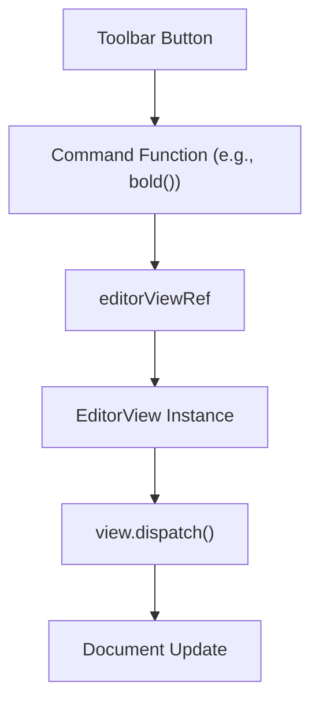

# Formatting & Commands

Markeon implements a decoupled command system that allows toolbar components to manipulate the editor state without being directly coupled to the editor's internal React lifecycle. This is achieved through a shared reference and a set of deterministic formatting utilities.

## Architecture Overview

The formatting system relies on a singleton reference to the active CodeMirror `EditorView`. This allows any utility function to access the editor's state and dispatch transactions from anywhere in the application.




## Editor Reference Handling

The `editorViewRef` acts as a bridge between the `EditorPane` (which manages the CodeMirror lifecycle) and the formatting commands.

```javascript
// src/lib/editorRef.js
export const editorViewRef = { current: null }
```

- **Writer:** The `EditorPane` updates `.current` when the editor is initialized and sets it to `null` when destroyed.
- **Reader:** Command functions call `getView()` to retrieve the current instance before attempting any document mutations.

## Command Implementation

### Text Wrapping
The `wrapSelection` utility is the engine for most inline formatting. It handles two primary scenarios:
1. **Selection exists:** Wraps the selected text with the provided markers.
2. **No selection:** Inserts markers and places the cursor between them.

**Supported Wrappers:**
- `bold()`: `**text**`
- `italic()`: `*text*`
- `strikethrough()`: `~~text~~`
- `inlineCode()`: `` `text` ``
- `codeBlock()`: Wraps selection in ` ``` ` blocks.

### Line Prefixing
The `toggleLinePrefix` utility manages block-level formatting. It operates on a per-line basis across the entire current selection.

- **Logic:** If all selected lines already start with the prefix, the prefix is removed from all lines. Otherwise, it is added to any line currently lacking it.
- **Applications:**
    - `blockquote()`: `> `
    - `bulletList()`: `- `
    - `orderedList()`: `1. `

### Specialized Commands

#### Headings
The `setHeading(level)` command ensures that lines are not nested with multiple heading markers. It strips existing `#` prefixes before applying the requested level (1-3), ensuring a clean transition between heading sizes.

#### Links
The `link()` command transforms selected text into a Markdown link format `[text](url)`. It intelligently places the cursor inside the `(url)` parentheses to allow for immediate input.

#### Layout Elements
- **Horizontal Rule:** The `horizontalRule()` command detects if the current line is empty to determine whether to insert a newline before the `---` separator.
- **Tables:** The `table()` command utilizes `insertAtCursor` to inject a pre-defined boilerplate Markdown table.

## Summary of Exported Commands

| Command | Action | Markdown Result |
| :--- | :--- | :--- |
| `bold` | Wrap selection | `**text**` |
| `italic` | Wrap selection | `*text*` |
| `strikethrough` | Wrap selection | `~~text~~` |
| `inlineCode` | Wrap selection | `` `text` `` |
| `codeBlock` | Wrap selection | ` ```\ntext\n``` ` |
| `h1`, `h2`, `h3` | Set line prefix | `# `, `## `, `### ` |
| `blockquote` | Toggle prefix | `> ` |
| `bulletList` | Toggle prefix | `- ` |
| `orderedList` | Toggle prefix | `1. ` |
| `link` | Replace selection | `[text](url)` |
| `horizontalRule` | Insert line | `---` |
| `table` | Insert template | `| Col 1 | ... |` |