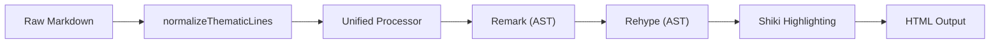

# Parsing and Syntax Highlighting

The Parsing and Syntax Highlighting module serves as the translation layer of Markeon, converting raw Markdown input into a structured, visually rich HTML preview. Its primary responsibility is to ensure that the transition from a plain-text editor to a "paper-like" rendered document is seamless, performant, and aesthetically accurate.

This module leverages a unified processing pipeline, combining the power of the `unified` ecosystem (Remark and Rehype) for structural transformation and `Shiki` for professional-grade syntax highlighting.

### Architectural Role

Within the Markeon architecture, this module acts as the engine for the Preview Pane. It doesn't just perform a simple string replacement; it transforms the document through a series of abstract syntax trees (ASTs) to allow for custom manipulations—such as handling page breaks and thematic line normalization—before the final HTML is generated.

| Component | Technology | Responsibility |
| :--- | :--- | :--- |
| **Markdown Parser** | `remark` | Parses Markdown text into a Markdown AST (mdast). |
| **HTML Transformer** | `rehype` | Converts mdast into an HTML AST (hast) and applies plugins. |
| **Syntax Highlighter** | `shiki` | Provides theme-aware, precise code highlighting. |
| **Custom Middleware** | Internal JS | Handles thematic line normalization and page break injection. |

### Data Flow and Processing Pipeline

The transformation process follows a linear pipeline. Before the Markdown even reaches the parser, it undergoes a normalization phase to prevent common rendering artifacts associated with long divider lines.



#### 1. Pre-processing and Normalization
Markdown parsers sometimes struggle with long sequences of symbols (like `=====`) used as thematic breaks, often treating them as overflowing paragraph text or incorrectly identified Setext headings. Markeon implements `normalizeThematicLines` to isolate these dividers, ensuring they are consistently rendered as `<hr>` elements.

#### 2. The Unified Pipeline
The core logic resides in `getProcessor()`, which initializes the pipeline. The flow moves from `remark-parse` (text to AST) through `remark-rehype` (Markdown AST to HTML AST) and finally to `rehype-stringify` (AST to HTML string).

```javascript
export async function renderMarkdown(content) {
  const processor = await getProcessor();
  const result = await processor.process(content);
  return result.toString();
}
```
*This entry point ensures that the asynchronous nature of the processor (which may need to load Shiki themes or plugins) is handled before returning the final HTML.*

### Syntax Highlighting with Shiki

Unlike traditional regex-based highlighters, Markeon uses **Shiki**, which utilizes TextMate grammars to provide the same highlighting quality found in VS Code. 

The integration is abstracted through a highlighter provider in `src/lib/shiki.js`, allowing the application to request a highlighter instance that is consistent across different parts of the UI.

```javascript
export function getHighlighter() {
  // Returns the configured Shiki highlighter instance
  // for processing code blocks within the rehype pipeline.
}
```

### Specialized Render Logic

To support the "document" nature of Markeon (as opposed to a simple web page), the module includes specialized handling for print layouts and navigation.

#### Page Break Management
Since Markeon targets a "paper-like" feel, it introduces a custom mechanism for page breaks. This is handled in two stages:
1. **Insertion**: `insertPageBreak` modifies the raw content to inject markers at specific positions.
2. **Processing**: `processPageBreaks` scans the generated HTML to convert these markers into CSS-driven page breaks (e.g., `break-after: page`), which are respected by PDF engines.

#### Thematic Line Guard
To prevent layout breakage caused by extremely long lines of underscores or equals signs, the module employs a custom rehype plugin: `rehypeThematicLineParagraphs`.

```javascript
function rehypeThematicLineParagraphs() {
  // Custom logic to identify <p> tags containing only 
  // thematic characters and convert them to <hr> 
  // to prevent horizontal overflow in the preview pane.
}
```

#### Document Outline Extraction
To power the navigation sidebars, the module provides `extractHeadingsFromPreview`. This function traverses the rendered HTML root to identify all heading tags (`<h1>`-`<h6>`), extracting their text and hierarchy to build a dynamic Table of Contents.